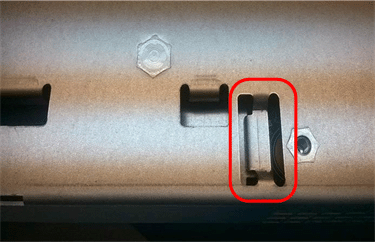

= 手順4：新しいコントローラにバッテリを移動する
:allow-uri-read: 

== 手順4：新しいコントローラにバッテリを移動する

障害が発生したコントローラからバッテリを取り外し、交換用コントローラに取り付けます。

.手順
. コントローラ内部（バッテリと DIMM の間）の緑の LED が消灯していることを確認します。
+
この緑の LED が点灯している場合は、コントローラがまだバッテリ電源を使用しています。この LED が消灯するのを待ってから、コンポーネントを取り外す必要があります。

+
image::../media/e2800_internal_cache_active_led.gif[E2800 の緑色の LED]

+
[cols="1a,2a"]
|===
| 項目 | 説明 

 a| 
1.
 a| 
内部キャッシュアクティブ LED

 a| 
2.
 a| 
バッテリー

|===
. バッテリの青色のリリースラッチの位置を確認します。
. バッテリをリリースラッチを押し下げながら引き出し、コントローラから外します。
+
image::../media/e2800_remove_battery.gif[バッテリのラッチ]

+
[cols="1a,2a"]
|===
| 項目 | 説明 

 a| 
1.
 a| 
バッテリのリリースラッチ

 a| 
2.
 a| 
バッテリー

|===
. バッテリを持ち上げながらスライドし、コントローラから引き出します。
. 交換用コントローラのカバーを取り外します。
. バッテリのスロットが手前になるよう交換用コントローラの向きを変えます。
. バッテリを少し下に傾けながらコントローラに挿入します。
+
バッテリ前部の金属製のフランジをコントローラ下部のスロットに挿入し、バッテリの上部がコントローラの左側にある小さな位置決めピンの下にくるまでスライドする必要があります。

. バッテリラッチを上に動かしてバッテリを固定します。
+
カチッという音がしてラッチが固定されると、ラッチの下部がシャーシの金属製のスロットに収まります。

. コントローラを裏返し、バッテリが正しく取り付けられていることを確認します。
+

CAUTION: *ハードウェアの損傷の可能性* -- バッテリー前面の金属製フランジは、コントローラーのスロットに完全に挿入する必要があります（最初の図を参照）。バッテリーが正しく取り付けられていない場合（2番目の図に示すように）、金属製のフランジがコントローラー基板に接触し、損傷を引き起こす可能性があります。

+
** *正解--バッテリの金属製のフランジがコントローラのスロットに完全に挿入されています*
+
image::../media/e2800_battery_flange_ok.gif[バッテリのフランジが正常な状態]

** *誤り -- バッテリーの金属製フランジがコントローラーのスロットに挿入されていません：*
+

. コントローラカバーを取り付けます。

