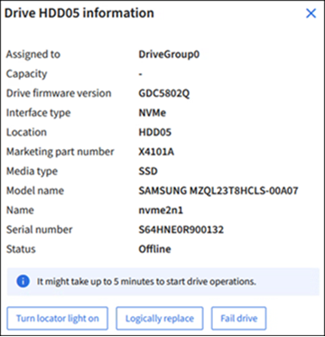

= [Manage Drives]タブを使用（SG110、SG1100、SGF6112、およびSG6160）
:allow-uri-read: 
:icons: font
:imagesdir: ../media/

[role="lead"]
Grid Managerの[Manage Drives]タブを使用して、この機能をサポートするアプライアンスのドライブについて、トラブルシューティングとメンテナンスのタスクを実行できます。

.作業を開始する前に
Grid Managerにサインインしておきます https://docs.netapp.com/us-en/storagegrid/admin/web-browser-requirements.html["サポートされている Web ブラウザ"^]。

.このタスクについて
この機能をサポートするアプライアンスがあり、かついずれかのを使用している場合は https://docs.netapp.com/us-en/storagegrid/admin/admin-group-permissions.html["ストレージアプライアンス管理者またはRoot Access権限"^]、アプライアンスの詳細ページに[Manage Drives]タブが表示されます。

NOTE: StorageGRID 11.8では、[Manage Drives]タブはSGF6112アプライアンスでのみサポートされます。

[Manage Drives]タブには、次のビューがあります。

レイアウト:: アプライアンス内のデータストレージドライブのレイアウト。ドライブの詳細を表示するドライブを選択してください。
+
--
image:../media/manage_drives_tab.png["[Manage Drives]タブのレイアウトビュー"]

--
表:: 各ドライブの情報が表示されます。ドライブの詳細を表示するドライブを選択してください。
+
--
image:../media/manage_drives_tab_table.png["[Manage Drives]タブのテーブルビュー"]

--
ドライブの詳細:: 各ドライブの概要。以下の手順に従って、適切なタスクボタンを選択します。
+
--
タブドライブの詳細"]

--

== ロケーターライトをオンまたはオフにする

アプライアンス内のドライブの場所を物理的に確認するには

. Grid Managerで、* nodes *>*_data center_*を選択します。
. *_ appliance storage node_*>*[ドライブの管理]*>*[レイアウト]*>*_drive_*を選択します。
+
ドライブの詳細パネルが表示されます。

. [ロケーターライトをオンにする]*を選択します。
+
** 電球アイコン image:../media/icon_drive-light-bulb.png["ドライブランプバルブ"] ドライブに対してと表示されます。
** 物理ドライブのオレンジのLEDが点滅します。

. ロケーターライトをオフにする場合は、*ロケーターライトをオフにする*を選択します。

== [[logically-replace-drive]]ドライブの論理的な交換

ストレージアプライアンスのドライブをリビルドまたは再初期化する必要がある場合は、次の手順を実行します。

. Grid Managerで、* nodes *>*_data center_*を選択します。
. *_ appliance storage node_*>*[ドライブの管理]*>*[レイアウト]*>*_drive_*を選択します。
+
ドライブの詳細パネルが表示されます。

. [Logically replace]*を選択します。
+
ドライブの詳細パネルで、ドライブのステータスが_Rebuilding_と表示されます。ドライブの再構築には最大5分かかることがあります。

== ドライブを使用停止にする

トラブルシューティングのために、障害が発生していると思われるドライブを手動で「使用停止」することができます。この場合、システムはそのドライブなしで動作します。

. Grid Managerで、* nodes *>*_data center_*を選択します。
. *_ appliance storage node_*>*[ドライブの管理]*>*[レイアウト]*>*_drive_*を選択します。
+
ドライブの詳細パネルが表示されます。

. [ドライブの使用停止]*を選択します。

ドライブを使用停止にしたら、ドライブを物理的に交換するか、または <<logically-replace-drive,ドライブを論理的に交換>>。
