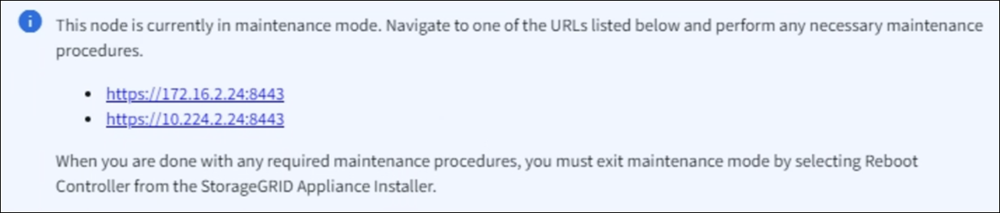

= アプライアンスをメンテナンスモードにします
:allow-uri-read: 
:icons: font
:imagesdir: ../media/

[role="lead"]
特定のメンテナンス手順を実行する前に、アプライアンスをメンテナンスモードにする必要があります。

.作業を開始する前に
* Grid Managerにサインインしておきます https://docs.netapp.com/us-en/storagegrid/admin/web-browser-requirements.html["サポートされている Web ブラウザ"^]。
* Maintenance または Root アクセス権限が必要です。詳細については、 StorageGRID の管理手順を参照してください。

.このタスクについて
まれに、 StorageGRID アプライアンスをメンテナンスモードにすると、アプライアンスにリモートアクセスできなくなることがあります。

NOTE: 保守モードの StorageGRID アプライアンスの admin アカウントのパスワードおよび SSH ホスト・キーは、アプライアンスが稼働していたときと同じままです。

.手順
. Grid Manager から * nodes * を選択します。
. Nodes ページのツリービューで、アプライアンスストレージノードを選択します。
. [ タスク ] を選択します。
. [* メンテナンスモード * ] を選択します。確認のダイアログボックスが表示されます。
. プロビジョニングパスフレーズを入力し、「 * OK 」を選択します。
+
進捗状況バーと一連のメッセージ（「 Request Sent 」、「 Stopping StorageGRID 」、「 Rebaling 」など）は、アプライアンスがメンテナンスモードに移行するための手順を完了していることを示しています。

+
アプライアンスがメンテナンスモードになっている場合は、 StorageGRID アプライアンスインストーラへのアクセスに使用できる URL が確認メッセージに表示されます。

+

. StorageGRID アプライアンスインストーラにアクセスするには、表示されたいずれかの URL にアクセスします。
+
可能であれば、アプライアンスの管理ネットワークポートの IP アドレスを含む URL を使用します。

+

NOTE: アプライアンスの管理ポートに直接接続する場合は、を使用します `+https://169.254.0.1:8443+` をクリックしてStorageGRID アプライアンスインストーラのページにアクセスします。

. StorageGRID アプライアンスインストーラで、アプライアンスがメンテナンスモードになっていることを確認します。
+
image::../media/maintenance_mode_notification_bar.png[メンテナンスモードのメッセージ]

. 必要なメンテナンスタスクを実行します。
. メンテナンス作業が完了したら、メンテナンスモードを終了して通常のノードの運用を再開します。StorageGRID アプライアンス・インストーラから、 *Advanced*>* Reboot Controller* を選択し、 * Reboot into StorageGRID * を選択します。
+
image::../media/reboot_controller_from_maintenance_mode.png[コントローラをメンテナンスモードでリブートします]

+
アプライアンスがリブートしてグリッドに再参加するまでに最大 20 分かかることがあります。リブートが完了し、ノードが再びグリッドに参加したことを確認するには、 Grid Manager に戻ります。nodes *ページに正常なステータス（緑色のチェックマークアイコン）が表示されます image:../media/icon_alert_green_checkmark.png["緑のチェックマーク"] （ノード名の左側）に表示されます。これは、アクティブなアラートがなく、ノードがグリッドに接続されていることを示します。

+
image::../media/nodes_menu.png[ノードページの正常ステータス]

