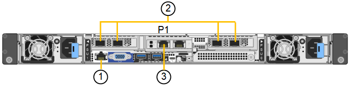
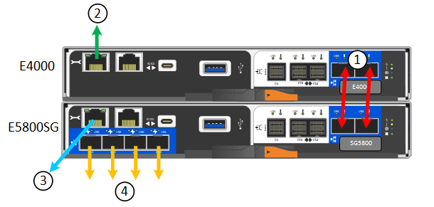
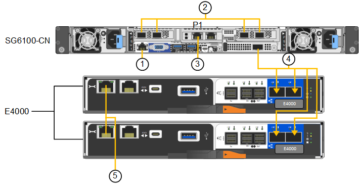

= アプライアンスをケーブル接続します
:allow-uri-read: 
:icons: font
:imagesdir: ../media/

[role="lead"]
アプライアンスまたはコントローラのネットワークポートを、StorageGRIDのグリッドネットワークおよびクライアントネットワーク（オプション）に接続します。一部のアプライアンスでは、アプライアンスの管理ポートをサービスラップトップに接続するか、コントローラの管理ポート間を接続します。

[role="tabbed-block"]
====
.SG100およびSG1000
--
アプライアンスの管理ポートをサービスラップトップに接続し、アプライアンスのネットワークポートを、 StorageGRID のグリッドネットワークとオプションのクライアントネットワークに接続する必要があります。

.作業を開始する前に
* 管理ポートを接続するための RJ-45 イーサネットケーブルを用意しておきます。
* ネットワークポートに次のいずれかを設定しておきます。これらのアイテムは、アプライアンスには付属していません。
+
** 4 つのネットワークポートを接続するための TwinAx ケーブルを 1~4 本。
** ポートに光ケーブルを使用する場合は、 SG100 用に SFP+ または SFP28 トランシーバを 1~4 個。
** SG1000 のポートに光ケーブルを使用する場合は、 QSFP+ または QSFP28 トランシーバを 1~4 個。

CAUTION: *レーザー被ばくの危険性*-- SFPまたはQSFPトランシーバを分解したり、部品を取り外したりしないでください。レーザー被ばくのおそれがあります。

.このタスクについて
次の図は、アプライアンス背面のポートを示しています。

SG100のポート接続：

image::../media/sg100_connections.png[SG100 背面コネクタ]

SG1000のポート接続：

image::../media/sg1000_connections.png[SG1000 ポートの接続]

[cols="1a,2a,2a,3a"]
|===
| コールアウト | ポート | ポートのタイプ | 使用 

 a| 
1.
 a| 
アプライアンスの BMC 管理ポート
 a| 
1GbE （ RJ-45 ）
 a| 
BMC インターフェイスにアクセスするネットワークに接続します。

 a| 
2.
 a| 
アプライアンスの 4 つのネットワーク・ポート
 a| 
* SG100 ： 10 / 25GbE
* SG1000 の場合： 10 / 25 / 40 / 100GbE

 a| 
StorageGRID のグリッドネットワークおよびクライアントネットワークに接続します。  を参照してください link:../installconfig/gathering-installation-information-sg100-and-sg1000.html#port-bond-modes["ポートボンディングモード（ポートボンディングモード（SG100およびSG1000）"]。

 a| 
3.
 a| 
アプライアンスの管理ネットワークポート（図のP1）
 a| 
1GbE （ RJ-45 ）

*注意：*このポートは1000 BaseT/フルでのみ動作し、10メガビットまたは100メガビットの速度をサポートしません。
 a| 
アプライアンスを StorageGRID の管理ネットワークに接続します。

 a| 
 a| 
アプライアンスの右端の RJ-45 ポート
 a| 
1GbE （ RJ-45 ）

*注意：*このポートは1000 BaseT/フルでのみ動作し、10メガビットまたは100メガビットの速度をサポートしません。
 a| 
* 管理ネットワークへの冗長接続が必要な場合は、管理ポート 1 とボンディングできます。
* 一時的なローカルアクセス用（ IP 169.254.0.1 ）に空けておくことができます。
* DHCPによって割り当てられたIPアドレスを使用できない場合は、設置時にアプライアンスをサービスラップトップに接続するために使用できます。

|===
.手順
. イーサネットケーブルを使用して、アプライアンスの BMC 管理ポートを管理ネットワークに接続します。
+
この接続はオプションですが、サポート用に接続することを推奨します。

. アプライアンスのネットワークポートを、 TwinAx ケーブル、または光ケーブルとトランシーバを使用して、適切なネットワークスイッチに接続します。
+
ハードウェアおよびリンク速度に必要な機器については、次の表を参照してください。

+
[cols="2a,2a"]
|===
| SG100 リンク速度（ GbE ） | 必要な機器 

 a| 
10
 a| 
SFP+ トランシーバ

 a| 
25
 a| 
SFP28 トランシーバ

| SG1000のリンク速度（GbE） | 必要な機器 

 a| 
10
 a| 
QSA および SFP+ トランシーバ

 a| 
25
 a| 
QSA および SFP28 トランシーバ

 a| 
40
 a| 
QSFP+トランシーバ

 a| 
100
 a| 
QFSP28トランシーバ

|===
+
** ポート速度オプションとして自動ネゴシエーションをサポートするモデルで、[Fixed port bonding mode]を選択した場合は、クライアントネットワーク専用のポートとは異なる速度でStorageGRIDグリッドネットワーク専用のポートを実行できます。
** ポート速度オプションとして自動ネゴシエーションをサポートしていないモデルでは、4つのネットワークポートすべてで同じリンク速度を使用する必要があります。
** 固定ポートボンディングモード（デフォルト）を使用する場合は、次の表のように各ポートを StorageGRID のグリッドネットワークまたはクライアントネットワークに接続します。
+
[cols="1a,2a"]
|===
| ポート | 接続先 

 a| 
ポート1
 a| 
クライアントネットワーク（オプション）

 a| 
ポート2
 a| 
Grid ネットワーク

 a| 
ポート3
 a| 
クライアントネットワーク（オプション）

 a| 
ポート 4.
 a| 
Grid ネットワーク

|===
** アグリゲートポートボンディングモードを使用する場合は、 1 つ以上のネットワークポートを 1 つ以上のスイッチに接続します。単一点障害を回避するために、 4 つのポートのうち少なくとも 2 つを接続する必要があります。1 つの LACP ボンドに複数のスイッチを使用する場合は、スイッチが MLAG または同等の機能をサポートしている必要があります。

. StorageGRID の管理ネットワークを使用する場合は、アプライアンスの管理ネットワークポートをイーサネットケーブルで管理ネットワークに接続します。

--
.SG110およびSG1100
--
アプライアンスの管理ポートをサービスラップトップに接続し、アプライアンスのネットワークポートをStorageGRID のグリッドネットワークとクライアントネットワーク（オプション）に接続します。

.作業を開始する前に
* 管理ポートを接続するための RJ-45 イーサネットケーブルを用意しておきます。
* ネットワークポートに次のいずれかを設定しておきます。これらのアイテムは、アプライアンスには付属していません。
+
** 4 つのネットワークポートを接続するための TwinAx ケーブルを 1~4 本。
** SG110でポートに光ケーブルを使用する場合は、SFP+またはSFP28トランシーバを1~4個。
** SG1100でポートに光ケーブルを使用する場合は、QSFP+またはQSFP28トランシーバを1~4個。

CAUTION: *レーザー被ばくの危険性*-- SFPまたはQSFPトランシーバを分解したり、部品を取り外したりしないでください。レーザー被ばくのおそれがあります。

.このタスクについて
次の図は、アプライアンス背面のポートを示しています。

SG110のポート接続：

SG1100のポート接続：

image::../media/sg1100_connections.png[SG1000 ポートの接続]

[cols="1a,2a,2a,3a"]
|===
| コールアウト | ポート | ポートのタイプ | 使用 

 a| 
1.
 a| 
アプライアンスの BMC 管理ポート
 a| 
1GbE （ RJ-45 ）
 a| 
BMC インターフェイスにアクセスするネットワークに接続します。

 a| 
2.
 a| 
アプライアンスの 4 つのネットワーク・ポート
 a| 
* SG110の場合：10 / 25GbE
* SG1100の場合：10 / 25 / 40 / 100GbE

 a| 
StorageGRID のグリッドネットワークおよびクライアントネットワークに接続します。を参照してください link:gathering-installation-information-sg110-and-sg1100.html#port-bond-modes["ポートボンディングモード（SG110およびSG1100）"]

 a| 
3.
 a| 
アプライアンスの管理ネットワークポート
 a| 
1GbE （ RJ-45 ）

*重要：*このポートは1/10GbE（RJ-45）でのみ動作し、100メガビット速度をサポートしません。
 a| 
アプライアンスを StorageGRID の管理ネットワークに接続します。

 a| 
 a| 
アプライアンスの右端の RJ-45 ポート
 a| 
1GbE （ RJ-45 ）

*重要：*このポートは1/10GbE（RJ-45）でのみ動作し、100メガビット速度をサポートしません。
 a| 
* 管理ネットワークへの冗長接続が必要な場合は、管理ポート 1 とボンディングできます。
* 一時的なローカルアクセス用（ IP 169.254.0.1 ）に空けておくことができます。
* DHCPによって割り当てられたIPアドレスを使用できない場合は、設置時にアプライアンスをサービスラップトップに接続するために使用できます。

|===
.手順
. イーサネットケーブルを使用して、アプライアンスの BMC 管理ポートを管理ネットワークに接続します。
+
この接続はオプションですが、サポート用に接続することを推奨します。

. アプライアンスのネットワークポートを、 TwinAx ケーブル、または光ケーブルとトランシーバを使用して、適切なネットワークスイッチに接続します。
+
ハードウェアおよびリンク速度に必要な機器については、次の表を参照してください。

+
[cols="2a,2a"]
|===
| SG110のリンク速度（GbE） | 必要な機器 

 a| 
10
 a| 
SFP+ トランシーバ

 a| 
25
 a| 
SFP28 トランシーバ

| SG1100のリンク速度（GbE） | 必要な機器 

 a| 
10
 a| 
QSA および SFP+ トランシーバ

 a| 
25
 a| 
QSA および SFP28 トランシーバ

 a| 
40
 a| 
QSFP+トランシーバ

 a| 
100
 a| 
QFSP28トランシーバ

|===
+
** ポート速度オプションとして自動ネゴシエーションをサポートするモデルで、[Fixed port bonding mode]を選択した場合は、クライアントネットワーク専用のポートとは異なる速度でStorageGRIDグリッドネットワーク専用のポートを実行できます。
** ポート速度オプションとして自動ネゴシエーションをサポートしていないモデルでは、4つのネットワークポートすべてで同じリンク速度を使用する必要があります。
** 固定ポートボンディングモード（デフォルト）を使用する場合は、次の表のように各ポートを StorageGRID のグリッドネットワークまたはクライアントネットワークに接続します。
+
[cols="1a,2a"]
|===
| ポート | 接続先 

 a| 
ポート1
 a| 
クライアントネットワーク（オプション）

 a| 
ポート2
 a| 
Grid ネットワーク

 a| 
ポート3
 a| 
クライアントネットワーク（オプション）

 a| 
ポート 4.
 a| 
Grid ネットワーク

|===
** アグリゲートポートボンディングモードを使用する場合は、 1 つ以上のネットワークポートを 1 つ以上のスイッチに接続します。単一点障害を回避するために、 4 つのポートのうち少なくとも 2 つを接続する必要があります。1 つの LACP ボンドに複数のスイッチを使用する場合は、スイッチが MLAG または同等の機能をサポートしている必要があります。

. StorageGRID の管理ネットワークを使用する場合は、アプライアンスの管理ネットワークポートをイーサネットケーブルで管理ネットワークに接続します。

--
.SG5700
--
2台のコントローラを相互に接続し、各コントローラの管理ポートを接続し、E5700SGコントローラの10 / 25GbEポートをStorageGRID のグリッドネットワークとクライアントネットワーク（オプション）に接続します。

.作業を開始する前に
* アプライアンスの箱を開封し、次のものを取り出しておきます。
+
** 電源コード × 2 。
** コントローラの FC インターコネクトポート用の光ケーブル × 2 。
** 10GbE または 16Gbps FC をサポートする SFP+ トランシーバ × 8 。ネットワークポートで 10GbE のリンク速度を使用する場合は、両方のコントローラの 2 つのインターコネクトポートと E5700SG コントローラの 4 つの 10 / 25GbE ネットワークポートでトランシーバを使用できます。

* アプライアンスには付属していない次のものを用意しておきます。
+
** 使用する 10 / 25GbE ポート用の光ケーブルを 1~4 本。
** 25GbE のリンク速度を使用する場合は、 SFP28 トランシーバを 1~4 個。
** 管理ポートを接続するためのイーサネットケーブル。

CAUTION: *レーザー光にさらされる危険性*-- SFPトランシーバを分解したり、部品を取り外したりしないでください。レーザー被ばくのおそれがあります。

.このタスクについて
この図は、SG5760と60SG5712の2台のコントローラと、E2800シリーズのストレージコントローラの上部と下部のE5700SGコントローラを示しています。SG5712とSG5712では、E2800シリーズのストレージコントローラは背面から見てE5700SGコントローラの左側にあります。

SG5760の接続：

image::../media/sg5760_connections.gif[SG5760 アプライアンスでの接続]

SG5760Xの接続：

image::../media/sg5760X_connections.png[SG5760Xアプライアンスでの接続]

[cols="1a,2a,2a,2a"]
|===
| コールアウト | ポート | ポートのタイプ | 使用 

 a| 
1.
 a| 
各コントローラの 2 つのインターコネクトポート
 a| 
16Gb/s FC 光ファイバ SFP+
 a| 
2 台のコントローラを相互に接続します。

 a| 
2.
 a| 
E2800シリーズコントローラの管理ポート1
 a| 
1GbE （ RJ-45 ）
 a| 
SANtricity System Manager にアクセスするネットワークに接続します。StorageGRID の管理ネットワークまたは独立した管理ネットワークを使用できます。

 a| 
2.
 a| 
E2800シリーズコントローラの管理ポート2
 a| 
1GbE （ RJ-45 ）
 a| 
テクニカルサポート専用です。

 a| 
3.
 a| 
E5700SGコントローラの管理ポート1
 a| 
1GbE （ RJ-45 ）
 a| 
E5700SG コントローラを StorageGRID の管理ネットワークに接続しています。

 a| 
3.
 a| 
E5700SGコントローラの管理ポート2
 a| 
1GbE （ RJ-45 ）
 a| 
* 管理ネットワークへの冗長接続が必要な場合は、管理ポート 1 とボンディングできます。
* 一時的なローカルアクセス用（ IP 169.254.0.1 ）に空けておくことができます。
* DHCPによって割り当てられたIPアドレスを使用できない場合は、設置時にE5700SGコントローラをサービスラップトップに接続するために使用できます。

 a| 
4.
 a| 
E5700SG コントローラの 10 / 25GbE ポート 1~4
 a| 
10GbE または 25GbE

* 注：アプライアンス付属の SFP+ トランシーバは、 10GbE のリンク速度をサポートしています。4 つのネットワークポートで 25GbE のリンク速度を使用する場合は、 SFP28 トランシーバを取り付ける必要があります。
 a| 
StorageGRID のグリッドネットワークおよびクライアントネットワークに接続します。を参照してください link:gathering-installation-information-sg5700.html#port-bond-modes["ポートボンディングモード（E5700SGコントローラ）"]。

|===
.手順
. 2 本の光ケーブルと 8 つのうち 4 つの SFP+ トランシーバを使用して、 E2800 コントローラを E5700SG コントローラに接続します。
+
[cols="1a,1a"]
|===
| 接続するポート | 接続先のポート 

 a| 
E2800 コントローラのインターコネクトポート 1
 a| 
E5700SGコントローラのインターコネクトポート1

 a| 
E2800コントローラのインターコネクトポート2
 a| 
E5700SGコントローラのインターコネクトポート2

|===
. SANtricity System Manager を使用する場合は、 E2800 コントローラの管理ポート 1 （ P1 、左側の RJ-45 ポート）をイーサネットケーブルで SANtricity System Manager の管理ネットワークに接続します。
+
E2800コントローラの管理ポート2（P2、右側のRJ-45ポート）は使用しないでください。このポートはテクニカルサポート専用です。

. StorageGRID の管理ネットワークを使用する場合は、 E5700SG コントローラの管理ポート 1 （ P1 、左側の RJ-45 ポート）をイーサネットケーブルで管理ネットワークに接続してください。
+
管理ネットワークにアクティブ / バックアップネットワークボンディングモードを使用する場合は、 E5700SG コントローラの管理ポート 2 （右側の RJ-45 ポート）をイーサネットケーブルで管理ネットワークに接続してください。

. E5700SG コントローラの 10 / 25GbE ポートを、光ケーブルと SFP+ または SFP28 トランシーバを使用して適切なネットワークスイッチに接続します。
+

NOTE: 10GbE のリンク速度を使用する場合は、 SFP+ トランシーバを取り付けます。25GbE のリンク速度を使用する場合は、 SFP28 トランシーバを取り付けます。

+
** ポート速度オプションとして自動ネゴシエーションをサポートするモデルで、[Fixed port bonding mode]を選択した場合は、クライアントネットワーク専用のポートとは異なる速度でStorageGRIDグリッドネットワーク専用のポートを実行できます。
** ポート速度オプションとして自動ネゴシエーションをサポートしていないモデルでは、4つのネットワークポートすべてで同じリンク速度を使用する必要があります。
** 固定ポートボンディングモード（デフォルト）を使用する場合は、次の表のように各ポートを StorageGRID のグリッドネットワークまたはクライアントネットワークに接続します。
+
[cols="1a,1a"]
|===
| ポート | 接続先 

 a| 
ポート1
 a| 
クライアントネットワーク（オプション）

 a| 
ポート2
 a| 
Grid ネットワーク

 a| 
ポート3
 a| 
クライアントネットワーク（オプション）

 a| 
ポート 4.
 a| 
Grid ネットワーク

|===
** アグリゲートポートボンディングモードを使用する場合は、 1 つ以上のネットワークポートを 1 つ以上のスイッチに接続します。単一点障害を回避するために、 4 つのポートのうち少なくとも 2 つを接続する必要があります。1 つの LACP ボンドに複数のスイッチを使用する場合は、スイッチが MLAG または同等の機能をサポートしている必要があります。

--
.SG5800
--
2台のコントローラを相互に接続し、各コントローラの管理ポートを接続し、SG5800コントローラの10 / 25GbEポートをStorageGRIDのグリッドネットワークとクライアントネットワーク（オプション）に接続します。

.作業を開始する前に
* アプライアンスの箱を開封し、次のものを取り出しておきます。
+
** 電源コード × 2 。
** コントローラのiSCSIインターコネクトポート用のケーブル×2

* アプライアンスには付属していない次のものを用意しておきます。
+
** 使用する10 / 25GbEポート用の光ケーブルまたは銅線ケーブルを1~4本。
** 光ケーブルを10GbEのリンク速度で使用する場合は、SFP+トランシーバを1~8個。
** 光ケーブルを25GbEのリンク速度で使用する場合は、SFP28トランシーバを1~8個。
** 管理ポートを接続するためのイーサネットケーブル。

CAUTION: *レーザー光にさらされる危険性*-- SFPトランシーバを分解したり、部品を取り外したりしないでください。レーザー被ばくのおそれがあります。

.このタスクについて
次の図はSG5860の2台のコントローラを示しています（上がE4000シリーズストレージコントローラ、下がSG5800コントローラ）。SG5812では、E4000シリーズストレージコントローラはSG5800コントローラの背面から見て左側にあります。

SG5860の接続：

[cols="1a,2a,2a,2a"]
|===
| コールアウト | ポート | ポートのタイプ | 使用 

 a| 
1.
 a| 
各コントローラの 2 つのインターコネクトポート
 a| 
25GbE iSCSI（SFP28）
 a| 
2 台のコントローラを相互に接続します。

 a| 
2.
 a| 
E4000シリーズコントローラの管理ポート1
 a| 
1GbE （ RJ-45 ）
 a| 
SANtricity System Manager にアクセスするネットワークに接続します。StorageGRID の管理ネットワークまたは独立した管理ネットワークを使用できます。

 a| 
3.
 a| 
SG5800コントローラの管理ポート1
 a| 
1GbE （ RJ-45 ）
 a| 
SG5800コントローラをStorageGRIDの管理ネットワークに接続します。

 a| 
4.
 a| 
SG5800コントローラの10 / 25GbEポート1~4
 a| 
10GbE または 25GbE
 a| 
StorageGRID のグリッドネットワークおよびクライアントネットワークに接続します。を参照してください link:gathering-installation-information-sg5800.html#port-bond-modes["ポートボンディングモード（SG5800コントローラ）"]。

|===
.手順
. 付属の2本のケーブルを使用して、E4000コントローラをSG5800コントローラに接続します。
+
[cols="1a,1a"]
|===
| 接続するポート | 接続先のポート 

 a| 
E4000コントローラのインターコネクトポート1
 a| 
SG5800コントローラのインターコネクトポート1

 a| 
E4000コントローラのインターコネクトポート2
 a| 
SG5800コントローラのインターコネクトポート2

|===
. 必要に応じて、E4000コントローラの管理ポート1（P1、左側のRJ-45ポート）をイーサネットケーブルでSANtricity System Managerの管理ネットワークに接続します。
. StorageGRIDの管理ネットワークを使用する場合は、SG5800コントローラの管理ポート1（左側のRJ-45ポート）をイーサネットケーブルで管理ネットワークに接続します。
+

NOTE: ポート 1 の物理リンク状態はソフトウェアでは利用できないため、現時点では SG5800 コントローラのステータス LED を使用して確認する必要があります。

. 銅線ケーブルまたは光ケーブルとSFP+またはSFP28トランシーバを使用して、SG5800コントローラの10 / 25GbEポートを適切なネットワークスイッチに接続します。
+

NOTE: 10GbE のリンク速度を使用する場合は、 SFP+ トランシーバを取り付けます。25GbE のリンク速度を使用する場合は、 SFP28 トランシーバを取り付けます。

+
** ポート速度オプションとして自動ネゴシエーションをサポートするモデルで、[Fixed port bonding mode]を選択した場合は、クライアントネットワーク専用のポートとは異なる速度でStorageGRIDグリッドネットワーク専用のポートを実行できます。
** ポート速度オプションとして自動ネゴシエーションをサポートしていないモデルでは、4つのネットワークポートすべてで同じリンク速度を使用する必要があります。
** 固定ポートボンディングモード（デフォルト）を使用する場合は、次の表のように各ポートを StorageGRID のグリッドネットワークまたはクライアントネットワークに接続します。
+
[cols="1a,1a"]
|===
| ポート | 接続先 

 a| 
ポート1
 a| 
クライアントネットワーク（オプション）

 a| 
ポート2
 a| 
Grid ネットワーク

 a| 
ポート3
 a| 
クライアントネットワーク（オプション）

 a| 
ポート 4.
 a| 
Grid ネットワーク

|===
** アグリゲートポートボンディングモードを使用する場合は、 1 つ以上のネットワークポートを 1 つ以上のスイッチに接続します。単一点障害を回避するために、 4 つのポートのうち少なくとも 2 つを接続する必要があります。1 つの LACP ボンドに複数のスイッチを使用する場合は、スイッチが MLAG または同等の機能をサポートしている必要があります。

--
.SG6000を使用します
--
ストレージコントローラをSG6000-CNコントローラに接続し、3台すべてのコントローラの管理ポートを接続し、SG6000-CNコントローラのネットワークポートをStorageGRID のグリッドネットワークとクライアントネットワーク（オプション）に接続します。

.作業を開始する前に
* アプライアンスに付属する 4 本の光ケーブルを使用して、 2 台のストレージコントローラを SG6000-CN コントローラに接続します。
* 管理ポートを接続するための RJ-45 イーサネットケーブルを最低 4 本用意しておきます。
* ネットワークポートに次のいずれかを設定しておきます。これらのアイテムは、アプライアンスには付属していません。
+
** 4 つのネットワークポートを接続するための TwinAx ケーブルを 1~4 本。
** ポートに光ケーブルを使用する場合は、 SFP+ または SFP28 トランシーバを 1~4 個。
+

CAUTION: *レーザー光にさらされる危険性*-- SFPトランシーバを分解したり、部品を取り外したりしないでください。レーザー被ばくのおそれがあります。

.このタスクについて
次の図は、SG6060およびSG6060Xアプライアンスの3台のコントローラを示しています（上がSG6000-CNコンピューティングコントローラ、下が2台のE2800ストレージコントローラ）。SG6060ではE2800Aコントローラを使用し、SG6060Xでは2つのバージョンのいずれかのE2800Bコントローラを使用します。

NOTE: E2800コントローラの仕様と機能はどちらのバージョンもインターコネクトポートの場所を除いて同じです。

CAUTION: E2800AとE2800Bのコントローラを同じアプライアンスで使用しないでください。

SG6060の接続：

image::../media/sg6000_e2800_connections.png[SG6060からE2800Aへの接続]

SG6060Xの接続：

* バージョン1
+
image::../media/sg6000x_e2800B_connections.png[SG6060とE2800Bの接続]

* バージョン2
+

NOTE: E2800BコントローラのFCトランシーバが上部のFC接続ポート（6）に取り付けられている場合は、下部の右下のFC接続ポート（7）に移動します。

+
image::../media/sg6000x_e2800B2_connections.png[SG6060とE2800Bの接続]

次の図は、 SGF6024 アプライアンスの 3 台のコントローラを示しています。 SG6000-CN コンピューティングコントローラが上部に、 2 台の EF570 ストレージコントローラがコンピューティングコントローラの下側にそれぞれ配置されています。

SGF6024の接続：

image::../media/sg6000_ef570_connections.png[SG6000 と SGF570 の接続]

[cols="1a,2a,2a,3a"]
|===
| コールアウト | ポート | ポートのタイプ | 使用 

 a| 
1.
 a| 
SG6000-CN コントローラの BMC 管理ポート
 a| 
1GbE （ RJ-45 ）
 a| 
BMC インターフェイスにアクセスするネットワークに接続します。

 a| 
2.
 a| 
FC 接続ポート：

* SG6000-CN コントローラで 4 つ
* 各ストレージコントローラに 2 つ

 a| 
16Gb/s FC 光ファイバ SFP+
 a| 
各ストレージコントローラを SG6000-CN コントローラに接続します。

 a| 
3.
 a| 
SG6000-CN コントローラの 4 つのネットワークポート
 a| 
10 / 25GbE
 a| 
StorageGRID のグリッドネットワークおよびクライアントネットワークに接続します。を参照してください link:../installconfig/gathering-installation-information-sg6000.html#port-bond-modes["ポートボンディングモード（SG6000-CNコントローラ）"]。

 a| 
4.
 a| 
SG6000-CNコントローラの管理ネットワークポート（図のP1）
 a| 
1GbE （ RJ-45 ）

*注意：*このポートは1000 BaseT/フルでのみ動作し、10メガビットまたは100メガビットの速度をサポートしません。
 a| 
SG6000-CN コントローラを StorageGRID の管理ネットワークに接続します。

 a| 
 a| 
SG6000-CN コントローラの右端の RJ-45 ポート
 a| 
1GbE （ RJ-45 ）

*注意：*このポートは1000 BaseT/フルでのみ動作し、10メガビットまたは100メガビットの速度をサポートしません。
 a| 
* 管理ネットワークへの冗長接続が必要な場合は、管理ポート 1 とボンディングできます。
* 一時的なローカルアクセス用（ IP 169.254.0.1 ）に空けておくことができます。
* DHCPによって割り当てられたIPアドレスを使用できない場合は、設置時にSG6000-CNコントローラをサービスラップトップに接続するために使用できます。

 a| 
5.
 a| 
各ストレージコントローラの管理ポート 1
 a| 
1GbE （ RJ-45 ）
 a| 
SANtricity System Manager にアクセスするネットワークに接続します。

 a| 
 a| 
各ストレージコントローラの管理ポート2
 a| 
1GbE （ RJ-45 ）
 a| 
テクニカルサポート専用です。

|===
.手順
. イーサネットケーブルを使用して、 SG6000-CN コントローラの BMC 管理ポートを管理ネットワークに接続します。
+
この接続はオプションですが、サポート用に接続することを推奨します。

. ストレージコントローラの 4 本の光ケーブルと 4 個の SFP+ トランシーバを使用して、各ストレージコントローラの 2 つの FC ポートを SG6000-CN コントローラの FC ポートに接続します。
. SG6000-CN コントローラのネットワークポートを、 TwinAx ケーブル、または光ケーブルと SFP+ または SFP28 トランシーバを使用して、適切なネットワークスイッチに接続します。
+

NOTE: 10GbE のリンク速度を使用する場合は、 SFP+ トランシーバを取り付けます。25GbE のリンク速度を使用する場合は、 SFP28 トランシーバを取り付けます。

+
** ポート速度オプションとして自動ネゴシエーションをサポートするモデルで、[Fixed port bonding mode]を選択した場合は、クライアントネットワーク専用のポートとは異なる速度でStorageGRIDグリッドネットワーク専用のポートを実行できます。
** ポート速度オプションとして自動ネゴシエーションをサポートしていないモデルでは、4つのネットワークポートすべてで同じリンク速度を使用する必要があります。
** 固定ポートボンディングモード（デフォルト）を使用する場合は、次の表のように各ポートを StorageGRID のグリッドネットワークまたはクライアントネットワークに接続します。
+
[cols="1a,2a"]
|===
| ポート | 接続先 

 a| 
ポート1
 a| 
クライアントネットワーク（オプション）

 a| 
ポート2
 a| 
Grid ネットワーク

 a| 
ポート3
 a| 
クライアントネットワーク（オプション）

 a| 
ポート 4.
 a| 
Grid ネットワーク

|===
+
*** アグリゲートポートボンディングモードを使用する場合は、 1 つ以上のネットワークポートを 1 つ以上のスイッチに接続します。単一点障害を回避するために、 4 つのポートのうち少なくとも 2 つを接続する必要があります。1 つの LACP ボンドに複数のスイッチを使用する場合は、スイッチが MLAG または同等の機能をサポートしている必要があります。

. StorageGRID の管理ネットワークを使用する場合は、 SG6000-CN コントローラの管理ネットワークポートをイーサネットケーブルで管理ネットワークに接続します。
. SANtricity System Manager の管理ネットワークを使用する場合は、各ストレージコントローラの管理ポート 1 （ P1 、左側の RJ-45 ポート）を、イーサネットケーブルで SANtricity System Manager の管理ネットワークに接続します。
+
ストレージコントローラの管理ポート2（P2、右側のRJ-45ポート）は使用しないでください。このポートはテクニカルサポート専用です。

--
.SG6100
--
アプライアンスの管理ポートをサービスラップトップに接続し、アプライアンスのネットワークポートをStorageGRID のグリッドネットワークとクライアントネットワーク（オプション）に接続します。

.作業を開始する前に
* SG6160のみ：2台のストレージコントローラをSG6100-CNコントローラに接続するための100GbE~4x25GbEブレークアウトケーブルがアプライアンスに付属しています。
* RJ-45イーサネットケーブルを用意しておきます。
+
** 管理ポート接続用のRJ-45ケーブル×1。
** SG6160のみ：使用するオプションのポート用に最大4本のRJ-45イーサネットケーブルを追加できます。これには、SG6100-CNの2番目の管理ポートとBMCポート、2台のE4000コントローラそれぞれのメンテナンスポートが含まれます。

* ネットワークポートに次のいずれかを設定しておきます。これらのアイテムは、アプライアンスには付属していません。
+
** 4 つのネットワークポートを接続するための TwinAx ケーブルを 1~4 本。
** ポートに光ケーブルを使用する場合は、SFP+またはSFP28トランシーバを1~8個。

CAUTION: *レーザー光にさらされる危険性*-- SFPトランシーバを分解したり、部品を取り外したりしないでください。レーザー被ばくのおそれがあります。

.このタスクについて
次の図は、SGF6112の背面にあるポートとSG6160アプライアンスの3台のコントローラを示しています。SG6160アプライアンスには、上部にSG6100-CNコンピューティングコントローラが1台、下部にE4000ストレージコントローラが2台搭載されています。

SGF6112の接続：

SG6160の接続：

[cols="1a,2a,2a,3a"]
|===
| コールアウト | ポート | ポートのタイプ | 使用 

 a| 
1.
 a| 
アプライアンスの BMC 管理ポート
 a| 
1GbE （ RJ-45 ）
 a| 
BMC インターフェイスにアクセスするネットワークに接続します。

 a| 
2.
 a| 
SG6100-CN コントローラの 4 つのネットワークポート
 a| 
* アプライアンスに4つの10 / 25GbEネットワークポートがあります
* オプションの100G NIC SKUを搭載した10 / 25 / 40 / 100GbEネットワークポート×4（SG6160のみ）

 a| 
StorageGRID のグリッドネットワークおよびクライアントネットワークに接続します。を参照してください link:gathering-installation-information-sg6100.html#port-bond-modes["ポートボンディングモード（SG6100）"]

 a| 
3.
 a| 
アプライアンスの管理ネットワークポート（図のP1）
 a| 
1 / 10GbE（RJ-45）

*重要：*このポートは1/10GbE（RJ-45）でのみ動作し、100メガビット速度をサポートしません。
 a| 
アプライアンスを StorageGRID の管理ネットワークに接続します。

 a| 
 a| 
アプライアンスの右端の RJ-45 ポート
 a| 
1 / 10GbE（RJ-45）

*注意：*このポートは1/10GbE（RJ-45）でのみ動作し、100メガビット速度には対応していません。
 a| 
* 管理ネットワークへの冗長接続が必要な場合は、管理ポート 1 とボンディングできます。
* 一時的なローカルアクセス用（ IP 169.254.0.1 ）に空けておくことができます。
* DHCPによって割り当てられたIPアドレスを使用できない場合は、設置時にアプライアンスをサービスラップトップに接続するために使用できます。

 a| 
4（SG6160のみ）
 a| 
合計5つの接続ポート
 a| 
* SG6100-CNの100GbEポート×1
* 各ストレージコントローラに2つの10 / 25GbEポート

 a| 
各ストレージコントローラをSG6100-CNコントローラに接続します。

 a| 
5（SG6160のみ）
 a| 
各ストレージコントローラの管理ポート 1
 a| 
1GbE （ RJ-45 ）
 a| 
SANtricity System Manager にアクセスするネットワークに接続します。

 a| 
 a| 
各ストレージコントローラの管理ポート2
 a| 
1GbE （ RJ-45 ）
 a| 
SANtricity System Manager にアクセスするネットワークに接続します。

|===
.手順
. イーサネットケーブルを使用して、アプライアンスの BMC 管理ポートを管理ネットワークに接続します。
+
この接続はオプションですが、サポート用に接続することを推奨します。

. 100GbE QSFP28~4本の25GbE SFP28ケーブルを1本使用して、各ストレージコントローラの2つのインターコネクトポートをSG6100-CNコントローラの100GbEポートに接続します。
. アプライアンスのネットワークポートを、 TwinAx ケーブル、または光ケーブルとトランシーバを使用して、適切なネットワークスイッチに接続します。
+
[cols="2a,2a"]
|===
| リンク速度（ GbE ） | 必要な機器 

 a| 
10
 a| 
SFP+ トランシーバ

 a| 
25
 a| 
SFP28 トランシーバ

|===
+
** グリッドネットワークポートとクライアントネットワークポートを異なる速度で実行できるのは、リンク速度として自動ネゴシエーションが選択され、ポートボンディングモードとして[Fixed]が選択されている場合のみです。そうしないと、4つのポートすべてが同じ速度で実行されます。
** 固定ポートボンディングモード（デフォルト）を使用する場合は、次の表のように各ポートを StorageGRID のグリッドネットワークまたはクライアントネットワークに接続します。
+
[cols="1a,2a"]
|===
| ポート | 接続先 

 a| 
ポート1
 a| 
クライアントネットワーク（オプション）

 a| 
ポート2
 a| 
Grid ネットワーク

 a| 
ポート3
 a| 
クライアントネットワーク（オプション）

 a| 
ポート 4.
 a| 
Grid ネットワーク

|===
** アグリゲートポートボンディングモードを使用する場合は、 1 つ以上のネットワークポートを 1 つ以上のスイッチに接続します。単一点障害を回避するために、 4 つのポートのうち少なくとも 2 つを接続する必要があります。1 つの LACP ボンドに複数のスイッチを使用する場合は、スイッチが MLAG または同等の機能をサポートしている必要があります。

. StorageGRID の管理ネットワークを使用する場合は、アプライアンスの管理ネットワークポートをイーサネットケーブルで管理ネットワークに接続します。
. アプライアンスに拡張シェルフが搭載されている場合のケーブル接続については、を参照してくださいlink:../sg6100/adding-expansion-shelf-to-deployed-sg6160.html["導入したSG6160に拡張シェルフを追加する手順"]。

--
====