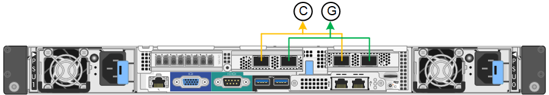
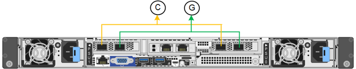

= ネットワークリンクを設定する
:allow-uri-read: 
:icons: font
:imagesdir: ../media/

[role="lead"]
アプライアンスをグリッドネットワーク、クライアントネットワーク、および管理ネットワークに接続するために使用するポートのネットワークリンクを設定できます。リンク速度およびポートボンディングモードとネットワークボンディングモードを設定できます。

TIP: ConfigBuilderを使用してJSONファイルを生成する場合は、ネットワークリンクを自動的に設定できます。を参照してください link:automating-appliance-installation-and-configuration.html["アプライアンスのインストールと設定を自動化"]。

.作業を開始する前に
* これで完了です link:obtaining-additional-equipment-and-tools.html["追加機器を入手した"] ケーブルの種類とリンク速度に応じて必要です。
* 使用するリンク速度に基づいて、正しいトランシーバをポートに取り付けておきます。
* 選択した速度をサポートするスイッチにネットワークポートを接続しておきます。

アグリゲートポートボンディングモード、 LACP ネットワークボンディングモード、または VLAN タギングを使用する場合

* アプライアンスのネットワークポートを、 VLAN と LACP をサポートするスイッチに接続しておきます。
* 複数のスイッチを LACP ボンドに加える場合は、 Multi-Chassis Link Aggregation （ MLAG ）グループまたは同等の機能をサポートするスイッチを使用します。
* VLAN 、 LACP 、 MLAG などを使用するようにスイッチを設定する方法について理解しておく必要があります。
* 各ネットワークに使用する一意の VLAN タグを確認しておきます。この VLAN タグが各ネットワークパケットに追加され、ネットワークトラフィックが正しいネットワークにルーティングされます。

.このタスクについて
デフォルト以外の設定を使用する場合にのみ、 Link Configuration ページで設定を行う必要があります。

NOTE: LACP送信ハッシュポリシーはlayer2+3です。

次の図と表に、各アプライアンスのポートボンディングモードとネットワークボンディングモードのオプションをまとめます。詳細については、次を参照してください。

* link:gathering-installation-information-sg100-and-sg1000.html#port-bond-modes["ポートボンディングモード（SG1000およびSG100）"]
* link:gathering-installation-information-sg5700.html#port-bond-modes["ポートボンディングモード（E5700SG）"]
* link:gathering-installation-information-sg6000.html#port-bond-modes["ポートボンディングモード（SG6000-CN）"]
* link:gathering-installation-information-sg6100.html#port-bond-modes["ポートボンディングモード（SGF6112）"]

[role="tabbed-block"]
====
.SG100およびSG1000
--
Fixedポートボンディングモード（デフォルト）::
+
--
次の図では、SG1000またはSG100の4つのネットワークポートがFixedポートボンディングモードでボンディングされています（デフォルトの構成）。

SG1000の場合：

image::../media/sg1000_fixed_port.png[SG1000のFixedポートボンディングモード]

SG100 ：

image::../media/sg100_fixed_port_draft.png[SG100 Fixed ポートボンディングモード]

[cols="1a,3a"]
|===
| コールアウト | ボンディングされるポート 

 a| 
C
 a| 
このネットワークを使用する場合、ポート 1 とポート 3 がクライアントネットワーク用にボンディングされます。

 a| 
G
 a| 
ポート 2 とポート 4 がグリッドネットワーク用にボンディングされます。

|===
次の表に、 4 つのネットワークポートを設定するためのオプションをまとめます。デフォルト以外の設定を使用する場合にのみ、 Link Configuration ページで設定を行う必要があります。

[cols="1a,2a,2a"]
|===
| ネットワークボンディングモード | クライアントネットワークが無効な場合（デフォルト） | クライアントネットワークが有効になりました 

 a| 
Active-Backup （デフォルト）
 a| 
* ポート 2 と 4 がグリッドネットワークにアクティブ / バックアップボンドを使用します。
* ポート1と3は使用されません。
* VLAN タグはオプションです。

 a| 
* ポート 2 と 4 がグリッドネットワークにアクティブ / バックアップボンドを使用します。
* ポート 1 と 3 がクライアントネットワークに Active-Backup ボンドを使用します。
* ネットワーク管理者用に、両方のネットワークに VLAN タグを指定できます。

 a| 
LACP （ 802.3ad ）
 a| 
* ポート 2 と 4 がグリッドネットワークに LACP ボンドを使用します。
* ポート1と3は使用されません。
* VLAN タグはオプションです。

 a| 
* ポート 2 と 4 がグリッドネットワークに LACP ボンドを使用します。
* ポート 1 と 3 がクライアントネットワークに LACP ボンドを使用します。
* ネットワーク管理者用に、両方のネットワークに VLAN タグを指定できます。

|===
--
Aggregate ポートボンディングモード::
+
--
次の図では、4つのネットワークポートがアグリゲートポートボンディングモードでボンディングされています。

SG1000の場合：

image::../media/sg1000_aggregate_ports.png[Aggregate ポートボンディングモード - SG1000]

SG100 ：

image::../media/sg100_aggregate_ports.png[アグリゲートポートボンディングモード： SG100]

[cols="1a,3a"]
|===
| コールアウト | ボンディングされるポート 

 a| 
1.
 a| 
4 つのポートすべてを 1 つの LACP ボンドにグループ化して、すべてのポートをグリッドネットワークとクライアントネットワークのトラフィックに使用できるようにします。

|===
次の表に、 4 つのネットワークポートを設定するためのオプションをまとめます。デフォルト以外の設定を使用する場合にのみ、 Link Configuration ページで設定を行う必要があります。

[cols="1a,2a,2a"]
|===
| ネットワークボンディングモード | クライアントネットワークが無効な場合（デフォルト） | クライアントネットワークが有効になりました 

 a| 
LACP （ 802.3ad ）のみ
 a| 
* ポート 1~4 がグリッドネットワークに単一の LACP ボンドを使用します。
* 単一の VLAN タグでグリッドネットワークのパケットが識別されます。

 a| 
* ポート 1~4 がグリッドネットワークとクライアントネットワークに単一の LACP ボンドを使用します。
* 2 つの VLAN タグで、グリッドネットワークのパケットとクライアントネットワークのパケットを分離できます。

|===
--
管理ポート用のActive-Backupネットワークボンディングモード::
+
--
次の図では、アプライアンスの2つの1GbE管理ポートが管理ネットワーク用にActive-Backupネットワークボンディングモードでボンディングされています。

SG1000の場合：

image::../media/sg1000_bonded_management_ports.png[SG1000 のボンディングされている管理ネットワークポート]

SG100 ：

image::../media/sg100_bonded_management_ports.png[ボンディングされている管理ネットワークのポート SG100]

--

--
.SG5700
--
Fixedポートボンディングモード（デフォルト）::
+
--
次の図では、 4 つの 10 / 25GbE ポートが Fixed ポートボンディングモードでボンディングされています（デフォルトの構成）。

image::../media/e5700sg_fixed_port.gif[E5700SG コントローラの 10 / 25GbE ポートが固定モードでボンディングされた状態を示す図]

[cols="1a,3a"]
|===
| コールアウト | ボンディングされるポート 

 a| 
C
 a| 
このネットワークを使用する場合、ポート 1 とポート 3 がクライアントネットワーク用にボンディングされます。

 a| 
G
 a| 
ポート 2 とポート 4 がグリッドネットワーク用にボンディングされます。

|===
次の表に、 4 つの 10 / 25GbE ポートを設定するためのオプションをまとめます。デフォルト以外の設定を使用する場合にのみ、 Link Configuration ページで設定を行う必要があります。

[cols="1a,2a,2a"]
|===
| ネットワークボンディングモード | クライアントネットワークが無効な場合（デフォルト） | クライアントネットワークが有効になりました 

 a| 
Active-Backup （デフォルト）
 a| 
* ポート 2 と 4 がグリッドネットワークにアクティブ / バックアップボンドを使用します。
* ポート1と3は使用されません。
* VLAN タグはオプションです。

 a| 
* ポート 2 と 4 がグリッドネットワークにアクティブ / バックアップボンドを使用します。
* ポート 1 と 3 がクライアントネットワークに Active-Backup ボンドを使用します。
* ネットワーク管理者用に、両方のネットワークに VLAN タグを指定できます。

 a| 
LACP （ 802.3ad ）
 a| 
* ポート 2 と 4 がグリッドネットワークに LACP ボンドを使用します。
* ポート1と3は使用されません。
* VLAN タグはオプションです。

 a| 
* ポート 2 と 4 がグリッドネットワークに LACP ボンドを使用します。
* ポート 1 と 3 がクライアントネットワークに LACP ボンドを使用します。
* ネットワーク管理者用に、両方のネットワークに VLAN タグを指定できます。

|===
--
Aggregate ポートボンディングモード::
+
--
次の図では、 4 つの 10 / 25GbE ポートがアグリゲートポートボンディングモードでボンディングされています。

image::../media/e5700sg_aggregate_port.gif[E5700SG コントローラの 10 / 25GbE ポートがアグリゲートモードでボンディングされた状態を示す図]

[cols="1a,3a"]
|===
| コールアウト | ボンディングされるポート 

 a| 
1.
 a| 
4 つのポートすべてを 1 つの LACP ボンドにグループ化して、すべてのポートをグリッドネットワークとクライアントネットワークのトラフィックに使用できるようにします。

|===
次の表に、 4 つの 10 / 25GbE ポートを設定するためのオプションをまとめます。デフォルト以外の設定を使用する場合にのみ、 Link Configuration ページで設定を行う必要があります。

[cols="1a,2a,2a"]
|===
| ネットワークボンディングモード | クライアントネットワークが無効な場合（デフォルト） | クライアントネットワークが有効になりました 

 a| 
LACP （ 802.3ad ）のみ
 a| 
* ポート 1~4 がグリッドネットワークに単一の LACP ボンドを使用します。
* 単一の VLAN タグでグリッドネットワークのパケットが識別されます。

 a| 
* ポート 1~4 がグリッドネットワークとクライアントネットワークに単一の LACP ボンドを使用します。
* 2 つの VLAN タグで、グリッドネットワークのパケットとクライアントネットワークのパケットを分離できます。

|===
--
管理ポート用のActive-Backupネットワークボンディングモード::
+
--
この図では、 E5700SG コントローラの 2 つの 1GbE 管理ポートが管理ネットワーク用に Active-Backup ネットワークボンディングモードでボンディングされています。

image::../media/e5700sg_bonded_management_ports.gif[E5700SGのボンディングされた管理ポート]

--

--
.SG6000を使用します
--
Fixedポートボンディングモード（デフォルト）::
+
--
次の図では、4つのネットワークポートがFixedポートボンディングモードでボンディングされています（デフォルトの構成）。

[cols="1a,3a"]
|===
| コールアウト | ボンディングされるポート 

 a| 
C
 a| 
このネットワークを使用する場合、ポート 1 とポート 3 がクライアントネットワーク用にボンディングされます。

 a| 
G
 a| 
ポート 2 とポート 4 がグリッドネットワーク用にボンディングされます。

|===
次の表は、ネットワークポートを設定するためのオプションをまとめたものです。デフォルト以外の設定を使用する場合にのみ、 Link Configuration ページで設定を行う必要があります。

[cols="1a,3a,3a"]
|===
| ネットワークボンディングモード | クライアントネットワークが無効な場合（デフォルト） | クライアントネットワークが有効になりました 

 a| 
Active-Backup （デフォルト）
 a| 
* ポート 2 と 4 がグリッドネットワークにアクティブ / バックアップボンドを使用します。
* ポート1と3は使用されません。
* VLAN タグはオプションです。

 a| 
* ポート 2 と 4 がグリッドネットワークにアクティブ / バックアップボンドを使用します。
* ポート 1 と 3 がクライアントネットワークに Active-Backup ボンドを使用します。
* ネットワーク管理者用に、両方のネットワークに VLAN タグを指定できます。

 a| 
LACP （ 802.3ad ）
 a| 
* ポート 2 と 4 がグリッドネットワークに LACP ボンドを使用します。
* ポート1と3は使用されません。
* VLAN タグはオプションです。

 a| 
* ポート 2 と 4 がグリッドネットワークに LACP ボンドを使用します。
* ポート 1 と 3 がクライアントネットワークに LACP ボンドを使用します。
* ネットワーク管理者用に、両方のネットワークに VLAN タグを指定できます。

|===
--
Aggregate ポートボンディングモード::
+
--
次の図では、 4 つのネットワークポートが Aggregate ポートボンディングモードでボンディングされています。

image::../media/sg6000_cn_aggregate_port.gif[SG6000-CN コントローラのネットワークポートが Aggregate モードでボンディングされた状態を示す図]

[cols="1a,3a"]
|===
| コールアウト | ボンディングされるポート 

 a| 
1.
 a| 
4 つのポートすべてを 1 つの LACP ボンドにグループ化して、すべてのポートをグリッドネットワークとクライアントネットワークのトラフィックに使用できるようにします。

|===
次の表は、ネットワークポートを設定するためのオプションをまとめたものです。デフォルト以外の設定を使用する場合にのみ、 Link Configuration ページで設定を行う必要があります。

[cols="1a,3a,3a"]
|===
| ネットワークボンディングモード | クライアントネットワークが無効な場合（デフォルト） | クライアントネットワークが有効になりました 

 a| 
LACP （ 802.3ad ）のみ
 a| 
* ポート 1~4 がグリッドネットワークに単一の LACP ボンドを使用します。
* 単一の VLAN タグでグリッドネットワークのパケットが識別されます。

 a| 
* ポート 1~4 がグリッドネットワークとクライアントネットワークに単一の LACP ボンドを使用します。
* 2 つの VLAN タグで、グリッドネットワークのパケットとクライアントネットワークのパケットを分離できます。

|===
--
管理ポート用のActive-Backupネットワークボンディングモード::
+
--
次の図では、 SG6000-CN コントローラの 2 つの 1GbE 管理ポートが管理ネットワーク用に Active-Backup ネットワークボンディングモードでボンディングされています。

image::../media/sg6000_cn_bonded_managemente_ports.png[ボンディングされている管理ネットワークのポート]

--

--
.SGF6112を参照してください
--
Fixedポートボンディングモード（デフォルト）::
+
--
次の図では、4つのネットワークポートがFixedポートボンディングモードでボンディングされています（デフォルトの構成）。

[cols="1a,3a"]
|===
| コールアウト | ボンディングされるポート 

 a| 
C
 a| 
このネットワークを使用する場合、ポート 1 とポート 3 がクライアントネットワーク用にボンディングされます。

 a| 
G
 a| 
ポート 2 とポート 4 がグリッドネットワーク用にボンディングされます。

|===
次の表は、ネットワークポートを設定するためのオプションをまとめたものです。デフォルト以外の設定を使用する場合にのみ、 Link Configuration ページで設定を行う必要があります。

[cols="1a,2a,2a"]
|===
| ネットワークボンディングモード | クライアントネットワークが無効な場合（デフォルト） | クライアントネットワークが有効になりました 

 a| 
Active-Backup （デフォルト）
 a| 
* ポート 2 と 4 がグリッドネットワークにアクティブ / バックアップボンドを使用します。
* ポート1と3は使用されません。
* VLAN タグはオプションです。

 a| 
* ポート 2 と 4 がグリッドネットワークにアクティブ / バックアップボンドを使用します。
* ポート 1 と 3 がクライアントネットワークに Active-Backup ボンドを使用します。
* ネットワーク管理者用に、両方のネットワークに VLAN タグを指定できます。

 a| 
LACP （ 802.3ad ）
 a| 
* ポート 2 と 4 がグリッドネットワークに LACP ボンドを使用します。
* ポート1と3は使用されません。
* VLAN タグはオプションです。

 a| 
* ポート 2 と 4 がグリッドネットワークに LACP ボンドを使用します。
* ポート 1 と 3 がクライアントネットワークに LACP ボンドを使用します。
* ネットワーク管理者用に、両方のネットワークに VLAN タグを指定できます。

|===
--
Aggregate ポートボンディングモード::
+
--
次の図では、4つのネットワークポートがアグリゲートポートボンディングモードでボンディングされています。

image::../media/sgf6112_aggregate_ports.png[SGF6112アグリゲートポートボンディングモード]

[cols="1a,3a"]
|===
| コールアウト | ボンディングされるポート 

 a| 
1.
 a| 
4 つのポートすべてを 1 つの LACP ボンドにグループ化して、すべてのポートをグリッドネットワークとクライアントネットワークのトラフィックに使用できるようにします。

|===
次の表は、ネットワークポートを設定するためのオプションをまとめたものです。デフォルト以外の設定を使用する場合にのみ、 Link Configuration ページで設定を行う必要があります。

[cols="1a,2a,2a"]
|===
| ネットワークボンディングモード | クライアントネットワークが無効な場合（デフォルト） | クライアントネットワークが有効になりました 

 a| 
LACP （ 802.3ad ）のみ
 a| 
* ポート 1~4 がグリッドネットワークに単一の LACP ボンドを使用します。
* 単一の VLAN タグでグリッドネットワークのパケットが識別されます。

 a| 
* ポート 1~4 がグリッドネットワークとクライアントネットワークに単一の LACP ボンドを使用します。
* 2 つの VLAN タグで、グリッドネットワークのパケットとクライアントネットワークのパケットを分離できます。

|===
--
管理ポート用のActive-Backupネットワークボンディングモード::
+
--
次の図では、SGF6112の2つの1GbE管理ポートが管理ネットワーク用にActive-Backupネットワークボンディングモードでボンディングされています。

image::../media/sgf6112_bonded_management_ports.png[SGF6112のボンディングされている管理ネットワークのポート]

--

--
====
.手順
. StorageGRID アプライアンスインストーラのメニューバーから、 *Configure Networking *>*Link Configuration * をクリックします。
+
Network Link Configuration ページには、アプライアンスの図と、ネットワークポートおよび管理ポートの番号が表示されます。

+
Link Statusテーブルには、番号付きポートのリンク状態、リンク速度、およびその他の統計情報が表示されます。

+
このページに初めてアクセスしたときの動作は次のとおりです。

+
** * リンク速度 * は * 自動 * に設定されています。
** * ポートボンディングモード * は「 * Fixed 」に設定されます。
** * グリッドネットワークの場合、ネットワークボンディングモード * が「アクティブ / バックアップ」に設定されます。
** 管理ネットワーク * が有効になっており、ネットワークボンディングモードが * Independent * に設定されています。
** クライアントネットワーク * が無効になっています。

. [* Link speed * （リンク速度 * ） ] ドロップダウンリストから、ネットワークポートのリンク速度を選択します。
+
グリッドネットワークとクライアントネットワークに使用するネットワークスイッチも、この速度をサポートし、この速度に対応するように設定する必要があります。設定されたリンク速度に適したアダプタまたはトランシーバを使用する必要があります。このオプションはリンク速度と前方誤り訂正（ FEC ）モードの両方をリンクパートナーとネゴシエートするため、可能な場合は自動リンク速度を使用します。

+
SG6000またはSG5700ネットワークポートに25GbEのリンク速度を使用する場合は、次の手順を実行します。

+
** SFP28トランシーバとSFP28 Twinaxケーブルまたは光ケーブルを使用します。
** SG5700の場合は、[リンク速度]*ドロップダウンリストから* 25GbE *を選択します。
** SG6000の場合、[リンク速度]ドロップダウンリストから*[自動]*を選択します。

. 使用する StorageGRID ネットワークを有効または無効にします。
+
グリッドネットワークは必須です。このネットワークを無効にすることはできません。

+
.. アプライアンスが管理ネットワークに接続されていない場合は、管理ネットワークの*[ネットワークを有効にする]*チェックボックスをオフにします。
.. アプライアンスがクライアントネットワークに接続されている場合は、クライアントネットワークの*[ネットワークを有効にする]*チェックボックスを選択します。
+
これで、データ NIC ポートでのクライアントネットワークの設定が表示されます。

. 表を参照して、ポートボンディングモードとネットワークボンディングモードを設定します。
+
次の例では、次のよう

+
** * グリッドネットワークとクライアントネットワークでアグリゲート * と * LACP * を選択。各ネットワークに一意の VLAN タグを指定する必要があります。値は 0~4095 の間で選択できます。
** * 管理ネットワーク用に選択されたアクティブ / バックアップ * 。
+
image::../media/sg1000_network_link_configuration_aggregate.png[Network Link Configuration Aggregate の値]

. 選択に問題がなければ、 * 保存 * をクリックします。
+

NOTE: 接続しているネットワークまたはリンクを変更すると、接続が失われる可能性があります。1分以内に再接続されない場合は、アプライアンスに割り当てられている他のIPアドレスのいずれかを使用してStorageGRID アプライアンスインストーラのURLを再入力します：+
`*https://_appliance_IP_:8443*`

