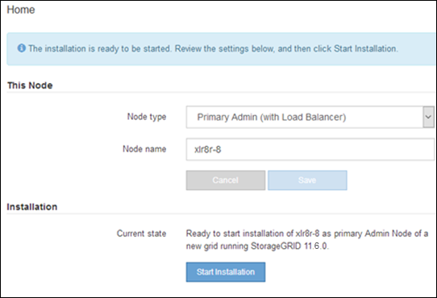

= サービスアプライアンスノードを導入する
:allow-uri-read: 
:icons: font
:imagesdir: ../media/

[role="lead"]
サービスアプライアンスは、プライマリ管理ノード、非プライマリ管理ノード、またはゲートウェイノードとして導入できます。すべてのサービスアプライアンスは、ゲートウェイノードと管理ノード（プライマリまたは非プライマリ）として同時に動作できます。

== サービスアプライアンスをプライマリ管理ノードとして導入する

サービスアプライアンスをプライマリ管理ノードとして導入する場合は、アプライアンスに組み込みの StorageGRID アプライアンスインストーラを使用して StorageGRID ソフトウェアをインストールするか、インストールするソフトウェアバージョンをアップロードします。プライマリ管理ノードは、他のタイプのアプライアンスノードをインストールする前にインストールして設定する必要があります。プライマリ管理ノードは、グリッドネットワーク、およびオプションの管理ネットワークとクライアントネットワーク（いずれかまたは両方が設定されている場合）に接続できます。

.作業を開始する前に
* アプライアンスをラックまたはキャビネットに設置し、ネットワークに接続し、電源を投入しておきます。
* StorageGRID アプライアンスインストーラを使用して、アプライアンスのネットワークリンク、 IP アドレス、ポートの再マッピング（必要な場合）を設定しておきます。
* を搭載したサービスラップトップを用意します https://docs.netapp.com/us-en/storagegrid-118/admin/web-browser-requirements.html["サポートされている Web ブラウザ"^]。
* アプライアンスに割り当てられている IP アドレスのいずれかを確認しておきます。接続されているどの StorageGRID ネットワークの IP アドレスでも使用できます。

.このタスクについて
アプライアンスプライマリ管理ノードに StorageGRID をインストールするには、次の手順を実行します。

* StorageGRID ソフトウェアをインストールするには、 StorageGRID アプライアンスインストーラを使用します。別のバージョンのソフトウェアをインストールする場合は、まず StorageGRID アプライアンスインストーラを使用してソフトウェアをアップロードします。
* ソフトウェアがインストールされるまで待ちます。
* ソフトウェアがインストールされると、アプライアンスが自動的にリブートされます。

.手順
. ブラウザを開き、アプライアンスの IP アドレスを入力します。[+]
`*https://_services_appliance_IP_:8443*`
+
StorageGRID アプライアンスインストーラのホームページが表示されます。

. [ このノード * ] セクションで、 [ * プライマリ管理者 * ] を選択します。
. [* Node name* （ノード名 * ） ] フィールドに、このアプライアンスノードに使用する名前を入力し、 [ * Save * （保存） ] をクリックします。
+
このノード名は、 StorageGRID システムでこのアプライアンスノードに割り当てられ、グリッドノードは Grid Manager の Grid Nodes ページに表示されます。

. 別のバージョンの StorageGRID ソフトウェアをインストールする必要がある場合は、次の手順を実行します。
+
.. インストールアーカイブをダウンロードします。
+
https://mysupport.netapp.com/site/products/all/details/storagegrid-appliance/downloads-tab["ネットアップのダウンロード：StorageGRID アプライアンス"^]

.. アーカイブを展開します。
.. StorageGRID アプライアンス・インストーラから、 * アドバンスト * > * StorageGRID ソフトウェアのアップロード * を選択します。
.. [ 削除 ] をクリックして、現在のソフトウェアパッケージを削除します。
+
image::../media/appliance_installer_rmv_current_software.png[アプライアンスインストーラ - 現在のソフトウェアを削除します]

.. ダウンロードして解凍したソフトウェアパッケージの [*Browse*]( 参照 ) をクリックし、チェックサムファイルの [*Browse*]( 参照 ) をクリックします。
+
image::../media/appliance_installer_upload_sg_software.png[アプライアンスインストーラ - SG ソフトウェアのアップロード]

.. ホームページに戻るには、「 * Home * 」（ホーム）を選択します。

. 現在の状態が「 Ready to start installation of primary Admin Node name with software version x.y' 」であり、「 Start Installation * 」ボタンが有効になっていることを確認します。
+

NOTE: 管理ノードアプライアンスをノードのクローニングターゲットとして導入する場合は、ここで導入プロセスを停止して、に進みます link:../commonhardware/appliance-node-cloning-procedure.html["ノードクローニングの手順"]。

. StorageGRID アプライアンスインストーラのホームページで、 * インストールの開始 * をクリックします。
+

+
現在の状態が「 Installation is in progress 」に変わり、「 Monitor Installation 」ページが表示されます。

+

NOTE: モニタのインストールページに手動でアクセスする必要がある場合は、メニューバーから * モニタのインストール * をクリックします。

== ゲートウェイノードまたは非プライマリ管理ノードとしてサービスアプライアンスを導入する

サービスアプライアンスをゲートウェイノードまたは非プライマリ管理ノードとして導入する場合は、アプライアンスに搭載されている StorageGRID アプライアンスインストーラを使用します。

.作業を開始する前に
* アプライアンスをラックまたはキャビネットに設置し、ネットワークに接続し、電源を投入しておきます。
* StorageGRID アプライアンスインストーラを使用して、アプライアンスのネットワークリンク、 IP アドレス、ポートの再マッピング（必要な場合）を設定しておきます。
* StorageGRID システムのプライマリ管理ノードを導入しておきます。
* StorageGRID アプライアンスインストーラの IP 設定ページに表示されるすべてのグリッドネットワークサブネットが、プライマリ管理ノードのグリッドネットワークサブネットリストで定義されている。
* を搭載したサービスラップトップを用意します https://docs.netapp.com/us-en/storagegrid-118/admin/web-browser-requirements.html["サポートされている Web ブラウザ"^]。
* アプライアンスに割り当てられている IP アドレスを確認しておきます。接続されているどの StorageGRID ネットワークの IP アドレスでも使用できます。

.このタスクについて
StorageGRID をサービスアプライアンスノードにインストールするには、次の手順を実行します。

* プライマリ管理ノードの IP アドレスおよびアプライアンスノードの名前を指定または確認します。
* インストールを開始し、ソフトウェアがインストールされるまで待ちます。
+
アプライアンスゲートウェイノードのインストールが一時停止します。インストールを再開するには、 Grid Manager にサインインし、グリッドノードをすべて承認し、 StorageGRID のインストールプロセスを完了します。非プライマリ管理ノードをインストールする場合、承認は必要ありません。

NOTE: SG100とSG1000サービスアプライアンスを同じサイトに導入しないでください。パフォーマンスが予測不能になる可能性があります

NOTE: 一度に複数のアプライアンスノードを導入する必要がある場合は、インストールプロセスを自動化できます。を参照してください link:automating-appliance-installation-and-configuration.html["アプライアンスのインストールと設定を自動化"]。

.手順
. ブラウザを開き、アプライアンスの IP アドレスを入力します。
+
`*https://_Controller_IP_:8443*`

+
StorageGRID アプライアンスインストーラのホームページが表示されます。

. プライマリ管理ノードの接続セクションで、プライマリ管理ノードの IP アドレスを指定する必要があるかどうかを確認します。
+
このデータセンターに他のノードがすでにインストールされている場合は、プライマリ管理ノードまたは ADMIN_IP が設定された少なくとも 1 つのグリッドノードが同じサブネットにあるという想定で、 StorageGRID アプライアンスインストーラがこの IP アドレスを自動的に検出します。

. この IP アドレスが表示されない場合や変更する必要がある場合は、アドレスを指定します。
+
[cols="1a,2a"]
|===
| オプション | 説明 

 a| 
IP を手動で入力します
 a| 
.. [管理ノードの検出を有効にする]*チェックボックスをオフにします。
.. IP アドレスを手動で入力します。
.. [ 保存（ Save ） ] をクリックします。
.. 新しい IP アドレスの接続状態が READY になるまで待ちます。

 a| 
接続されたすべてのプライマリ管理ノードの自動検出
 a| 
.. [管理ノードの検出を有効にする]*チェックボックスを選択します。
.. 検出された IP アドレスのリストが表示されるまで待ちます。
.. このアプライアンスストレージノードを導入するグリッドのプライマリ管理ノードを選択します。
.. [ 保存（ Save ） ] をクリックします。
.. 新しい IP アドレスの接続状態が READY になるまで待ちます。

|===
. [ノード名]フィールドに、このアプライアンスノードに使用するシステム名を入力し、*[保存]*をクリックします。
+
ここに表示される名前は、アプライアンスノードのシステム名です。システム名は内部StorageGRID 処理に必要であり、変更することはできません。

. 別のバージョンの StorageGRID ソフトウェアをインストールする必要がある場合は、次の手順を実行します。
+
.. インストールアーカイブをダウンロードします。
+
https://mysupport.netapp.com/site/products/all/details/storagegrid-appliance/downloads-tab["ネットアップのダウンロード：StorageGRID アプライアンス"^]

.. アーカイブを展開します。
.. StorageGRID アプライアンス・インストーラから、 * アドバンスト * > * StorageGRID ソフトウェアのアップロード * を選択します。
.. [ 削除 ] をクリックして、現在のソフトウェアパッケージを削除します。
+
image::../media/appliance_installer_rmv_current_software.png[アプライアンスインストーラ - 現在のソフトウェアを削除します]

.. ダウンロードして解凍したソフトウェアパッケージの [*Browse*]( 参照 ) をクリックし、チェックサムファイルの [*Browse*]( 参照 ) をクリックします。
+
image::../media/appliance_installer_upload_sg_software.png[アプライアンスインストーラ - SG ソフトウェアのアップロード]

.. ホームページに戻るには、「 * Home * 」（ホーム）を選択します。

. Installation（インストール）セクションで、現在の状態がのインストール開始準備完了（Ready to start installation）であることを確認します `_node name_` をプライマリ管理ノードでグリッドに追加します `_admin_ip_` "*インストールの開始*ボタンが有効になっていることを確認します。
+
[Start Installation* （インストールの開始） ] ボタンが有効になっていない場合は、ネットワーク設定またはポート設定の変更が必要になることがあります。手順については、アプライアンスのメンテナンス手順を参照してください。

. StorageGRID アプライアンスインストーラのホームページで、 * インストールの開始 * をクリックします。
+
image::../media/appliance_installer_services_appliance_non_pan.png[Appliance Installer Home - 非プライマリ管理ノードをインストールします]

+
現在の状態が「 Installation is in progress 」に変わり、「 Monitor Installation 」ページが表示されます。

+

NOTE: モニタのインストールページに手動でアクセスする必要がある場合は、メニューバーから * モニタのインストール * をクリックします。

. グリッドに複数のアプライアンスノードがある場合は、アプライアンスごとに上記の手順を繰り返します。

