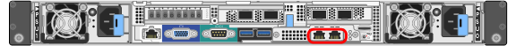

= ネットワーク情報の収集（SG6000）
:allow-uri-read: 
:icons: font
:imagesdir: ../media/

[role="lead"]
次の表を使用して、アプライアンスに接続する各ネットワークに必要な情報を記録します。これらの値は、ハードウェアの設置と設定に必要です。

TIP: 表を使用する代わりに、ConfigBuilderに付属のワークブックを使用してください。ConfigBuilderワークブックを使用すると、システム情報をアップロードしてJSONファイルを生成し、StorageGRID アプライアンスインストーラで一部の設定手順を自動的に実行できます。を参照してください link:automating-appliance-installation-and-configuration.html["アプライアンスのインストールと設定を自動化"]。

== ストレージコントローラの SANtricity System Manager に接続するために必要な情報

アプライアンスの両方のストレージコントローラ（E2800シリーズコントローラまたはEF570コントローラ）を、SANtricity System Managerで使用する管理ネットワークに接続します。コントローラは次のように各アプライアンスに配置されています。

* SG6060とSG6060X：コントローラAが上部に、コントローラBが下部に配置されています。
* SGF6024 ：コントローラ A が左側、コントローラ B が右側にあります。

[cols="2a,1a,1a"]
|===
| 必要な情報 | コントローラ A の値 | コントローラ B の値 

 a| 
管理ポート 1 （コントローラの P1 ポート）に接続するイーサネットスイッチポート
 a| 
 a| 

 a| 
管理ポート 1 の MAC アドレス（ポート P1 のラベルに記載）
 a| 
 a| 

 a| 
DHCP によって管理ポート 1 に割り当てられた IP アドレス（電源投入後に使用可能な場合）

* 注： * ストレージコントローラに接続するネットワークに DHCP サーバがある場合、ネットワーク管理者は MAC アドレスを使用して DHCP サーバによって割り当てられた IP アドレスを特定できます。
 a| 
 a| 

 a| 
管理ネットワークでアプライアンスに使用する静的 IP アドレス
 a| 
IPv4 の場合：

* IPv4 アドレス：
* サブネットマスク：
* ゲートウェイ

IPv6の場合：

* IPv6アドレス：
* ルーティング可能な IP アドレス：
* ストレージコントローラルータの IP アドレス：

 a| 
IPv4 の場合：

* IPv4 アドレス：
* サブネットマスク：
* ゲートウェイ

IPv6の場合：

* IPv6アドレス：
* ルーティング可能な IP アドレス：
* ストレージコントローラルータの IP アドレス：

 a| 
IP アドレスの形式
 a| 
1 つ選択してください：

* IPv4
* IPv6

 a| 
1 つ選択してください：

* IPv4
* IPv6

 a| 
速度と二重モード

* 注： SANtricity システムマネージャ管理ネットワークのイーサネットスイッチが自動ネゴシエーションに設定されていることを確認してください。
 a| 
次の値でなければなりません

* Autonegotiate （デフォルト）

 a| 
次の値でなければなりません

* Autonegotiate （デフォルト）

|===

== SG6000-CNコントローラを管理ネットワークに接続するために必要な情報

StorageGRID の管理ネットワークは、システムの管理とメンテナンスに使用するオプションのネットワークです。アプライアンスは、 SG6000-CN コントローラの次の 1GbE 管理ポートを使用して管理ネットワークに接続します。

[cols="2a,1a"]
|===
| 必要な情報 | あなたの価値 

 a| 
管理ネットワークが有効になりました
 a| 
1 つ選択してください：

* いいえ
* ○（デフォルト）

 a| 
ネットワークボンディングモード
 a| 
1 つ選択してください：

* Independent （デフォルト）
* アクティブ / バックアップ

 a| 
図の赤い丸で示された左側のポートのスイッチポート（ Independent ネットワークボンディングモードのデフォルトのアクティブポート）
 a| 

 a| 
図の赤い丸で示されている右側のポートのスイッチポート（ Active-Backup ネットワークボンディングモードの場合のみ）
 a| 

 a| 
管理ネットワークポートの MAC アドレス

* 注： SG6000-CN コントローラの前面にある MAC アドレスラベルには、 BMC 管理ポートの MAC アドレスが記載されています。管理ネットワークポートの MAC アドレスを特定するには、ラベルに記載された 16 進数に * 2 * を追加する必要があります。たとえば、ラベルに記載されている MAC アドレスの末尾が * 09 * の場合、管理ポートの MAC アドレスの末尾は * 0B * となります。ラベルに記載された MAC アドレスの末尾が * （ _y_） FF* の場合、管理ポートの MAC アドレスの末尾は * （ _y_+1 ） 01 * となります。この計算を簡単に行うには、 Windows で Calculator を開き、 Programmer モードに設定して Hex を選択し、 MAC アドレスを入力してから、 *+2=* と入力します。
 a| 

 a| 
DHCP によって割り当てられた管理ネットワークポートの IP アドレス（電源投入後に使用可能な場合）

* 注： * DHCP によって割り当てられた IP アドレスは、 MAC アドレスを使用して特定できます。
 a| 
* IPv4 アドレス（ CIDR ）：
* ゲートウェイ

 a| 
管理ネットワークでアプライアンスストレージノードに使用する静的 IP アドレス

* 注： * ネットワークにゲートウェイがない場合は、同じ静的 IPv4 アドレスをゲートウェイに指定してください。
 a| 
* IPv4 アドレス（ CIDR ）：
* ゲートウェイ

 a| 
管理ネットワークのサブネット（ CIDR ）
 a| 

|===

== SG6000-CNコントローラの10 / 25GbEポートの接続と設定に必要な情報

SG6000-CN コントローラの 4 つの 10 / 25GbE ポートは、 StorageGRID のグリッドネットワーク、およびオプションのクライアントネットワークに接続します。

[cols="2a,1a"]
|===
| 必要な情報 | あなたの価値 

 a| 
リンク速度
 a| 
1 つ選択してください：

* auto （デフォルト）
* 10GbE の場合
* 25GbE

 a| 
ポートボンディングモード
 a| 
1 つ選択してください：

* Fixed （デフォルト）
* アグリゲート

 a| 
ポート 1 のスイッチポート（固定モードのクライアントネットワーク）
 a| 

 a| 
ポート 2 のスイッチポート（ Fixed モードのグリッドネットワーク）
 a| 

 a| 
ポート3のスイッチポート（固定モードのクライアントネットワーク）
 a| 

 a| 
ポート4のスイッチポート（固定モードのグリッドネットワーク）
 a| 

|===

== SG6000-CNコントローラをグリッドネットワークに接続するために必要な情報

StorageGRID のグリッドネットワークは、内部のすべての StorageGRID トラフィックに使用される必須のネットワークです。アプライアンスは、 SG6000-CN コントローラの 10 / 25GbE ポートを使用してグリッドネットワークに接続します。

[cols="2a,1a"]
|===
| 必要な情報 | あなたの価値 

 a| 
ネットワークボンディングモード
 a| 
1 つ選択してください：

* Active-Backup （デフォルト）
* LACP （ 802.3ad ）

 a| 
VLAN タギングが有効です
 a| 
1 つ選択してください：

* いいえ（デフォルト）
* はい。

 a| 
VLANタグ（VLANタギングが有効な場合）
 a| 
0~4095 の値を入力してください：

 a| 
電源投入後に使用可能な場合、 DHCP によってグリッドネットワークに割り当てられた IP アドレス
 a| 
* IPv4 アドレス（ CIDR ）：
* ゲートウェイ

 a| 
グリッドネットワークでアプライアンスストレージノードに使用する静的 IP アドレス

* 注： * ネットワークにゲートウェイがない場合は、同じ静的 IPv4 アドレスをゲートウェイに指定してください。
 a| 
* IPv4 アドレス（ CIDR ）：
* ゲートウェイ

 a| 
グリッドネットワークのサブネット（ CIDRs ）
 a| 

|===

== SG6000-CNコントローラをクライアントネットワークに接続するために必要な情報

StorageGRID のクライアントネットワークは、一般にグリッドへのクライアントプロトコルアクセスを可能にするために使用する、オプションのネットワークです。アプライアンスは、 SG6000-CN コントローラの 10 / 25GbE ポートを使用してクライアントネットワークに接続します。

[cols="2a,1a"]
|===
| 必要な情報 | あなたの価値 

 a| 
クライアントネットワークが有効になりました
 a| 
1 つ選択してください：

* いいえ（デフォルト）
* はい。

 a| 
ネットワークボンディングモード
 a| 
1 つ選択してください：

* Active-Backup （デフォルト）
* LACP （ 802.3ad ）

 a| 
VLAN タギングが有効です
 a| 
1 つ選択してください：

* いいえ（デフォルト）
* はい。

 a| 
VLANタグ（VLANタギングが有効な場合）
 a| 
0~4095 の値を入力してください：

 a| 
電源投入後に DHCP によってクライアントネットワークに割り当てられた IP アドレスがある場合は
 a| 
* IPv4 アドレス（ CIDR ）：
* ゲートウェイ

 a| 
クライアントネットワークでアプライアンスストレージノードに使用する静的 IP アドレス

* 注： * クライアントネットワークが有効になっている場合、コントローラのデフォルトルートではここで指定したゲートウェイが使用されます。
 a| 
* IPv4 アドレス（ CIDR ）：
* ゲートウェイ

|===

== SG6000-CN コントローラを BMC 管理ネットワークに接続するために必要な情報

SG6000-CN コントローラの BMC インターフェイスには、次の 1GbE 管理ポートを使用してアクセスできます。このポートは、 Intelligent Platform Management Interface （ IPMI ）標準を使用した、イーサネット経由でのコントローラハードウェアのリモート管理をサポートします。

image::../media/bmc_management_port.gif[BMC 管理ポート]

NOTE: BMCを含むすべてのアプライアンスに対してリモートIPMIアクセスを有効または無効にすることができます。リモートIPMIインターフェイスを使用すると、BMCアカウントとパスワードを持つすべてのユーザが、低レベルのハードウェアからStorageGRIDアプライアンスにアクセスできます。BMCへのリモートIPMIアクセスが不要な場合は、次のいずれかの方法でこのオプションを無効にします。+
Grid Managerで、* configuration *>* Security *>* Security settings *>* Appliances *に移動し、* Enable remote IPMI access *チェックボックスをオフにします。[+]
グリッド管理APIで、プライベートエンドポイントを使用します。 `PUT /private/bmc`。

[cols="2a,1a"]
|===
| 必要な情報 | あなたの価値 

 a| 
BMC 管理ポートに接続するイーサネットスイッチポート（赤枠内）
 a| 

 a| 
電源投入後に DHCP によって BMC 管理ネットワークに割り当てられた IP アドレスがある場合は
 a| 
* IPv4 アドレス（ CIDR ）：
* ゲートウェイ

 a| 
BMC 管理ポートに使用する静的 IP アドレス
 a| 
* IPv4 アドレス（ CIDR ）：
* ゲートウェイ

|===

== ポートボンディングモード

いつ link:configuring-network-links.html["ネットワークリンクを設定しています"] SG6000-CNコントローラでは、グリッドネットワークとオプションのクライアントネットワークに接続する10 / 25GbEポート、およびオプションの管理ネットワークに接続する1GbE管理ポートに対してポートボンディングを使用できます。ポートボンディングを使用すると、 StorageGRID ネットワークとアプライアンスの間のパスが冗長化されるため、データの保護に役立ちます。

=== 10 / 25GbE ポートのネットワークボンディングモード

SG6000-CN コントローラの 10 / 25GbE ネットワークポートは、グリッドネットワークおよびクライアントネットワーク接続用に、 Fixed または Aggregate のポートボンディングモードをサポートします。

==== Fixed ポートボンディングモード

固定モードは、 10 / 25GbE ネットワークポートのデフォルトの設定です。

image::../media/sg6000_cn_fixed_port.gif[Fixed ポートボンディングモード]

[cols="1a,3a"]
|===
| コールアウト | ボンディングされるポート 

 a| 
C
 a| 
このネットワークを使用する場合、ポート 1 とポート 3 がクライアントネットワーク用にボンディングされます。

 a| 
G
 a| 
ポート 2 とポート 4 がグリッドネットワーク用にボンディングされます。

|===
Fixed ポートボンディングモードを使用する場合は、 Active-Backup モードまたは Link Aggregation Control Protocol （ LACP ）（ 802.3ad ）モードを使用してポートをボンディングできます。

* Active-Backup モード（デフォルト）では、一度に 1 つのポートのみがアクティブになります。アクティブポートで障害が発生すると、バックアップポートが自動的にフェイルオーバーして接続が継続されます。ポート 4 がポート 2 のバックアップパスとなり（グリッドネットワーク）、ポート 3 がポート 1 のバックアップパスとなります（クライアントネットワーク）。
* LACP モードでは、各ポートペアでコントローラとネットワークの間の論理チャネルが形成され、スループットが向上します。一方のポートで障害が発生しても、もう一方のポートは引き続きチャネルを提供します。スループットは低下しますが、接続に影響はありません。

NOTE: 冗長接続が必要ない場合は、ネットワークごとに1つのポートのみを使用できます。ただし、 StorageGRID のインストール後に Grid Manager でアラートがトリガーされてリンクが停止したことが通知される。このポートは切断されているため、このアラートは安全に無効にすることができます。

Grid Manager から * Alert * > * Rules * を選択し、ルールを選択して * Edit rule * をクリックします。次に、*有効*チェックボックスをオフにします。

==== Aggregate ポートボンディングモード

アグリゲートポートボンディングモードを使用すると、各 StorageGRID ネットワークのスループットが大幅に向上し、追加のフェイルオーバーパスも確保されます。

image::../media/sg6000_cn_aggregate_port.gif[Aggregate ポートボンディングモード]

[cols="1a,3a"]
|===
| コールアウト | ボンディングされるポート 

 a| 
1.
 a| 
接続されたすべてのポートを 1 つの LACP ボンドにグループ化して、すべてのポートをグリッドネットワークとクライアントネットワークのトラフィックに使用できるようにします。

|===
アグリゲートポートボンディングモードを使用する場合は、次の点に注意してください。

* LACP ネットワークボンディングモードを使用する必要があります。
* 各ネットワークに一意の VLAN タグを指定する必要があります。この VLAN タグが各ネットワークパケットに追加され、ネットワークトラフィックが正しいネットワークにルーティングされます。
* VLAN と LACP をサポートするスイッチにポートを接続する必要があります。複数のスイッチを LACP ボンドに加える場合は、対象のスイッチが Multi-Chassis Link Aggregation （ MLAG ）グループまたは同等の機能をサポートしていることが必要です。
* VLAN、LACP、MLAGなどを使用するようにスイッチを設定する方法を理解しておく必要があります。

4つの10 / 25GbEポートをすべて使用する必要がない場合は、1つ、2つ、または3つのポートを使用できます。複数のポートを使用すると、 10 / 25GbE ポートの 1 つに障害が発生した場合でも、ネットワーク接続を確保できる可能性が高くなります。

NOTE: 4 つのポート全部を使用しない場合は、 StorageGRID をインストールしたあとにケーブルが取り外されていることを通知するアラームがグリッドマネージャで生成されるので注意してください。このアラームは確認後に解除してかまいません。

=== 1GbE 管理ポートのネットワークボンディングモード

SG6000-CN コントローラの 2 つの 1GbE 管理ポートでは、独立したネットワークボンディングモードまたは Active-Backup ネットワークボンディングモードを選択してオプションの管理ネットワークに接続できます。

Independent モードでは、左側の管理ポートだけが管理ネットワークに接続されます。このモードではパスは冗長化されません。右側の管理ポートは接続されず、一時的なローカル接続（ IP アドレス 169.254.0.1 ）に使用できます。

Active-Backup モードでは、両方の管理ポートが管理ネットワークに接続されます。一度に 1 つのポートのみがアクティブになります。アクティブポートで障害が発生すると、バックアップポートが自動的にフェイルオーバーして接続が継続されます。これら 2 つの物理ポートを 1 つの論理管理ポートにボンディングすることで、管理ネットワークへのパスが冗長化されます。

NOTE: 1GbE 管理ポートが Active-Backup モードに設定されている場合に SG6000-CN コントローラへの一時的なローカル接続が必要となった場合は、両方の管理ポートからケーブルを取り外し、一時的なケーブルを右側の管理ポートに接続し、 IP アドレス 169.254.0.1 を使用してアプライアンスにアクセスしてください。

image::../media/sg6000_cn_bonded_managemente_ports.png[1GbE ポート]

[cols="1a,3a"]
|===
| コールアウト | ネットワークボンディングモード 

 a| 
A
 a| 
両方の管理ポートが、管理ネットワークに接続された 1 つの論理管理ポートにボンディングされます。

 a| 
私
 a| 
左側のポートが管理ネットワークに接続されます。右側のポートは一時的なローカル接続（ IP アドレス 169.254.0.1 ）に使用できます。

|===
.関連情報
* link:../installconfig/hardware-description-sg6000.html#sg6000-controllers["SG6000コントローラ"]
* link:../installconfig/reviewing-appliance-network-connections.html["アプライアンスのネットワーク接続を確認する"]
* link:../installconfig/gathering-installation-information-sg6000.html#port-bond-modes["ポートボンディングモード（SG6000-CNコントローラ）"]
* link:cabling-appliance.html["アプライアンスをケーブル接続します"]
* link:../installconfig/setting-ip-configuration.html["StorageGRID IP アドレスを設定する"]

