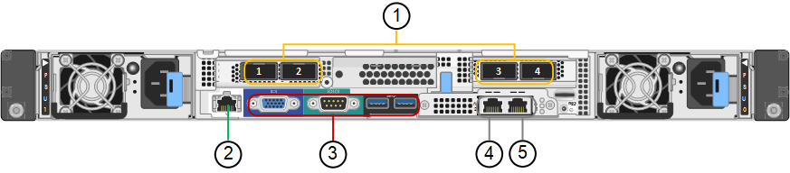

= SG100 および SG1000 アプライアンス：概要
:allow-uri-read: 
:icons: font
:imagesdir: ../media/

[role="lead"]
StorageGRID SG100 サービスアプライアンスと SG1000 サービスアプライアンスはゲートウェイノードおよび管理ノードとして動作して、 StorageGRID システムで高可用性のロードバランシングサービスを提供できます。両方のアプライアンスをゲートウェイノードとして使用し、管理ノード（プライマリノードまたは非プライマリノード）を同時に使用できます。

== アプライアンスの特長

サービスアプライアンスのどちらのモデルにも次の機能があります。

* ゲートウェイノードまたは管理ノードは StorageGRID システムで機能します。
* ノードの導入と設定を簡易化する StorageGRID アプライアンスインストーラ。
* 導入後、は既存の管理ノードから、またはローカルドライブにダウンロードしたソフトウェアから StorageGRID ソフトウェアにアクセスできます。導入プロセスをさらに簡易化するために、アプライアンスには最新バージョンのソフトウェアがプリロードされています。
* 一部のアプライアンスハードウェアを監視および診断するためのベースボード管理コントローラ（ BMC ）。
* グリッドネットワーク、管理ネットワーク、クライアントネットワークを含む 3 つの StorageGRID ネットワークすべてに接続できること。
+
** SG100 は、グリッドネットワークとクライアントネットワークとの 10GbE または 25GbE 接続を最大 4 つサポートします。
** SG1000 では、グリッドネットワークとクライアントネットワークとの 10GbE 、 25GbE 、 40GbE 、または 100GbE 接続が最大 4 つサポートされています。

== SG100 と SG1000 の図

この図は、 SG100 の前面とベゼルを取り外した SG1000 の前面を示しています。前面からは、ベゼル上の製品名以外の 2 つのアプライアンスは同じです。

image::../media/sg1000_front_with_ssds.png[SSD SG100 および SG1000 の前面]

オレンジの枠で示される2本のソリッドステートドライブ（SSD）は、StorageGRID オペレーティングシステムの格納に使用され、冗長性を確保するためにRAID 1を使用してミラーリングされます。SG100またはSG1000サービスアプライアンスが管理ノードとして設定されている場合は、それらのドライブを使用して監査ログ、指標、およびデータベーステーブルを格納できます。

残りのドライブスロットは空です。

== SG100のコネクタ

この図は、 SG100 の背面にあるコネクタを示しています。

image::../media/sg100_rear_connectors.png[リアコネクタ SG100]

[cols="1a,2a,2a,2a"]
|===
| コールアウト | ポート | を入力します | 使用 

 a| 
1.
 a| 
ネットワークポート 1~4
 a| 
ケーブルまたは SFP トランシーバタイプ（ SFP28 および SFP+ モジュールをサポート）、スイッチ速度、設定されたリンク速度に基づく 10 / 25GbE
 a| 
StorageGRID のグリッドネットワークおよびクライアントネットワークに接続します。

 a| 
2.
 a| 
BMC 管理ポート
 a| 
1GbE （ RJ-45 ）
 a| 
アプライアンスのベースボード管理コントローラに接続します。

 a| 
3.
 a| 
診断とサポート用のポート
 a| 
* VGA
* シリアル、 115200 8-N-1
* USB

 a| 
テクニカルサポート専用です。

 a| 
4.
 a| 
管理ネットワークポート 1
 a| 
1GbE （ RJ-45 ）
 a| 
アプライアンスを StorageGRID の管理ネットワークに接続します。

 a| 
5.
 a| 
管理ネットワークポート2
 a| 
1GbE （ RJ-45 ）
 a| 
オプション：

* StorageGRID の管理ネットワークへの冗長接続を確保するには、管理ポート 1 とボンディングします。
* 一時的なローカルアクセス用（ IP 169.254.0.1 ）に空けておくことができます。
* DHCPによって割り当てられたIPアドレスを使用できない場合は、設置時にポート2を使用してIP設定を行います。

|===

== SG1000のコネクタ

次の図は、SG1000の背面にあるコネクタを示しています。

[cols="1a,2a,2a,2a"]
|===
| コールアウト | ポート | を入力します | 使用 

 a| 
1.
 a| 
ネットワークポート 1~4
 a| 
ケーブルまたはトランシーバのタイプ、スイッチ速度、設定されたリンク速度に基づく 10 / 25 / 40 / 100GbE 。QSFP28 と QSFP+ （ 40/100GbE ）はネイティブでサポートされており、 SFP28 / SFP+ トランシーバを QSA （別売）と併用して 10 / 25GbE の速度を使用できます。
 a| 
StorageGRID のグリッドネットワークおよびクライアントネットワークに接続します。

 a| 
2.
 a| 
BMC 管理ポート
 a| 
1GbE （ RJ-45 ）
 a| 
アプライアンスのベースボード管理コントローラに接続します。

 a| 
3.
 a| 
診断とサポート用のポート
 a| 
* VGA
* シリアル、 115200 8-N-1
* USB

 a| 
テクニカルサポート専用です。

 a| 
4.
 a| 
管理ネットワークポート 1
 a| 
1GbE （ RJ-45 ）
 a| 
アプライアンスを StorageGRID の管理ネットワークに接続します。

 a| 
5.
 a| 
管理ネットワークポート2
 a| 
1GbE （ RJ-45 ）
 a| 
オプション：

* StorageGRID の管理ネットワークへの冗長接続を確保するには、管理ポート 1 とボンディングします。
* 一時的なローカルアクセス用（ IP 169.254.0.1 ）に空けておくことができます。
* DHCPによって割り当てられたIPアドレスを使用できない場合は、設置時にポート2を使用してIP設定を行います。

|===

== SG100 および SG1000 アプリケーション

StorageGRID サービスアプライアンスは、ゲートウェイサービスおよび一部のグリッド管理サービスの冗長性を提供するためにさまざまな方法で設定できます。

アプライアンスは、次の方法で導入できます。

* ゲートウェイノードとして新規または既存のグリッドに追加します
* プライマリまたは非プライマリ管理ノードとして新しいグリッドに追加するか、非プライマリ管理ノードとして既存のグリッドに追加します
* ゲートウェイノードと管理ノード（プライマリまたは非プライマリ）として同時に動作します

アプライアンスでは、 S3 または Swift データパス接続に対し、ハイアベイラビリティ（ HA ）グループとインテリジェントなロードバランシングを実装できます。

次に、アプライアンスの機能を最大限に活用する例を示します。

* 2 台の SG1000 アプライアンスをゲートウェイノードとして設定して、ゲートウェイサービスを提供するには、 2 台の SG100 または 2 台の SG1000 アプライアンスを使用します。
+

NOTE: SG100とSG1000サービスアプライアンスを同じサイトに導入しないでください。パフォーマンスが予測不能になる可能性があります

* 一部のグリッド管理サービスの冗長性を確保するには、 2 台の SG100 または 2 台の SG1000 アプライアンスを使用します。そのためには、各アプライアンスを管理ノードとして設定します。
* 2 台の SG1000 アプライアンスを使用して、 1 つ以上の仮想 IP アドレス経由でアクセスする可用性の高いロードバランシングサービスとトラフィックシェーピングサービスを提供します。そのためには、アプライアンスを管理ノードまたはゲートウェイノードの任意の組み合わせとして設定し、両方のノードを同じ HA グループに追加します。
+

NOTE: 同じHAグループの管理ノードとゲートウェイノードを使用する場合、管理ノードのみのポートはフェイルオーバーしません。の手順を参照してください https://docs.netapp.com/us-en/storagegrid-118/admin/configure-high-availability-group.html["HAグループを設定しています"^]。

StorageGRID ストレージアプライアンスとともに使用すると、 SG100 と SG1000 サービスアプライアンスの両方で、外部のハイパーバイザーやコンピューティングハードウェアに依存しないアプライアンスのみのグリッドを導入できます。
