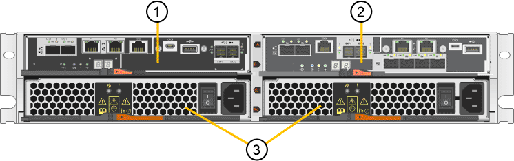

= SG5700 アプライアンス：概要
:allow-uri-read: 
:icons: font
:imagesdir: ../media/

[role="lead"]
SG5700 StorageGRID アプライアンスは、 StorageGRID グリッドにおいてストレージノードとして機能する、ストレージとコンピューティングを統合したプラットフォームです。アプライアンスは、アプライアンスストレージノードと仮想（ソフトウェアベース）ストレージノードを組み合わせたハイブリッドグリッド環境で使用できます。

StorageGRID SG5700シリーズアプライアンスには次のような特長があります。

* StorageGRID ストレージノードのストレージ要素とコンピューティング要素を統合します。
* ストレージノードの導入と設定を簡易化するために、 StorageGRID アプライアンスインストーラが搭載されています。
* ハードウェアの管理と監視に使用する E シリーズ SANtricity System Manager が搭載されています。
* StorageGRID のグリッドネットワークとクライアントネットワークとの 10GbE または 25GbE 接続を最大 4 つサポートします。
* Full Disk Encryption（FDE）ドライブまたはFIPSドライブをサポートします。これらのドライブを SANtricity System Manager のドライブセキュリティ機能と併用すると、データへの不正アクセスを防止できます。

SG5700アプライアンスには、SG5712とSG5712、SG5712、SG5760とSG5712、SG5712の60Xの4つのモデルがあります。ストレージコントローラのインターコネクトポートの場所を除き、SG5712とSG5712の機能に違いはありません。同様に、SG5760とSG5760Xには、ストレージコントローラ上のインターコネクトポートの場所を除き、仕様や機能に違いはありません。

== SG5700のコンポーネント

SG5700モデルには次のコンポーネントが含まれています。

[role="tabbed-block"]
====
.SG5712
--
コンピューティングコントローラ:: E5700SG コントローラのものです
ストレージコントローラ:: E2800Aコントロオラ
シャーシ:: E シリーズ DE212C エンクロージャ： 2 ラックユニット（ 2U ）エンクロージャ
ドライブ:: 12 本の NL-SAS ドライブ（ 3.5 インチ）
冗長電源装置とファン:: 電源 / ファンキャニスター × 2

--
.SG5712X
--
コンピューティングコントローラ:: E5700SG コントローラのものです
ストレージコントローラ:: E2800Bコントロオラ
シャーシ:: E シリーズ DE212C エンクロージャ： 2 ラックユニット（ 2U ）エンクロージャ
ドライブ:: 12 本の NL-SAS ドライブ（ 3.5 インチ）
冗長電源装置とファン:: 電源 / ファンキャニスター × 2

--
.SG5760
--
コンピューティングコントローラ:: E5700SG コントローラのものです
ストレージコントローラ:: E2800Aコントロオラ
シャーシ:: E シリーズ DE460C エンクロージャ： 4 台のラックユニット（ 4U ）エンクロージャ
ドライブ:: NL-SASドライブ×60（3.5インチ）
冗長電源装置とファン:: 2 つの電源キャニスターと 2 つのファンキャニスター

--
.SG5760X
--
コンピューティングコントローラ:: E5700SG コントローラのものです
ストレージコントローラ:: E2800Bコントロオラ
シャーシ:: E シリーズ DE460C エンクロージャ： 4 台のラックユニット（ 4U ）エンクロージャ
ドライブ:: NL-SASドライブ×60（3.5インチ）
冗長電源装置とファン:: 2 つの電源キャニスターと 2 つのファンキャニスター

--
====
StorageGRID アプライアンスで使用可能な最大物理ストレージは、各エンクロージャ内のドライブの数に応じて決まっています。ドライブを追加したシェルフを追加して使用可能なストレージを拡張することはできません。

== SG5700の構成図

=== SG5712の前面と背面

次の図は、12本のドライブを搭載した2UエンクロージャであるSG5712の前面と背面を示しています。

image::../media/sg5712_front_and_back_views.gif[SG5712 アプライアンスの前面と背面]

=== SG5712のコンポーネント

SG5712 には、 2 台のコントローラと 2 つの電源 / ファンキャニスターが含まれています。

[cols="1a,3a"]
|===
| コールアウト | 説明 

 a| 
1.
 a| 
E2800Aコントローラ（ストレージコントローラ）

 a| 
2.
 a| 
E5700SG コントローラ（コンピューティングコントローラ）

 a| 
3.
 a| 
電源 / ファンキャニスター

|===

=== SG5712Xの前面と背面

次の図は、12本のドライブを搭載した2UエンクロージャであるSG5712Xの前面と背面を示しています。

image::../media/sg5712x_front_and_back_views.gif[SG5712Xアプライアンスの前面および背面です]

=== SG5712Xのコンポーネント

SG5712Xには、2つのコントローラと2つの電源/ファンキャニスターが搭載されています。

image::../media/sg5712x_with_callouts.gif[SG5712Xアプライアンスのコントローラと電源/ファンキャニスター]

[cols="1a,3a"]
|===
| コールアウト | 説明 

 a| 
1.
 a| 
E2800Bコントロオラストレエシコントロオラ

 a| 
2.
 a| 
E5700SG コントローラ（コンピューティングコントローラ）

 a| 
3.
 a| 
電源 / ファンキャニスター

|===

=== SG5760の前面と背面

次の図は、SG5760モデル（5台のドライブドロワーに60本のドライブを搭載した4Uエンクロージャ）の前面と背面を示しています。

image::../media/sg5760_front_and_back_views.gif[SG5760 アプライアンスの前面と背面です]

=== SG5760のコンポーネント

SG5760 には、コントローラ 2 台、ファンキャニスター 2 台、電源キャニスター 2 台が搭載されています。

image::../media/sg5760_with_callouts.gif[コントローラ,fan canisters,and power canisters in SG5760 appliance]

[cols="1a,2a"]
|===
| コールアウト | 説明 

 a| 
1.
 a| 
E2800Aコントローラ（ストレージコントローラ）

 a| 
2.
 a| 
E5700SG コントローラ（コンピューティングコントローラ）

 a| 
3.
 a| 
ファンキャニスター（ 2 つのうちの 1 つ）

 a| 
4.
 a| 
電源キャニスター（ 2 つのうちの 1 つ）

|===

=== SG5760Xの前面図と背面図

次の図は、SG5760Xモデル（5台のドライブドロワーに60本のドライブを搭載した4Uエンクロージャ）の前面と背面を示しています。

image::../media/sg5760x_front_and_back_views.gif[SG5760Xアプライアンスの前面および背面]

=== SG5760Xノコンホオネント

SG5760Xには、コントローラ2台、ファンキャニスター2台、電源キャニスター2台が搭載されています。

image::../media/sg5760x_with_callouts.gif[コントローラ,fan canisters,and power canisters in SG5760X appliance]

[cols="1a,3a"]
|===
| コールアウト | 説明 

 a| 
1.
 a| 
E2800Bコントロオラストレエシコントロオラ

 a| 
2.
 a| 
E5700SG コントローラ（コンピューティングコントローラ）

 a| 
3.
 a| 
ファンキャニスター（ 2 つのうちの 1 つ）

 a| 
4.
 a| 
電源キャニスター（ 2 つのうちの 1 つ）

|===

== SG5700コントローラ

StorageGRID アプライアンスの12ドライブSG5712とSG5712、および60ドライブSG5760とSG5712およびE5700SG 60Xモデルには、コンピューティングコントローラとEシリーズE2800ストレージコントローラが含まれています。

* SG5712とSG5760では、E2800Aコントローラを使用します。
* SG5712XおよびSG5760Xでは、E2800Bコントローラを使用します。

E2800AコントローラとE2800Bコントローラの仕様と機能は、インターコネクトポートの場所を除き同じです。

=== E5700SGコンピューティングコントローラ

* アプライアンスのコンピューティングサーバとして機能します。
* StorageGRID アプライアンスインストーラが搭載されています。
+

NOTE: StorageGRID ソフトウェアは、アプライアンスにプリインストールされていません。このソフトウェアには、アプライアンスの導入時に管理ノードからアクセスします。

* グリッドネットワーク、管理ネットワーク、クライアントネットワークを含む、 3 つの StorageGRID ネットワークすべてに接続できます。
* E2800 コントローラに接続し、イニシエータとして機能します。

==== E5700SGコネクタ

image::../media/e5700sg_controller_with_callouts.gif[E5700SG コントローラのコネクタ]

[cols="1a,2a,2a,2a"]
|===
| コールアウト | ポート | を入力します | 使用 

 a| 
1.
 a| 
インターコネクトポート 1 と 2
 a| 
16Gb/秒ファイバチャネル（FC）、光ファイバSFP
 a| 
E5700SG コントローラを E2800 コントローラに接続してください。

 a| 
2.
 a| 
診断とサポート用のポート
 a| 
* RJ-45 シリアルポート
* マイクロ USB シリアルポート
* USBポート

 a| 
テクニカルサポート専用です。

 a| 
3.
 a| 
ドライブ拡張ポート
 a| 
12Gb/ 秒 SAS の場合
 a| 
使用されません。

 a| 
4.
 a| 
ネットワークポート 1~4
 a| 
SFP トランシーバのタイプ、スイッチの速度、設定されたリンク速度に基づく 10GbE または 25GbE
 a| 
StorageGRID のグリッドネットワークおよびクライアントネットワークに接続します。

 a| 
5.
 a| 
管理ポート 1
 a| 
1Gb （ RJ-45 ）イーサネット
 a| 
StorageGRID の管理ネットワークに接続します。

 a| 
6.
 a| 
管理ポート 2.
 a| 
1Gb （ RJ-45 ）イーサネット
 a| 
オプション：

* StorageGRID の管理ネットワークへの冗長接続を確保するには、管理ポート 1 とボンディングします。
* 一時的なローカルアクセス用（ IP 169.254.0.1 ）に空けておくことができます。
* DHCPによって割り当てられたIPアドレスを使用できない場合は、設置時にポート2を使用してIP設定を行います。

|===

=== E2800ストレージコントローラ

SG5700アプライアンスでは、E2800AとE2800Bの2つのバージョンのE2800ストレージコントローラが使用されます。E2800AにはHICがなく、E2800Bには4ポートのHICが搭載されています。2つのコントローラバージョンの仕様と機能は、インターコネクトポートの位置を除いて同じです。

E2800シリーズストレージコントローラの仕様は次のとおりです。

* アプライアンスのストレージコントローラとして機能します。
* ドライブ上のデータストレージを管理します。
* シンプレックスモードでは標準の E シリーズコントローラとして機能します。
* SANtricity OS ソフトウェア（コントローラファームウェア）を搭載しています。
* アプライアンスハードウェアの監視、アラートの管理、 AutoSupport 機能、ドライブセキュリティ機能を実行するための SANtricity System Manager が搭載されています。
* E5700SG コントローラに接続してターゲットとして機能します。

==== E2800Aのコネクタ

image::../media/e2800_controller_with_callouts.gif[E2800Aコントローラのコネクタ]

==== E2800Bコネクタ

image::../media/e2800B_controller_with_callouts.gif[E2800Bコントロオラノコネクタ]

[cols="1a,2a,2a,2a"]
|===
| コールアウト | ポート | を入力します | 使用 

 a| 
1.
 a| 
インターコネクトポート 1 と 2
 a| 
16Gb/s FC光ファイバSFP
 a| 
E2800 コントローラを E5700SG コントローラに接続します。

 a| 
2.
 a| 
管理ポート 1 と 2
 a| 
1Gb （ RJ-45 ）イーサネット
 a| 
* ポート 1 のオプション：
+
** 管理ネットワークに接続して、 SANtricity System Manager に TCP/IP で直接アクセスできるようにします
** スイッチポートと IP アドレスを保存する場合は、有線を使用しないでください。  Grid Managerまたはストレージグリッドアプライアンスインストーラを使用してSANtricity System Managerにアクセスします。

* 注 * ：正確なログタイムスタンプのための NTP 同期など、オプションの SANtricity 機能の一部は、ポート 1 を有線接続しないままにする場合は使用できません。

* 注：ポート 1 を有線接続しない場合は、 StorageGRID 11.5 以降および SANtricity 11.70 以降が必要です。

* ポート 2 はテクニカルサポート専用です。

 a| 
3.
 a| 
診断とサポート用のポート
 a| 
* RJ-45 シリアルポート
* マイクロ USB シリアルポート
* USBポート

 a| 
テクニカルサポート専用です。

 a| 
4.
 a| 
ドライブ拡張ポート
 a| 
12Gb/ 秒 SAS の場合
 a| 
使用されません。

|===
.関連情報
http://mysupport.netapp.com/info/web/ECMP1658252.html["NetApp E シリーズシステムのドキュメントのサイト"^]
