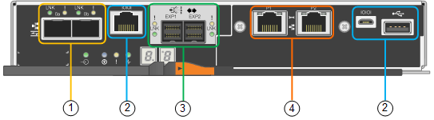

= SG6060およびSG6060Xアプライアンス：概要
:allow-uri-read: 
:icons: font
:imagesdir: ../media/

[role="lead"]
StorageGRID SG6060とSG6060Xアプライアンスには、それぞれコンピューティングコントローラと、2台のストレージコントローラと60本のドライブを搭載したストレージコントローラシェルフが搭載されています。

必要に応じて、60ドライブ拡張シェルフを両方のアプライアンスに追加できます。ストレージコントローラのインターコネクトポートの位置以外に、SG6060とSG6060Xには仕様や機能の違いはありません。

== SG6060とSG6060Xのコンポーネント

SG6060およびSG6060Xアプライアンスには、次のコンポーネントが含まれています。

コンピューティングコントローラ:: SG6000-CNコントローラは、次のコンポーネントで構成される1ラックユニット（1U）サーバです。
+
--
* 40 コア（ 80 スレッド）
* 192GB の RAM
* 25Gbps アグリゲートイーサネット帯域幅 × 最大 4
* 16Gbps Fibre Channel （ FC ）インターコネクト × 4
* ベースボード管理コントローラ（ BMC ） - ハードウェア管理を簡素化します
* 冗長電源装置

--
ストレージコントローラシェルフ:: EシリーズE2860コントローラシェルフ（ストレージアレイ）は4Uシェルフで、構成は次のとおりです。
+
--
* E2800シリーズのコントローラ×2（デュプレックス構成）-ストレージコントローラのフェイルオーバーをサポートします
+
** E2800Aストレージコントローラが搭載されます
** SG6060Xには、E2800Bのストレージコントローラが含まれています

* 5 ドロワードライブシェルフ - 3.5 インチドライブを 60 本（ SSD × 2 、 NL-SAS ドライブ × 58 ）収容
* 冗長電源装置とファン

--
オプション：ストレージ拡張シェルフ:: 各SG6060およびSG6060Xアプライアンスには拡張シェルフを1台または2台搭載して合計180本のドライブを搭載できます（そのうち2本はEシリーズの読み取りキャッシュ用に予約されています）。
+
--
* 注：拡張シェルフは、初期導入時に設置することも、あとで追加することもできます。

EシリーズDE460Cエンクロージャは4Uシェルフで、次のコンポーネントを搭載しています。

* 入出力モジュール（ IOM ） × 2
* それぞれに 12 本の NL-SAS ドライブを搭載し、合計 60 本のドライブを搭載したドロワー × 5
* 冗長電源装置とファン

--

== SG6060およびSG6060Xの図

SG6060とSG6060Xの前面は同じです。

=== SG6060またはSG6060Xの前面

次の図は、SG6060またはSG6060Xの前面です。1Uコンピューティングコントローラ1台、2台のストレージコントローラと5台のドライブドロワーに60本のドライブを搭載した4Uシェルフ1台で構成されます。

image::../media/sg6060_front_view_with_and_without_bezels.gif[SG6060 の正面図]

[cols="1a,2a"]
|===
| コールアウト | 説明 

 a| 
1.
 a| 
前面ベゼルを取り付けた SG6000-CN コンピューティングコントローラ

 a| 
2.
 a| 
前面ベゼルを取り付けた E2860 コントローラシェルフ（オプションの拡張シェルフも同様）

 a| 
3.
 a| 
前面ベゼルを取り外した SG6000-CN のコンピューティングコントローラ

 a| 
4.
 a| 
前面ベゼルを取り外した E2860 コントローラシェルフ（オプションの拡張シェルフも同様）

|===

=== SG6060の背面

この図は、コンピューティングコントローラ、ストレージコントローラ、ファン、電源装置を含む SG6060 の背面を示しています。

image::../media/sg6060_rear_view.gif[SG6060 の背面図]

[cols="1a,2a"]
|===
| コールアウト | 説明 

 a| 
1.
 a| 
SG6000-CN コンピューティングコントローラの電源装置（ × 2 ）

 a| 
2.
 a| 
SG6000-CN コンピューティングコントローラのコネクタ

 a| 
3.
 a| 
E2860 コントローラシェルフのファン（ × 2 ）

 a| 
4.
 a| 
EシリーズE2800Aストレージコントローラ（×2）とコネクタ

 a| 
5.
 a| 
E2860 コントローラシェルフの電源装置（ × 2 ）

|===

=== SG6060Xの背面

次の図は、SG6060Xの背面を示しています。

image::../media/sg6060x_rear_view.gif[SG6060xの背面図]

[cols="1a,2a"]
|===
| コールアウト | 説明 

 a| 
1.
 a| 
SG6000-CN コンピューティングコントローラの電源装置（ × 2 ）

 a| 
2.
 a| 
SG6000-CN コンピューティングコントローラのコネクタ

 a| 
3.
 a| 
E2860 コントローラシェルフのファン（ × 2 ）

 a| 
4.
 a| 
EシリーズE2800Bストレージコントローラ（×2）とコネクタ

 a| 
5.
 a| 
E2860 コントローラシェルフの電源装置（ × 2 ）

|===

=== 拡張シェルフ

この図は、SG6060とSG6060Xのオプションの拡張シェルフの背面です。これには、入出力モジュール（IOM）、ファン、電源装置が含まれます。各 SG6060 には、初期設置に含めることもあとで追加することもできる拡張シェルフを 1 台または 2 台設置することもできます。

image::../media/de460c_expansion_shelf_rear_view.gif[拡張シェルフの背面]

[cols="1a,2a"]
|===
| コールアウト | 説明 

 a| 
1.
 a| 
拡張シェルフのファン（ × 2 ）

 a| 
2.
 a| 
拡張シェルフの IOM （ × 2 ）

 a| 
3.
 a| 
拡張シェルフの電源装置（ × 2 ）

|===

== SG6000コントローラ

StorageGRID SG6000 アプライアンスの各モデルには、 1U エンクロージャに SG6000-CN コンピューティングコントローラが搭載され、 2U または 4U エンクロージャにデュプレックス E シリーズストレージコントローラが搭載されています。各タイプのコントローラの詳細については、次の図を確認してください。

=== SG6000-CNコンピューティングコントローラ

* アプライアンスのコンピューティングリソースを提供します。
* StorageGRID アプライアンスインストーラが搭載されています。
+

NOTE: StorageGRID ソフトウェアは、アプライアンスにプリインストールされていません。このソフトウェアは、アプライアンスの導入時に管理ノードから取得されます。

* グリッドネットワーク、管理ネットワーク、クライアントネットワークを含む、 3 つの StorageGRID ネットワークすべてに接続できます。
* E シリーズストレージコントローラに接続し、イニシエータとして機能します。

==== SG6000-CNコネクタ

image::../media/sg6000_cn_rear_connectors.gif[SG6000-CN 背面のコネクタ]

[cols="1a,2a,2a,3a"]
|===
| コールアウト | ポート | を入力します | 使用 

 a| 
1.
 a| 
インターコネクトポート 1~4
 a| 
16Gb/s Fibre Channel （ FC ）、光ファイバ内蔵
 a| 
SG6000-CN コントローラを E2800 コントローラに接続（各 E2800 に 2 つの接続）します。

 a| 
2.
 a| 
ネットワークポート 1~4
 a| 
10GbE または 25GbE 。ケーブルまたは SFP トランシーバタイプ、スイッチ速度、および設定されたリンク速度に基づきます
 a| 
StorageGRID のグリッドネットワークおよびクライアントネットワークに接続します。

 a| 
3.
 a| 
BMC 管理ポート
 a| 
1GbE （ RJ-45 ）
 a| 
SG6000-CN のベースボード管理コントローラに接続します。

 a| 
4.
 a| 
診断とサポート用のポート
 a| 
* VGA
* シリアル、 115200 8-N-1
* USB

 a| 
テクニカルサポート専用です。

 a| 
5.
 a| 
管理ネットワークポート 1
 a| 
1GbE （ RJ-45 ）
 a| 
SG6000-CN を StorageGRID の管理ネットワークに接続します。

 a| 
6.
 a| 
管理ネットワークポート2
 a| 
1GbE （ RJ-45 ）
 a| 
オプション：

* StorageGRID の管理ネットワークへの冗長接続を確保するには、管理ポート 1 とボンディングします。
* 一時的なローカルアクセス用（ IP 169.254.0.1 ）に空けておくことができます。
* DHCPによって割り当てられたIPアドレスを使用できない場合は、設置時にポート2を使用してIP設定を行います。

|===

=== SGF6024：EF570ストレージコントローラ

* 2 台のコントローラでフェイルオーバーに対応。
* ドライブ上のデータを格納。
* デュプレックス構成では標準の E シリーズコントローラとして機能。
* SANtricity OS ソフトウェア（コントローラファームウェア）を搭載。
* ストレージハードウェアの監視やアラートの管理、 AutoSupport 機能、ドライブセキュリティ機能に対応した SANtricity System Manager が搭載されています。
* SG6000-CN コントローラに接続して、フラッシュストレージへのアクセスを提供します。

==== EF570コネクタ

[cols="1a,2a,2a,3a"]
|===
| コールアウト | ポート | を入力します | 使用 

 a| 
1.
 a| 
インターコネクトポート 1 と 2
 a| 
16Gb/秒FC光ファイバSFP
 a| 
各EF570コントローラをSG6000-CNコントローラに接続します。

SG6000-CN コントローラへの接続は 4 つ（各 EF570 から 2 つ）あります。

 a| 
2.
 a| 
診断とサポート用のポート
 a| 
* RJ-45 シリアルポート
* マイクロ USB シリアルポート
* USBポート

 a| 
テクニカルサポート専用です。

 a| 
3.
 a| 
ドライブ拡張ポート
 a| 
12Gb/ 秒 SAS の場合
 a| 
使用されません。SGF6024 アプライアンスでは、拡張ドライブシェルフはサポートされません。

 a| 
4.
 a| 
管理ポート 1 と 2
 a| 
1Gb （ RJ-45 ）イーサネット
 a| 
* ポート 1 は、ブラウザから SANtricity System Manager にアクセスするネットワークに接続します。
* ポート 2 はテクニカルサポート専用です。

|===

=== SG6060およびSG6060X：E2800ストレージコントローラ

* 2 台のコントローラでフェイルオーバーに対応。
* ドライブ上のデータを格納。
* デュプレックス構成では標準の E シリーズコントローラとして機能。
* SANtricity OS ソフトウェア（コントローラファームウェア）を搭載。
* ストレージハードウェアの監視やアラートの管理、 AutoSupport 機能、ドライブセキュリティ機能に対応した SANtricity System Manager が搭載されています。
* SG6000-CN コントローラに接続して、ストレージへのアクセスを提供します。

SG6060およびSG6060Xでは、E2800ストレージコントローラを使用します。

[cols="1a,2a,2a"]
|===
| アプライアンス | コントローラ | コントローラHIC 

 a| 
SG6060 の設計
 a| 
E2800Aストレージコントローラ×2
 a| 
なし

 a| 
SG6060Xの
 a| 
E2800Bストレージコントローラ×2
 a| 
4ポートのHIC

|===
E2800AとE2800Bのストレージコントローラの仕様と機能は、インターコネクトポートの場所を除きます。

CAUTION: E2800AとE2800Bを同じアプライアンスで使用しないでください。

==== E2800Aのコネクタ

image::../media/e2800_controller_with_callouts.gif[E2800Aコントローラのコネクタ]

[cols="1a,2a,2a,3a"]
|===
| コールアウト | ポート | を入力します | 使用 

 a| 
1.
 a| 
インターコネクトポート 1 と 2
 a| 
16Gb/秒FC光ファイバSFP
 a| 
E2800AコントローラのそれぞれをSG6000-CNコントローラに接続します。

SG6000-CNコントローラへの接続は4つ（各E2800Aから2つ）あります。

 a| 
2.
 a| 
管理ポート 1 と 2
 a| 
1Gb （ RJ-45 ）イーサネット
 a| 
* ポート 1 のオプション：
+
** 管理ネットワークに接続して、 SANtricity System Manager に TCP/IP で直接アクセスできるようにします
** スイッチポートと IP アドレスを保存する場合は、有線を使用しないでください。  Grid Managerまたはストレージグリッドアプライアンスインストーラを使用してSANtricity System Managerにアクセスします。

* 注 * ：正確なログタイムスタンプのための NTP 同期など、オプションの SANtricity 機能の一部は、ポート 1 を有線接続しないままにする場合は使用できません。

* 注：ポート 1 を有線接続しない場合は、 StorageGRID 11.5 以降および SANtricity 11.70 以降が必要です。

* ポート 2 はテクニカルサポート専用です。

 a| 
3.
 a| 
診断とサポート用のポート
 a| 
* RJ-45 シリアルポート
* マイクロ USB シリアルポート
* USBポート

 a| 
テクニカルサポート専用です。

 a| 
4.
 a| 
ドライブ拡張ポート 1 と 2
 a| 
12Gb/ 秒 SAS の場合
 a| 
拡張シェルフの IOM のドライブ拡張ポートに接続します。

|===

==== E2800Bコネクタ

image::../media/e2800B_controller_with_callouts.gif[E2800Bコントロオラノコネクタ]

[cols="1a,2a,2a,3a"]
|===
| コールアウト | ポート | を入力します | 使用 

 a| 
1.
 a| 
インターコネクトポート 1 と 2
 a| 
16Gb/秒FC光ファイバSFP
 a| 
各E2800BコントローラをSG6000-CNコントローラに接続します。

SG6000-CNコントローラへの接続は4つあります（各E2800Bから2つ）。

 a| 
2.
 a| 
管理ポート 1 と 2
 a| 
1Gb （ RJ-45 ）イーサネット
 a| 
* ポート 1 のオプション：
+
** 管理ネットワークに接続して、 SANtricity System Manager に TCP/IP で直接アクセスできるようにします
** スイッチポートと IP アドレスを保存する場合は、有線を使用しないでください。Grid Managerまたはストレージグリッドアプライアンスインストーラを使用してSANtricity System Managerにアクセスします。

* 注 * ：正確なログタイムスタンプのための NTP 同期など、オプションの SANtricity 機能の一部は、ポート 1 を有線接続しないままにする場合は使用できません。

* 注：ポート 1 を有線接続しない場合は、 StorageGRID 11.5 以降および SANtricity 11.70 以降が必要です。

* ポート 2 はテクニカルサポート専用です。

 a| 
3.
 a| 
診断とサポート用のポート
 a| 
* RJ-45 シリアルポート
* マイクロ USB シリアルポート
* USBポート

 a| 
テクニカルサポート専用です。

 a| 
4.
 a| 
ドライブ拡張ポート 1 と 2
 a| 
12Gb/ 秒 SAS の場合
 a| 
拡張シェルフの IOM のドライブ拡張ポートに接続します。

|===

=== SG6060およびSG6060X：オプションの拡張シェルフのIOM

拡張シェルフには、ストレージコントローラまたはその他の拡張シェルフに接続する入出力モジュール（ IOM ）が 2 台搭載されています。

==== IOMコネクタ

image::../media/iom_connectors.gif[背面の IOM]

[cols="1a,2a,2a,3a"]
|===
| コールアウト | ポート | を入力します | 使用 

 a| 
1.
 a| 
ドライブ拡張ポート 1~4
 a| 
12Gb/ 秒 SAS の場合
 a| 
各ポートをストレージコントローラまたは追加の拡張シェルフ（ある場合）に接続します。

|===