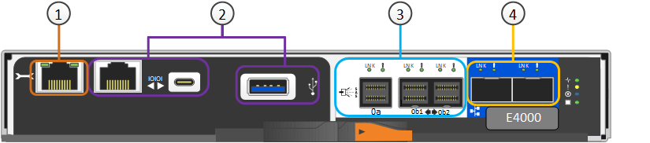

= StorageGRID SG6200アプライアンス
:allow-uri-read: 
:icons: font
:imagesdir: ../media/

[role="lead"]
StorageGRID SG6200シリーズアプライアンスは、StorageGRIDシステムでストレージノードとして動作します。すべてのStorageGRIDアプライアンスと同様に、単一の導入環境で他のアプライアンスモデルやソフトウェア専用ノードと自由に混在させることができます。

StorageGRID SG6260アプライアンスは、読み取りキャッシュとして機能する2台のNVMe SSDを備えたコンピューティングコントローラと、2台のストレージコントローラと60台のNL-SASハードドライブを搭載したストレージコントローラシェルフで構成されています。オプションの拡張シェルフを最大2台追加することで、最大180台のNL-SASハードドライブまで拡張可能です。StorageGRID SGF6212アプライアンスは、コンパクトな1Uフォームファクタに12個のNVMe SSDを搭載したオールフラッシュアプライアンスです。

== アプライアンスの特長

=== 一般的な機能

SGF6212およびSG6260アプライアンスには、以下の機能が備わっています：

* StorageGRID ストレージノードのストレージ要素とコンピューティング要素を統合します。
* ストレージノードの導入と設定を簡易化する StorageGRID アプライアンスインストーラが搭載されています。
* コンピューティングコントローラのハードウェアを監視および診断するためのベースボード管理コントローラ（BMC）が搭載されています。

=== データ保護機能

SGF6212は、以下のデータ保護機能を提供します：

* 1本のSSDで障害が発生したあとも、オブジェクトの可用性に影響を与えることなく機能する。
* 複数のSSDで障害が発生した場合でも、オブジェクトの可用性を最小限に抑えながら機能する（基盤となるRAIDスキームの設計に基づく）。
+

NOTE: 設定されているILMポリシーによっては、ローカルで使用できないオブジェクトに対する要求を他のノードが処理できるため、通常は可用性が低下することはありません。

* ノードのルートボリューム（StorageGRID オペレーティングシステム）を収容するRAIDに極端な損傷を与えないSSD障害から、稼働中に完全にリカバリ可能です。
* 複数のSSDで障害が発生してローカルデータが失われた場合は、他のノードのコピーまたはイレイジャーコーディングされたチャンクを使用してオブジェクトデータを自動的にリストアできます。
* として運営する能力 https://docs.netapp.com/us-en/storagegrid/admin/managing-load-balancing.html["キャッシュ機能付きゲートウェイノード"^]。

SG6260は、以下のデータ保護機能を提供します：

* 任意の2本のハードドライブ（HDD）で障害が発生したあとも、オブジェクトの可用性に影響を与えることなく機能する。
* 障害発生時や交換時にHDDを迅速に退避してリビルドし（設置時にDDPまたはDDP16用に構成した場合）、標準のRAID 6に比べてデータの保持性が向上します。
* いずれかの2本のHDDで障害が発生しても、稼働中に完全にリカバリ可能。
* 複数のHDDで障害が発生してローカルデータが失われた場合は、他のノードのコピーまたはイレイジャーコーディングされたチャンクを使用してオブジェクトデータを自動的にリストアできます。

== SG6200 ハードウェアコンポーネント

=== SGF6212 アプライアンス

SGF6212アプライアンスには、以下のコンポーネントが含まれています：

コンピューティングとストレージのプラットフォーム:: 1ラックユニット（1U）サーバ。構成は次のとおりです。
+
--
* 256 GB の RAM
* 240 GB 内蔵ブートドライブ（StorageGRID ソフトウェアを含む）
* 1/10 GBase-Tポート×2
* グリッド/クライアント ネットワーク トラフィック用 4 × 10/25/40/100GbE イーサネット ポート（または、オプションの 200GbE NIC を備えた 4 × 200GbE）
* データストレージ用のNVMe SSD 12台
* ベースボード管理コントローラ（ BMC ） - ハードウェア管理を簡素化します
* 冗長電源装置とファン

--

=== SG6260アプライアンス

SG6260アプライアンスには、以下のコンポーネントが含まれています：

コンピューティングコントローラ:: SG6200-CNコントローラは、以下を含む1ラックユニット（1U）サーバです。
+
--
* 256 GB の RAM
* 240 GB 内蔵ブートドライブ（StorageGRID ソフトウェアを含む）
* 1/10 GBase-Tポート×2
* グリッド/クライアント ネットワーク トラフィック用 4 × 10/25/40/100GbE イーサネット ポート（または、オプションの 200GbE NIC を備えた 4 × 200GbE）
* 1 x 100 GbEストレージ相互接続ポート
* 読み取りキャッシュ用NVMe SSD×2
* ベースボード管理コントローラ（ BMC ） - ハードウェア管理を簡素化します
* 冗長電源装置とファン

--
ストレージコントローラシェルフ:: EシリーズE4000コントローラシェルフ（ストレージアレイ）は4Uシェルフで、次の構成が含まれます。
+
--
* E4000シリーズコントローラ×2（デュプレックス構成）（ストレージコントローラのフェイルオーバーをサポート）
* 5ドロワードライブシェルフ（3.5インチNL-SASドライブを60本収容）
* 冗長電源装置とファン

--
オプション：ストレージ拡張シェルフ:: 各SG6260アプライアンスには、1台または2台の拡張シェルフを搭載でき、合計180台のドライブを収容できます。拡張シェルフは、初期導入時に取り付けることも、後から追加することもできます。
+
--
EシリーズDE460Cエンクロージャは4Uシェルフで、次のコンポーネントを搭載しています。

* 入出力モジュール（ IOM ） × 2
* それぞれに 12 本の NL-SAS ドライブを搭載し、合計 60 本のドライブを搭載したドロワー × 5
* 冗長電源装置とファン

--

== SGF6212およびSG6260の図

=== SGF6212 正面図

この図は、ベゼルなしのSGF6212の前面を示しています。このアプライアンスには、12台のSSDドライブを搭載した1Uサイズのコンピューティングおよびストレージプラットフォームが含まれています。

image::../media/s25_front_with_ssds.png[SGF6212 正面図]

=== SGF6212 背面図

この図は、ポート、ファン、電源装置を含むSGF6212の背面を示しています。

image::../media/sgf6212_rear_connectors.png[SGF6212 背面図]

[cols="1a,2a,2a,2a"]
|===
| コールアウト | ポート | を入力します | 使用 

 a| 
1.
 a| 
ネットワークポート 1~4
 a| 
ケーブルまたはトランシーバのタイプ、スイッチ速度、および設定されたリンク速度に基づいて、10/25/40/100/200-GbE。

QSFP56（最大200GbE/ポート）、QSFP28（最大100GbE/ポート）、およびQSFP+（40GbE）がネイティブでサポートされています（200GbEの速度を実現するには、200GbE NICオプションが必要です）。オプションのSFP+（10GbE）またはSFP28（25GbE）トランシーバは、QSA（別売）と組み合わせて使用できます。
 a| 
StorageGRID のグリッドネットワークおよびクライアントネットワークに接続します。

 a| 
2.
 a| 
BMC 管理ポート
 a| 
1GbE （ RJ-45 ）
 a| 
アプライアンスのベースボード管理コントローラに接続します。

 a| 
3.
 a| 
診断とサポート用のポート
 a| 
* Mini display port
* USB 3.0ポート
* Micro-USBコンソールポート

 a| 
テクニカルサポート専用です。

 a| 
4.
 a| 
管理ネットワークポート 1
 a| 
1 / 10GbE（RJ-45）
 a| 
アプライアンスを StorageGRID の管理ネットワークに接続します。

 a| 
5.
 a| 
管理ネットワークポート2
 a| 
1 / 10GbE（RJ-45）
 a| 
オプション：

* StorageGRID の管理ネットワークへの冗長接続を確立するには、管理ネットワークポート1とボンディングします。
* 一時的なローカルアクセス用（ IP 169.254.0.1 ）に空けておくことができます。
* DHCPによって割り当てられたIPアドレスを使用できない場合は、設置時にポート2を使用してIP設定を行います。

|===
この図は、SGF6212の背面にある電源の位置と識別用LEDを示しています。機器のポートには、追加のステータスおよびアクティビティLEDが搭載されています。これらのLEDは、機器の機種によって異なる場合があります。

image::../media/s25_rear_leds.png[リアLED SGF6212]

[cols="1a,2a,3a"]
|===
| コールアウト | LED | 状態 

 a| 
1.
 a| 
電源装置LED
 a| 
* 緑、点灯：アプライアンスに電源が投入され、電源ボタンがオンになっています。
* 緑色の点滅：アプライアンスに電源が投入され、電源ボタンがオフになっています。
* 消灯：アプライアンスに電力が供給されていません。
* オレンジ：電源装置に障害があります。

 a| 
2.
 a| 
LEDの識別
 a| 
* 青、点滅：キャビネットまたはラック内のアプライアンスを示します。
* 青、点灯：キャビネットまたはラック内のアプライアンスを示します。
* オフ：キャビネットまたはラック内で、アプライアンスが目視で識別できません。

|===

=== SG6260 正面図

この図はSG6260の前面を示しており、1Uのコンピューティング コントローラと、2つのストレージ コントローラと5つのドライブ ドロワに60台のドライブを搭載した4Uのシェルフが含まれています。

image::../media/sg6260_front_view_without_bezels.png[SG6260 正面図]

[cols="1a,2a"]
|===
| コールアウト | 説明 

 a| 
1.
 a| 
前面ベゼルを取り外したSG6200-CNコンピューティングコントローラ

 a| 
2.
 a| 
前面ベゼルを取り外したE4000コントローラシェルフ（オプションの拡張シェルフも同じです）

|===

=== SG6260 の背面図

この図は、SG6260の背面を示しており、コンピューティングコントローラ、ストレージコントローラ、ファン、電源装置が含まれています。

image::../media/sg6260_rear_view.png[SG6260 リアビュー]

[cols="1a,2a"]
|===
| コールアウト | 説明 

 a| 
1.
 a| 
SG6200-CNコンピューティングコントローラ用電源（2個のうちの1個）

 a| 
2.
 a| 
SG6200-CNコンピューティングコントローラ用コネクタ

 a| 
3.
 a| 
E4000コントローラシェルフのファン（×2）

 a| 
4.
 a| 
EシリーズE400ストレージコントローラ（2個のうちの1個）とコネクタ

 a| 
5.
 a| 
E4000コントローラシェルフの電源装置（×2）

|===

== SG6200コントローラ

=== SG6200-CNコンピューティングコントローラ

* アプライアンスのコンピューティングリソースを提供します。
* StorageGRID アプライアンスインストーラが搭載されています。
+

NOTE: StorageGRID ソフトウェアは、アプライアンスにプリインストールされていません。このソフトウェアは、アプライアンスの導入時に管理ノードから取得されます。

* グリッドネットワーク、管理ネットワーク、クライアントネットワークを含む、 3 つの StorageGRID ネットワークすべてに接続できます。
* E シリーズストレージコントローラに接続し、イニシエータとして機能します。

この図は、SG6200-CNコンピューティングコントローラの背面にあるポートを示しています。

image::../media/sg6200_cn_rear_connectors.png[SG6200-CN リアコネクタ]

[cols="1a,2a,2a,3a"]
|===
| コールアウト | ポート | を入力します | 使用 

 a| 
1.
 a| 
ネットワークポート 1~4
 a| 
ケーブルまたはトランシーバーの種類、スイッチ速度、および設定されたリンク速度に基づいて、10/25/40/100/200-GbEに対応します。QSFP56（最大200GbE/ポート）、QSFP28（最大100GbE/ポート）、およびQSFP+（40GbE）がネイティブでサポートされています（200GbEの速度を実現するには、200GbE NICオプションが必要です）。オプションのSFP+（10GbE）またはSFP28（25GbE）トランシーバーは、QSA（別売）と組み合わせて使用できます。
 a| 
StorageGRID のグリッドネットワークおよびクライアントネットワークに接続します。

 a| 
2.
 a| 
BMC 管理ポート
 a| 
1GbE （ RJ-45 ）
 a| 
SG6200-CNベースボード管理コントローラに接続します。

 a| 
3.
 a| 
診断とサポート用のポート
 a| 
* Mini display port
* USB 3.0ポート
* Micro-USBコンソールポート

 a| 
テクニカルサポート専用です。

 a| 
4.
 a| 
管理ネットワークポート 1
 a| 
1 / 10GbE（RJ-45）
 a| 
SG6200-CNをStorageGRIDの管理ネットワークに接続します。

 a| 
5.
 a| 
管理ネットワークポート2
 a| 
1 / 10GbE（RJ-45）
 a| 
オプション：

* StorageGRID の管理ネットワークへの冗長接続を確保するには、管理ポート 1 とボンディングします。
* 一時的なローカルアクセス用（ IP 169.254.0.1 ）に空けておくことができます。
* DHCPによって割り当てられたIPアドレスを使用できない場合は、設置時にポート2を使用してIP設定を行います。

 a| 
6.
 a| 
インターコネクトポート
 a| 
100GbE
 a| 
SG6200-CNコントローラをE4000コントローラに接続します。

|===
この図は、SG6200-CNコンピューティングコントローラの背面にある電源の位置と識別用LEDを示しています。機器のポートには、追加のステータスおよびアクティビティLEDが搭載されています。これらのLEDは、機器の機種によって異なる場合があります。

image::../media/s25_rear_leds.png[リアLED SG6200-CN]

[cols="1a,2a,3a"]
|===
| コールアウト | LED | 状態 

 a| 
1.
 a| 
電源装置LED
 a| 
* 緑、点灯：アプライアンスに電源が投入され、電源ボタンがオンになっています。
* 緑色の点滅：アプライアンスに電源が投入され、電源ボタンがオフになっています。
* 消灯：アプライアンスに電力が供給されていません。
* オレンジ：電源装置に障害があります。

 a| 
2.
 a| 
LEDの識別
 a| 
* 青、点滅：キャビネットまたはラック内のアプライアンスを示します。
* 青、点灯：キャビネットまたはラック内のアプライアンスを示します。
* オフ：キャビネットまたはラック内で、アプライアンスが目視で識別できません。

|===

=== SG6260：E4000ストレージコントローラ

* 2 台のコントローラでフェイルオーバーに対応。
* ドライブ上のデータを格納。
* デュプレックス構成では標準の E シリーズコントローラとして機能。
* SANtricity OS ソフトウェア（コントローラファームウェア）を搭載。
* ストレージハードウェアの監視やアラートの管理、 AutoSupport 機能、ドライブセキュリティ機能に対応した SANtricity System Manager が搭載されています。
* SG6200-CNコントローラに接続し、ストレージへのアクセスを提供します。

[cols="1a,2a,2a,3a"]
|===
| コールアウト | ポート | を入力します | 使用 

 a| 
1.
 a| 
管理ポート 1
 a| 
1Gb （ RJ-45 ）イーサネット
 a| 
* ポート 1 のオプション：
+
** 管理ネットワークに接続して、 SANtricity System Manager に TCP/IP で直接アクセスできるようにします
** スイッチポートと IP アドレスを保存する場合は、有線を使用しないでください。  Grid Managerまたはストレージグリッドアプライアンスインストーラを使用してSANtricity System Managerにアクセスします。

*注*：ポート1を未配線のままにする場合、正確なログタイムスタンプのためのNTP同期など、一部のオプションのSANtricity機能は使用できません。

 a| 
2.
 a| 
診断とサポート用のポート
 a| 
* RJ-45 シリアルポート
* マイクロ USB シリアルポート
* USBポート

 a| 
テクニカルサポート専用です。

 a| 
3.
 a| 
ドライブ拡張ポート 1 と 2
 a| 
12Gb/ 秒 SAS の場合
 a| 
拡張シェルフの IOM のドライブ拡張ポートに接続します。

 a| 
4.
 a| 
インターコネクトポート 1 と 2
 a| 
25GbE iSCSI
 a| 
各E4000コントローラをSG6200-CNコントローラに接続します。

SG6200-CNコントローラへの接続は4つあります（各E4000から2つずつ）。

|===

=== SG6260：オプションの拡張シェルフ用IOM

拡張シェルフには、ストレージコントローラまたはその他の拡張シェルフに接続する入出力モジュール（ IOM ）が 2 台搭載されています。

==== IOMコネクタ

image::../media/iom_connectors.gif[背面の IOM]

[cols="1a,2a,2a,3a"]
|===
| コールアウト | ポート | を入力します | 使用 

 a| 
1.
 a| 
ドライブ拡張ポート 1~4
 a| 
12Gb/ 秒 SAS の場合
 a| 
各ポートをストレージコントローラまたは追加の拡張シェルフ（ある場合）に接続します。

|===