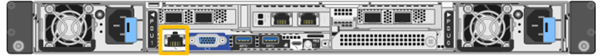

= BMC 管理ポートの IP アドレスを設定します
:allow-uri-read: 
:icons: font
:imagesdir: ../media/

[role="lead"]
BMCインターフェイスにアクセスするには、SGF6112、SG6000-CNコントローラ、SG6100-CNコントローラ、またはサービスアプライアンスのBMC管理ポートのIPアドレスを設定しておく必要があります。

ConfigBuilderを使用してJSONファイルを生成する場合は、IPアドレスを自動的に設定できます。を参照してください link:automating-appliance-installation-and-configuration.html["アプライアンスのインストールと設定を自動化"]。

.作業を開始する前に
* 管理クライアントはを使用してい https://docs.netapp.com/us-en/storagegrid/admin/web-browser-requirements.html["サポートされている Web ブラウザ"^]ます。
* StorageGRID ネットワークに接続できる管理クライアントを使用している必要があります。
* BMC 管理ポートが、使用する管理ネットワークに接続されている必要があります。
+
[role="tabbed-block"]
====
.SG100
--
image::../media/sg100_bmc_management_port.png[SG100のBMC管理ポート]

--
.SG110
--

--
.SG1000 からのアクセス
--
image::../media/sg1000_bmc_management_port.png[SG1000 BMC 管理ポート]

--
.SG1100
--
image::../media/sg1100_bmc_management_port.png[BMC管理ポートSG1100]

--
.SG6000を使用します
--
image::../media/sg6000_cn_bmc_management_port.gif[SG6000-CN コントローラの BMC 管理ポート]

--
.SG6100
--
_SGF6112_：

SG6100-CN_：

image::../media/sg6100_cn_bmc_management_port.png[BMC管理ポートSG610-CN]

--
====

.このタスクについて
BMC 管理ポートでは、サポート目的で下位レベルのハードウェアアクセスが許可されます。

NOTE: このポートは、信頼されているセキュアな内部管理ネットワークにのみ接続してください。該当するネットワークがない場合は、テクニカルサポートから BMC 接続の要請があった場合を除き、 BMC ポートを接続しないか、またはブロックしたままにしてください。

.手順
. クライアントから、StorageGRID アプライアンスインストーラのURLを入力します：+
`*https://_Appliance_IP_:8443*`
+
の場合 `Appliance_IP`には、任意のStorageGRID ネットワーク上のアプライアンスのIPアドレスを使用します。

+
StorageGRID アプライアンスインストーラのホームページが表示されます。

. [ ハードウェアの設定 *>*BMC 構成 *] を選択します。
+
image::../media/bmc_configuration_page.gif[Advanced > BMC Configuration オプションを示すスクリーンショット]

+
[Baseboard Management Controller Configuration] ページが表示されます。

. 自動的に表示される IPv4 アドレスを書き留めます。
+
このポートに IP アドレスを割り当てるためのデフォルトの方法は、 DHCP です。

+

NOTE: DHCP 値が表示されるまでに数分かかる場合があります。

+
image::../media/bmc_configuration_dhcp_address.gif[DHCP アドレスを示す地下管理コントローラの設定ページ]

. 必要に応じて、 BMC 管理ポートに静的 IP アドレスを設定します。
+

NOTE: BMC 管理ポートに静的 IP を割り当てるか、 DHCP サーバでアドレスの永久リースを割り当てる必要があります。

+
.. 「 * Static * 」を選択します。
.. CIDR 表記を使用して IPv4 アドレスを入力します。
.. デフォルトゲートウェイを入力します。
+
image::../media/bmc_configuration_static_ip.gif[Baseboard Management Controller Configuration Static オプション]

.. [ 保存（ Save ） ] をクリックします。
+
変更が適用されるまで数分かかる場合があります。

