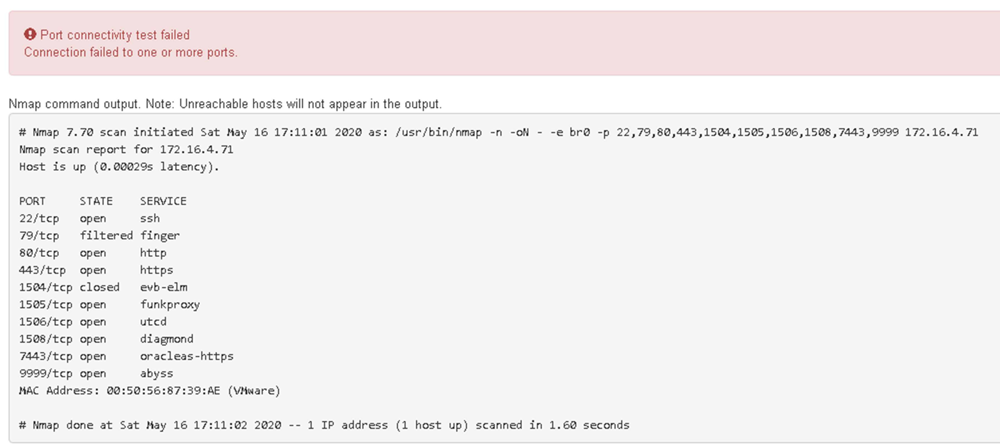

= ポートレベルのネットワーク接続を確認
:allow-uri-read: 
:icons: font
:imagesdir: ../media/

[role="lead"]
StorageGRID アプライアンスインストーラとその他のノードの間のアクセスがファイアウォールの妨げにならないように、 StorageGRID アプライアンスインストーラが指定した IP アドレスまたはアドレス範囲にある特定の TCP ポートまたはポートセットに接続できることを確認します。

.このタスクについて
StorageGRID アプライアンスインストーラに付属のポートのリストを使用して、アプライアンスとグリッドネットワーク内の他のノードの間の接続をテストできます。

また、外部 NFS サーバや DNS サーバで使用されるポートなど、管理ネットワークとクライアントネットワーク、および UDP ポートで接続をテストすることもできます。これらのポートのリストについては、を参照してください https://docs.netapp.com/us-en/storagegrid-118/network/network-port-reference.html["ネットワークポート参照"^]。

NOTE: ポート接続テーブルに表示されているグリッドネットワークポートは、StorageGRIDバージョン11.7以降でのみ有効です。各ノードタイプに適したポートを確認するには、使用している StorageGRID のバージョンに対応したネットワークガイドラインを確認する必要があります。

.手順
. StorageGRID アプライアンスインストーラから、 *Configure Networking *>* Port Connectivity Test (nmap)* をクリックします。
+
Port Connectivity Test ページが表示されます。

+
ポート接続テーブルには、グリッドネットワークでの TCP 接続を必要とするノードタイプが表示されます。各ノードタイプについて、アプライアンスにアクセスできる必要があるグリッドネットワークのポートがテーブルに表示されます。

+
表に記載されたアプライアンスポートとグリッドネットワーク内のその他のノードの間の接続をテストできます。

. [* ネットワーク *] ドロップダウンから、テストするネットワークを選択します。 * グリッド * 、 * 管理者 * 、または * クライアント * 。
. そのネットワーク上のホストの IPv4 アドレスの範囲を指定します。
+
たとえば、ネットワーク上のゲートウェイやプライマリ管理ノードをプローブできます。

+
次の例に示すように、ハイフンを使用して範囲を指定します。

. TCP ポート番号、カンマで区切ったポートのリスト、またはポートの範囲を入力します。
+
image::../media/port_connectivity_test_start.png[ポート接続テスト]

. [ 接続のテスト * ] をクリックします。
+
** 選択したポートレベルのネットワーク接続が有効な場合は、「 Port connectivity test passed 」というメッセージが緑色のバナーに表示されます。nmap コマンドの出力は、バナーの下に表示されます。
+
image::../media/port_connectivity_test_passed.png[ポート接続テストに成功しました]

** ポートレベルのネットワーク接続がリモートホストに確立されても ' ホストが選択したポートの 1 つ以上をリッスンしていない場合は ' ポート接続テストに失敗しましたというメッセージが黄色のバナーに表示されますnmap コマンドの出力は、バナーの下に表示されます。
+
ホストがリッスンしていないリモート・ポートの状態はすべて「 closed 」です。 たとえば、接続しようとしているノードがインストール済みの状態で、 StorageGRID NMS サービスがまだ実行されていない場合に、黄色のバナーが表示されることがあります。

+
image::../media/nmap_test_yellow_banner.png[Nmap テストイエローバナー]

** 選択した1つ以上のポートに対してポートレベルのネットワーク接続を確立できない場合は、赤いバナーに「Port connectivity test failed」というメッセージが表示されます。nmap コマンドの出力は、バナーの下に表示されます。
+
赤いバナーは、リモートホストのポートへの TCP 接続試行が行われたが、送信者には何も返されなかったことを示します。応答が返されない場合、ポートの状態は「 filtered 」となり、ファイアウォールによってブロックされている可能性があります。

+

NOTE: 「閉」のポートも一覧表示されます。

+

