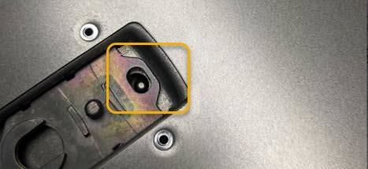

= SG110またはSG1100アプライアンスカバーを交換する
:allow-uri-read: 
:icons: font
:imagesdir: ../media/

[role="lead"]
メンテナンスのためにアプライアンスのカバーを取り外して内部コンポーネントにアクセスし、作業が完了したらカバーを元に戻します。

== カバーを取り外します

.作業を開始する前に
link:reinstalling-sg110-and-sg1100-into-cabinet-or-rack.html["キャビネットまたはラックからのアプライアンスの取り外し"] トップカバーにアクセスするには。

.手順
. アプライアンスカバーのラッチがロックされていないことを確認してください。必要に応じて、ラッチロックに示されているように、青色のプラスチック製ラッチロックをロック解除方向に4分の1回転させます。
. ラッチをアプライアンスシャーシの背面方向に上下に回転させて停止し、カバーをシャーシから慎重に持ち上げて脇に置きます。
+
image::../media/sg6060_cover_latch_open.jpg[アプライアンスのカバーラッチが開いている]

+

CAUTION: 静電気防止用リストバンドのストラップの端を手首に巻き付け、クリップの端を金属製のアースに固定して、アプライアンス内部での作業時に静電気が発生しないようにします。

== カバーを再度取り付けます

.作業を開始する前に
アプライアンス内ですべてのメンテナンス手順を完了しておきます。

.手順
. カバーラッチを開いた状態で、シャーシの上にあるカバーを持ち、上部カバーラッチの穴をシャーシのピンに合わせます。カバーの位置が合ったら、シャーシに下ろします。
+

. カバーラッチが止まるまで前後に回し、カバーをシャーシに完全に固定します。カバーの前端に隙間がないことを確認します。
+
カバーが完全に装着されていない場合、アプライアンスをラックにスライドさせて入れることができない可能性があります。

. オプション：ラッチロックに表示されているように、青色のプラスチックラッチロックを 1 / 4 回転させてロック方向に回します。

.完了後
link:reinstalling-sg110-and-sg1100-into-cabinet-or-rack.html["キャビネットまたはラックへのアプライアンスの再設置"]。
