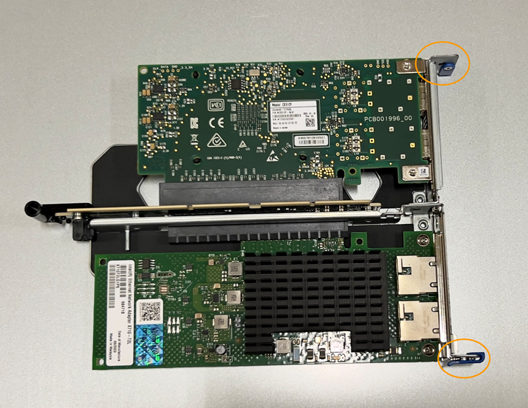

= SG110またはSG1100のNICの交換
:allow-uri-read: 
:icons: font
:imagesdir: ../media/

[role="lead"]
SG110またはSG1100が適切に機能しない場合や障害が発生した場合は、そのNICの交換が必要になることがあります。

次の手順を実行します。

* NICを取り外します
* NICを取り付け直します

== NICを取り外します

.作業を開始する前に
* 正しい交換用NICを用意しておきます。
* 次のことを決定しました。 link:verify-component-to-replace.html["交換するNICの場所"]。
* これで完了です link:locating-sg110-and-sg1100-in-data-center.html["SG110またはSG1100アプライアンスの物理的な場所"] データセンターのNICを交換する場所。
+

NOTE: A link:power-sg110-and-sg1100-off-on.html#shut-down-the-appliance["アプライアンスの通常のシャットダウン"] は、アプライアンスをラックから取り外す前に必要です。

* すべてのケーブルと link:reinstalling-sg110-and-sg1100-cover.html["アプライアンスカバーを取り外した"]。

.このタスクについて
サービスの中断を防ぐために、ネットワークインターフェイスカード（NIC）の交換を開始する前に他のすべてのストレージノードがグリッドに接続されていることを確認するか、サービスの中断が許容される時間帯にスケジュールされたメンテナンス時間内にNICを交換してください。の情報を参照してください https://docs.netapp.com/us-en/storagegrid-118/monitor/monitoring-system-health.html#monitor-node-connection-states["ノードの接続状態を監視しています"^]。

CAUTION: オブジェクトのコピーを1つだけ作成するILMルールを使用したことがある場合は、スケジュールされたメンテナンス時間にNICを交換する必要があります。そうしないと、この手順 中にオブジェクトへのアクセスが一時的に失われる可能性があります。については、を参照してください https://docs.netapp.com/us-en/storagegrid-118/ilm/why-you-should-not-use-single-copy-replication.html["シングルコピーレプリケーションを使用しない理由"^]。

.手順
. ESD リストバンドのストラップの端を手首に巻き付け、静電気の放電を防ぐためにクリップの端をメタルアースに固定します。
. アプライアンスの背面にあるNICを含むライザーアセンブリの場所を確認します。
+
アプライアンスの3つのNICは、写真のシャーシの位置にある2つのライザーアセンブリにあります（上部カバーを取り外した状態のアプライアンスの背面）。

+
image::../media/sgf6112-nic-positions.jpg[NICの場所]

+
[cols="1a,2a,4a"]
|===
|  | デバイス名またはパーツ名 | 説明 

 a| 
1.
 a| 
hic1/hic2
 a| 
2ポートライザーアセンブリ内の10 / 25GbEイーサネットネットワークポート

 a| 
2.
 a| 
mtc1/mtc2
 a| 
2ポートライザーアセンブリの1/10GBASE-T管理ポート

 a| 
3.
 a| 
hic3/hic4.
 a| 
1ポートライザーアセンブリ内の10 / 25GbEイーサネットネットワークポート

 a| 
4.
 a| 
2スロットライザーアセンブリ
 a| 
10 / 25GbE NICと1 / 10GBASE-T NICのいずれかをサポートします

 a| 
5.
 a| 
1スロットライザーアセンブリ
 a| 
いずれかの10 / 25GbE NICをサポートします

|===
. 障害が発生したNICのライザーアセンブリを青色のマークが付いた穴からつかんで、慎重に持ち上げます。ライザーアセンブリを持ち上げながらシャーシの前面方向に移動し、取り付けられているNICの外部コネクタがシャーシから外れるようにします。
. NICにアクセスできるように、ライザーを金属フレーム側を下にした平らな静電気防止面に置きます。
+
** *2枚のNICを搭載した2スロットライザーアセンブリ*
+

** * NICを1つ搭載した1スロットライザーアセンブリ*
+
image::../media/one-slot-assembly-sgf6112.png[1スロットライザーアセンブリのNIC]

. 交換するNICの青いラッチ（丸で囲まれた部分）を開き、NICをライザーアセンブリから慎重に取り外します。NICを少し揺らして、NICをコネクタから取り外します。力を入れすぎてはいけません。
. NICを静電気防止処置を施した平らな場所に置きます。

== NICを取り付け直します

取り外したNICと同じ場所に交換用NICを取り付けます。

.作業を開始する前に
* 正しい交換用NICを用意しておきます。
* 障害が発生した既存のNICを取り外しておきます。

.手順
. ESD リストバンドのストラップの端を手首に巻き付け、静電気の放電を防ぐためにクリップの端をメタルアースに固定します。
. 交換用NICをパッケージから取り出します。
. 2スロットライザーアセンブリのいずれかのNICを交換する場合は、次の手順を実行します。
+
.. 青色のラッチが開いた位置にあることを確認します。
.. NICをライザーアセンブリのコネクタに合わせます。写真に示すように、NICが完全に装着されるまで慎重にコネクタに押し込み、青色のラッチを閉じます。
+

.. 2スロットライザーアセンブリ（丸で囲んだ部分）の位置合わせ穴の位置をシステム基板のガイドピンに合わせて確認し、ライザーアセンブリの位置が正しいことを確認します。
+
image::../media/sgf6112_two-slot-riser_alignment_hole.png[大型ライザーアセンブリの位置合わせ穴]

.. システム基板上のガイドピンの位置を確認します
+
image::../media/sgf6112_two-slot-riser_guide-pin.png[2スロットライザーアセンブリのガイドピン]

.. ライザーアセンブリがシステム基板のコネクタおよびガイドピンに揃うように、ライザーアセンブリをシャーシに配置します。
.. 2スロットライザーアセンブリを、青色のマークが付いた穴の横の中心線に沿って、完全に装着されるまで慎重に押し込みます。

. 1スロットライザーアセンブリのNICを交換する場合は、次の手順を実行します。
+
.. 青色のラッチが開いた位置にあることを確認します。
.. NICをライザーアセンブリのコネクタに合わせます。写真に示すように、NICが完全に装着されるまで慎重にコネクタに押し込み、青色のラッチを閉じます。
+
image::../media/one-slot-assembly-sgf6112.png[1スロットライザーアセンブリのNIC]

.. 1スロットライザーアセンブリ（丸で囲んだ部分）の位置合わせ穴の位置をシステム基板のガイドピンに合わせて確認し、ライザーアセンブリの位置が正しいことを確認します。
+
image::../media/sgf6112_one-slot-riser_alignment_hole.png[1スロットライザーアセンブリの位置合わせ穴]

.. システム基板上のガイドピンの位置を確認します
+
image::../media/sgf6112_one-slot-riser_system-pin.png[1スロットライザーアセンブリのガイドピン]

.. 1スロットライザーアセンブリをシャーシに配置し、システム基板のコネクタとガイドピンの位置が合っていることを確認します。
.. 1スロットライザーアセンブリを、青色のマークが付いた穴の横の中心線に沿って、完全に装着されるまで慎重に押し込みます。

. ケーブルを再取り付けするNICポートから保護キャップを取り外します。

.完了後
アプライアンスで実行する他のメンテナンス手順がない場合は、アプライアンスのカバーを再度取り付け、アプライアンスをラックに戻してケーブルを接続し、電源を投入します。

部品の交換後、障害のある部品は、キットに付属する RMA 指示書に従ってネットアップに返却してください。を参照してください https://mysupport.netapp.com/site/info/rma["パーツの返品と交換"^] 詳細については、を参照してください。
