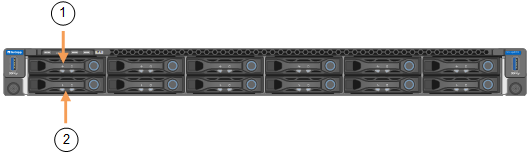

= SG110またはSG110アプライアンスの交換
:allow-uri-read: 
:icons: font
:imagesdir: ../media/

[role="lead"]
アプライアンスが適切に機能しない場合や障害が発生した場合は、交換が必要となることがあります。

.作業を開始する前に
* 交換するアプライアンスと同じパーツ番号の交換用アプライアンスを用意しておきます。
* アプライアンスに接続する各ケーブルを識別するためのラベルを用意しておきます。
* これで完了です link:locating-sg110-and-sg1100-in-data-center.html["アプライアンスを物理的に設置します"]。

.このタスクについて
アプライアンスの交換中は、 StorageGRID ノードにアクセスできなくなります。アプライアンスが動作している場合は、この手順 の起動時に通常の方法でシャットダウンを実行できます。

NOTE: StorageGRID ソフトウェアをインストールする前にアプライアンスを交換すると、この手順 の完了後すぐに StorageGRID アプライアンスインストーラにアクセスできない場合があります。StorageGRID アプライアンスインストーラには、アプライアンスと同じサブネット上の他のホストからはアクセスできますが、他のサブネット上のホストからはアクセスできません。この状態は 15 分以内に（元のアプライアンスのいずれかの ARP キャッシュエントリがタイムアウトした時点で）自動的に解消されます。あるいは、古い ARP キャッシュエントリをローカルルータまたはゲートウェイから手動でパージすれば、すぐにこの状態を解消できます。

.手順
. アプライアンスの現在の設定を表示して記録します。
+
.. 交換するアプライアンスにログインします。
+
... 次のコマンドを入力します。 `ssh admin@_grid_node_IP_`
... に記載されているパスワードを入力します `Passwords.txt` ファイル。
... 次のコマンドを入力してrootに切り替えます。 `su -`
... に記載されているパスワードを入力します `Passwords.txt` ファイル。
+
rootとしてログインすると、プロンプトがから変わります `$` 終了： `#`。

.. 入力するコマンド `*run-host-command ipmitool lan print*` をクリックして、アプライアンスの現在のBMC設定を表示します。

. link:power-sg110-and-sg1100-off-on.html#shut-down-the-sgf6112-appliance["アプライアンスをシャットダウンします"]。
. このStorageGRIDアプライアンスのいずれかのネットワークインターフェイスがDHCP用に設定されている場合は、交換用アプライアンスのMACアドレスを参照するように、DHCPサーバの永続的なDHCPリース割り当てを更新する必要があります。これにより、アプライアンスに適切なIPアドレスが確実に割り当てられます。
+
ネットワーク管理者またはDHCPサーバ管理者に連絡して、恒久的なDHCPリース割り当てを更新してください。管理者は、DHCPサーバのログから、またはアプライアンスのイーサネットポートが接続されているスイッチのMACアドレステーブルを調べて、交換用アプライアンスのMACアドレスを特定できます。

. アプライアンスを取り外して交換します。
+
.. ケーブルにラベルを付け、ケーブルとネットワークトランシーバを取り外します。
+

IMPORTANT: パフォーマンスの低下を防ぐため、ケーブルをねじったり、折り曲げたり、挟んだり、踏んだりしないでください。

.. link:reinstalling-sg110-and-sg1100-into-cabinet-or-rack.html["障害が発生したアプライアンスをキャビネットまたはラックから取り外す"]。
.. 障害が発生したアプライアンスの交換可能コンポーネント（電源装置2台、冷却ファン8台、NIC 3台、SSD 2台）の位置をメモします。
+
2つのドライブは、シャーシ内で次の位置にあります（ベゼルを取り外した状態のシャーシ前面）。

+

+
|===
|  | ドライブ 

 a| 
1.
 a| 
HDD00

 a| 
2.
 a| 
HDD01

|===
.. 交換可能なコンポーネントを交換用アプライアンスに移動します。
+
交換可能なコンポーネントの再取り付けについては、説明されているメンテナンス手順に従ってください。

+

CAUTION: ドライブのデータを保持する場合は、障害が発生したアプライアンスと同じドライブスロットにSSDドライブを挿入してください。そうしないと、アプライアンスインストーラに警告メッセージが表示されます。アプライアンスをグリッドに再参加させるには、ドライブを正しいスロットに配置し、アプライアンスをリブートする必要があります。

.. link:reinstalling-sg110-and-sg1100-into-cabinet-or-rack.html["交換用アプライアンスをキャビネットまたはラックに設置する"]。
.. ケーブルと光トランシーバを交換してください。

. アプライアンスの電源をオンにします。
. 交換したアプライアンスでSEDドライブでハードウェアドライブ暗号化が有効になっている場合は、次の手順を実行する必要があります。 link:optional-enabling-node-encryption.html#access-an-encrypted-drive["ドライブ暗号化パスフレーズを入力"] 交換用アプライアンスの初回起動時に暗号化されたドライブにアクセスするには、次の手順を実行します。
. アプライアンスがグリッドに再参加するまで待ちます。アプライアンスがグリッドに再参加しない場合は、StorageGRID アプライアンスインストーラのホームページのガイダンスに従って問題に対処してください。
+

WARNING: ディスクドライブを別のスロットに移動するなど、物理ハードウェアの変更が必要であることがアプライアンスインストーラによって示された場合は、ハードウェアを変更する前にアプライアンスの電源をオフにしてください。

. 交換したアプライアンスでノード暗号化の暗号化キーを管理するためにキー管理サーバ（KMS）を使用していた場合は、ノードをグリッドに追加するために追加の設定が必要になることがあります。ノードが自動的にグリッドに追加されない場合は、次の設定が新しいアプライアンスに転送されたことを確認し、想定される設定と異なる設定があれば手動で設定します。
+
** link:../installconfig/accessing-storagegrid-appliance-installer.html["StorageGRID 接続を設定します"]
** https://docs.netapp.com/us-en/storagegrid-118/admin/kms-overview-of-kms-and-appliance-configuration.html#set-up-the-appliance["アプライアンスのノード暗号化を設定します"^]

. 交換したアプライアンスにログインします。
+
.. 次のコマンドを入力します。 `ssh admin@_grid_node_IP_`
.. に記載されているパスワードを入力します `Passwords.txt` ファイル。
.. 次のコマンドを入力してrootに切り替えます。 `su -`
.. に記載されているパスワードを入力します `Passwords.txt` ファイル。

. 交換したアプライアンスのBMCネットワーク接続をリストアします。次の 2 つのオプションがあります。
+
** 静的IP、ネットマスク、およびゲートウェイを使用します
** DHCPを使用して、IP、ネットマスク、およびゲートウェイを取得します
+
... 静的IP、ネットマスク、およびゲートウェイを使用するようにBMCの設定をリストアするには、次のコマンドを入力します。
+
`*run-host-command ipmitool lan set 1 ipaddr _Appliance_IP_*`

+
`*run-host-command ipmitool lan set 1 netmask _Netmask_IP_*`

+
`*run-host-command ipmitool lan set 1 defgw ipaddr _Default_gateway_*`

... DHCPを使用してIP、ネットマスク、およびゲートウェイを取得するようにBMCの設定を復元するには、次のコマンドを入力します。
+
`*run-host-command ipmitool lan set 1 ipsrc dhcp*`

. BMCネットワーク接続をリストアしたら、BMCインターフェイスに接続して監査し、追加で適用したBMCのカスタム設定をリストアします。たとえば、SNMPトラップの送信先やEメール通知の設定を確認する必要があります。を参照してください link:../installconfig/configuring-bmc-interface.html["BMCインターフェイスの設定"]。
. アプライアンスノードが Grid Manager に表示され、アラートが表示されていないことを確認します。

.関連情報
link:../installconfig/viewing-status-indicators.html["ステータスインジケータを表示します"]

link:../installconfig/troubleshooting-hardware-installation-sg110-and-sg1100.html#view-error-codes["アプライアンスのブート時のコードを確認します"]

部品の交換後、障害のある部品は、キットに付属する RMA 指示書に従ってネットアップに返却してください。を参照してください https://mysupport.netapp.com/site/info/rma["パーツの返品と交換"^] 詳細については、を参照してください。
