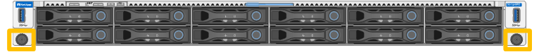

= SG120とSG1200をキャビネットまたはラックに再配置
:allow-uri-read: 
:icons: font
:imagesdir: ../media/

[role="lead"]
SG120またはSG1200をキャビネットまたはラックから取り外して上部カバーにアクセスするか、アプライアンスを別の場所に移動してから、ハードウェアのメンテナンスが完了したら、アプライアンスをキャビネットまたはラックに再度取り付けます。

.作業を開始する前に
* SG120またはSG1200に接続されている各ケーブルを識別するためのラベルがあります。
* link:locating-sg120-and-sg1200-in-data-center.html["SG120またはSG1200が物理的に配置されている"]データセンターでメンテナンスを実行している場所があります。
* link:power-sg120-and-sg1200-off-on.html#shut-down-the-sg120-or-sg1200-appliance["SG120またはSG1200をシャットダウンする"]があります。
+

CAUTION: 電源スイッチを使用してアプライアンスをシャットダウンしないでください。

== 手順1：SG120またはSG1200をキャビネットまたはラックから取り外します

.手順
. アプライアンスの電源ケーブルにラベルを付けてから外します。
. ESD リストバンドのストラップの端を手首に巻き付け、静電気の放電を防ぐためにクリップの端をメタルアースに固定します。
. アプライアンスのデータケーブルと、SFP+、SFP28、またはSFP56トランシーバーにラベルを付けてから、それらを取り外してください。
+

IMPORTANT: パフォーマンスの低下を防ぐため、ケーブルをねじったり、折り曲げたり、挟んだり、踏んだりしないでください。

. アプライアンスの前面パネルの2本の非脱落型ネジを緩めます。
+

. SG120またはSG1200をラックから前方にスライドさせ、取り付けレールが完全に伸びて両側のラッチがカチッと音がするまで引き出します。
+
アプライアンスの上部カバーには手が届きます。

+

NOTE: キャビネットやラックから機器を完全に取り外す場合は、レールキットの説明書に従って、レールから機器を取り外してください。

== ステップ2：SG120またはSG1200をキャビネットまたはラックに再設置します

.手順
. 両方のラックレールにある青色のレールリリースを同時に押し、SG120またはSG1200をラックに完全に収まるまでスライドさせて挿入します。
+
コントローラをこれ以上動かせない場合は、シャーシの両側にある青いラッチを引いて、コントローラを奥までスライドさせます。

+
image::../media/sg6000_cn_rails_blue_button.gif[SG120またはSG1200のレール上でのスライド]

+

NOTE: コントローラの電源を入れるまでは、前面ベゼルを取り付けないでください。

. コントローラの前面パネルの非脱落型ネジを締めて、コントローラをラックに固定します。
+

. ESD リストバンドのストラップの端を手首に巻き付け、静電気の放電を防ぐためにクリップの端をメタルアースに固定します。
. link:../installconfig/cabling-appliance.html["コントローラーのデータケーブルとSFPトランシーバーを再接続します"]。
+

IMPORTANT: パフォーマンスの低下を防ぐため、ケーブルをねじったり、折り曲げたり、挟んだり、踏んだりしないでください。

. link:../installconfig/connecting-power-cords-and-applying-power.html["コントローラの電源ケーブルを再接続"]。
. link:power-sg120-and-sg1200-off-on.html#power-on-sg120-or-sg1200-and-verify-operation["アプライアンスの再起動"]。

