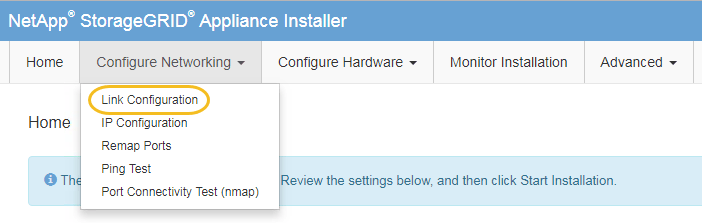

= SG5800コントローラのリンク設定を変更
:allow-uri-read: 
:icons: font
:imagesdir: ../media/

[role="lead"]
SG5800コントローラのイーサネットリンク設定を変更できます。ポートボンディングモード、ネットワークボンディングモード、およびリンク速度を変更できます。

.作業を開始する前に
link:../commonhardware/placing-appliance-into-maintenance-mode.html["SG5800コントローラをメンテナンスモードにする"]。

NOTE: まれに、 StorageGRID アプライアンスをメンテナンスモードにすると、アプライアンスにリモートアクセスできなくなることがあります。

.このタスクについて
SG5800コントローラのイーサネットリンク設定を変更するオプションは次のとおりです。

* ポートボンディングモード * を「 Fixed 」から「 Aggregate 」または「 Aggregate 」から「 Fixed 」に変更します
* ネットワークボンディングモード * を Active-Backup から LACP に、または LACP から Active-Backup に変更
* VLAN タグを有効または無効にするか、 VLAN タグの値を変更します
* リンク速度を自動（推奨）、10GbE、または25GbEに変更する。

.手順
. メニューから * Configure Networking * > * Link Configuration * を選択します。
+

. [[change_link_configuration_sg5800、start=2]]リンク設定に必要な変更を加えます。
+
オプションの詳細については、を参照してください link:../installconfig/configuring-network-links.html["ネットワークリンクを設定する"]。

. 選択に問題がなければ、 * 保存 * をクリックします。
+

NOTE: 接続しているネットワークまたはリンクを変更すると、接続が失われる可能性があります。1分以内に再接続されない場合は、アプライアンスに割り当てられている他のIPアドレスのいずれかを使用してStorageGRID アプライアンスインストーラのURLを再入力します：+
`*https://_SG5800_Controller_IP_:8443*`

+
VLAN 設定を変更した場合は、アプライアンスのサブネットが変更されている可能性があります。アプライアンスの IP アドレスを変更する必要がある場合は、に従います link:../installconfig/setting-ip-configuration.html["StorageGRID IPアドレスを設定します"] 手順

. StorageGRID アプライアンスインストーラから、 *Configure Networking*>*Ping Test* を選択します。
. 手順でのリンク設定の変更によって影響を受けた可能性があるネットワーク上のIPアドレスへの接続を確認するには、[Ping Test]ツールを使用し<<change_link_configuration_sg5800,リンク設定を変更します>>ます。
+
最低でもプライマリ管理ノードのグリッド IP アドレスと、 1 つ以上の他のストレージノードのグリッド IP アドレスについて、 ping が通ることを確認します。必要に応じて、リンク設定の問題を修正します。

. リンク設定の変更が問題なく機能していることを確認したら、ノードをリブートします。StorageGRID アプライアンス・インストーラから、 *Advanced*>* Reboot Controller* を選択し、 * Reboot into StorageGRID * を選択します。
+
image::../media/reboot_controller_from_maintenance_mode.png[コントローラをメンテナンスモードでリブートします]

+
アプライアンスがリブートしてグリッドに再参加するまでに最大 20 分かかることがあります。リブートが完了し、ノードが再びグリッドに参加したことを確認するには、 Grid Manager に戻ります。nodes *ページに正常なステータス（緑色のチェックマークアイコン）が表示されます image:../media/icon_alert_green_checkmark.png["緑のチェックマーク"] （ノード名の左側）に表示されます。これは、アクティブなアラートがなく、ノードがグリッドに接続されていることを示します。

+
image::../media/nodes_menu.png[アプライアンスノードがグリッドに再参加しました]

