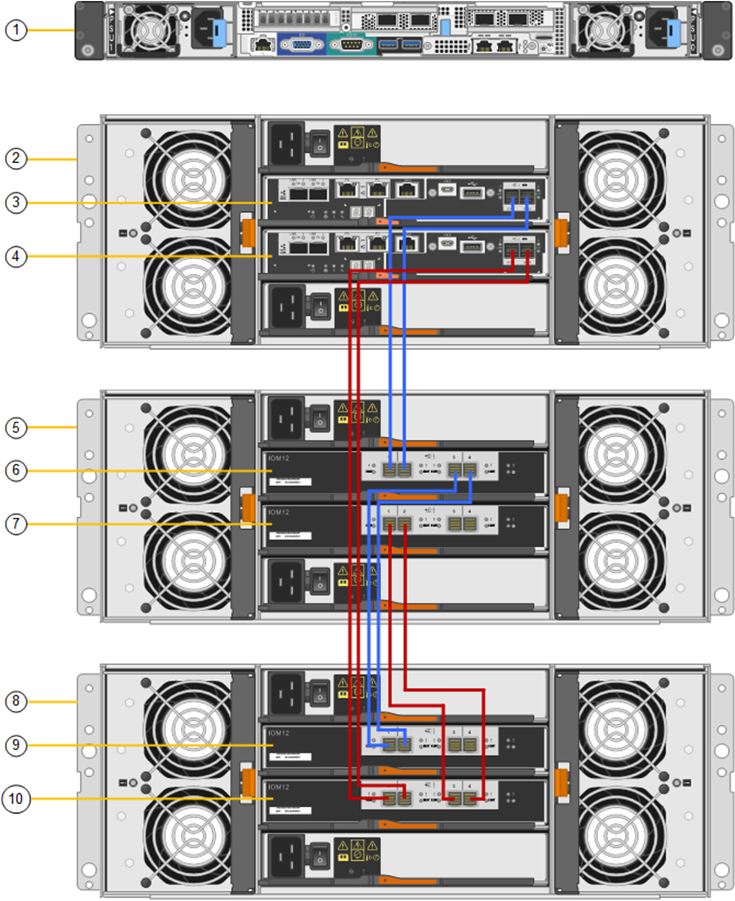
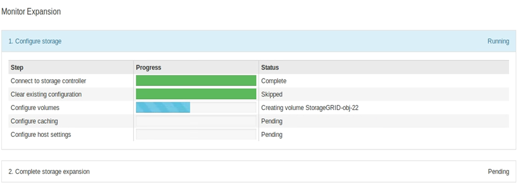

= 導入済み SG6060 に拡張シェルフを追加します
:allow-uri-read: 
:icons: font
:imagesdir: ../media/

[role="lead"]
ストレージ容量を増やすには、 StorageGRID システムにすでに導入されている SG6060 に拡張シェルフを 1 台または 2 台追加します。

.作業を開始する前に
* プロビジョニングパスフレーズが必要です。
* StorageGRID 11.4 以降が実行されている必要があります。
* 拡張シェルフごとに、拡張シェルフと SAS ケーブルを 2 本用意します。
* データセンターに拡張シェルフを追加するストレージアプライアンスを物理的に配置しておきます。
+
link:locating-controller-in-data-center.html["データセンターでコントローラを探します"]

.このタスクについて
拡張シェルフを追加するには、次の手順を実行します。

* キャビネットまたはラックにハードウェアを設置します。
* SG6060 をメンテナンスモードにします。
* 拡張シェルフを E2860 コントローラシェルフまたは別の拡張シェルフに接続します。
* StorageGRID アプライアンスインストーラを使用して拡張を開始します
* 新しいボリュームが設定されるまで待ちます。

拡張シェルフ 1 台または 2 台の手順 を完了するには、アプライアンスノードあたり 1 時間以内に作業を行う必要があります。ダウンタイムを最小限に抑えるために、次の手順では、 SG6060 をメンテナンスモードにする前に新しい拡張シェルフとドライブを設置するように指示します。残りの手順には、アプライアンスノード 1 台あたり 20~30 分かかります。

.手順
. の手順に従ってください link:../installconfig/sg6060-installing-60-drive-shelves-into-cabinet-or-rack.html["キャビネットまたはラックへの60ドライブシェルフの設置"]。
. の手順に従ってください link:../installconfig/sg6060-installing-drives.html["ドライブの取り付け"]。
. Grid Manager から link:../commonhardware/placing-appliance-into-maintenance-mode.html["SG6000-CN コントローラをメンテナンスモードにします"]。
. 次の図に示すように、各拡張シェルフを E2860 コントローラシェルフに接続します。
+
この図は、 2 台の拡張シェルフを示しています。IOM A のみをコントローラ A に接続し、 IOM B をコントローラ B に接続します

+

+
[cols="1a,2a"]
|===
| コールアウト | 説明 

 a| 
1.
 a| 
SG6000-CN の情報

 a| 
2.
 a| 
E2860 コントローラシェルフです

 a| 
3.
 a| 
コントローラ A

 a| 
4.
 a| 
コントローラ B

 a| 
5.
 a| 
拡張シェルフ 1

 a| 
6.
 a| 
拡張シェルフ 1 の IOM A

 a| 
7.
 a| 
拡張シェルフ 1 の IOM B

 a| 
8
 a| 
拡張シェルフ2

 a| 
9
 a| 
拡張シェルフ2のIOM A

 a| 
10
 a| 
拡張シェルフ2のIOM B

|===
. 電源コードを接続し、拡張シェルフに電源を投入
+
.. 各拡張シェルフの 2 つ電源装置のそれぞれに電源コードを接続します。
.. 各拡張シェルフの 2 本の電源コードを、キャビネットまたはラック内の別々の PDU に接続します。
.. 拡張シェルフごとに 2 つの電源スイッチをオンにします。
+
*** 電源投入プロセス中は、電源スイッチをオフにしないでください。
*** 拡張シェルフのファンは、初回起動時に大きな音を立てることがあります。起動時に大きな音がしても問題はありません。

. StorageGRID アプライアンスインストーラのホームページを監視します。
+
拡張シェルフの電源投入が完了してシステムで検出されるまでに約 5 分かかります。ホームページに、検出された新しい拡張シェルフの数と、拡張の開始ボタンが有効になっていることが表示されます。

+
次のスクリーンショットは、既存または新規の拡張シェルフの数に応じて、ホームページに表示されるメッセージの例を示しています。

+
** ページ上部の丸で囲まれたバナーには、検出された拡張シェルフの総数が表示されます。
+
*** バナーには拡張シェルフの総数が表示され、シェルフの構成と導入が完了しているか、新規および未設定のいずれであるかが示されます。
*** 拡張シェルフが検出されなかった場合は、バナーは表示されません。

** ページ下部の丸で囲まれたメッセージは、拡張を開始する準備ができていることを示します。
+
*** メッセージには、 StorageGRID が検出した新しい拡張シェルフの数が示されます。「 Attached 」は、シェルフが検出されたことを示します。"`Unconfigureed" は、シェルフが新規であり、 StorageGRID アプライアンス・インストーラを使用してまだ構成されていないことを示します。
+

NOTE: すでに導入されている拡張シェルフはこのメッセージに含まれません。これらの値は、ページ上部のバナーの数に含まれています。

*** このメッセージは、新しい拡張シェルフが検出されない場合は表示されません。
+
image::../media/appl_installer_home_expansion_shelf_ready_to_install.png[拡張シェルフの設置]

. 必要に応じて、ホームページのメッセージに記載されている問題を解決します。
+
たとえば、ストレージハードウェアの問題を解決するには、 SANtricity System Manager を使用します。

. ホームページに表示される拡張シェルフの数が、追加する拡張シェルフの数と一致していることを確認します。
+

NOTE: 新しい拡張シェルフが検出されていない場合は、適切にケーブル接続され、電源がオンになっていることを確認します。

. [[start_expansion]] * Start Expansion をクリックして、拡張シェルフを設定し、オブジェクトストレージで使用できるようにします。
. 拡張シェルフ構成の進捗状況を監視します。
+
初期インストール時と同様に、進行状況バーが Web ページに表示されます。

+

+
設定が完了すると、アプライアンスが自動的にリブートしてメンテナンスモードを終了し、グリッドに再参加します。このプロセスには最大20分かかることがあります。

+

NOTE: 拡張シェルフの構成に失敗した場合に再試行するには、 StorageGRID アプライアンスインストーラで * Advanced * > * Reboot Controller * を選択し、 * Reboot into Maintenance Mode * を選択します。ノードがリブートしたら、を再試行します <<start_expansion,拡張シェルフ構成>>。

+
リブートが完了すると、 * Tasks * タブは次のスクリーンショットのようになります。

+
image::../media/appliance_installer_reboot_complete.png[リブートが完了しました]

. アプライアンスストレージノードおよび新しい拡張シェルフのステータスを確認します。
+
.. Grid Managerで、* nodes *を選択し、アプライアンスストレージノードに緑のチェックマークアイコンが表示されていることを確認します。
+
緑のチェックマークアイコンは、アクティブなアラートがなく、ノードがグリッドに接続されていることを示します。ノードアイコンの説明については、を参照してください https://docs.netapp.com/us-en/storagegrid/monitor/monitoring-system-health.html#monitor-node-connection-states["ノードの接続状態を監視します"^]。

.. 「 * Storage * 」タブを選択し、追加した各拡張シェルフのオブジェクトストレージテーブルに 16 個の新しいオブジェクトストアが表示されていることを確認します。
.. 新しい各拡張シェルフのシェルフステータスが Nominal であり、構成ステータスが Configured になっていることを確認します。

