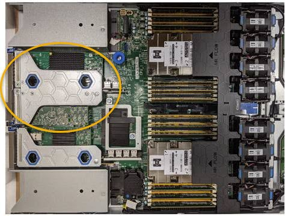

= SG6000のファイバチャネルHBAの交換
:allow-uri-read: 
:icons: font
:imagesdir: ../media/

[role="lead"]
Fibre Channel HBAが適切に機能しない場合や障害が発生した場合は、交換が必要になることがあります。

== 交換するファイバチャネル HBA を確認します

交換する Fibre Channel Host Bus Adapter （ HBA ；ホストバスアダプタ）が不明な場合は、この手順 を確認してください。

.作業を開始する前に
* Fibre Channel HBA を交換する必要があるストレージアプライアンスまたは SG6000-CN コントローラのシリアル番号を確認しておきます。
+

NOTE: 交換するファイバチャネル HBA を搭載したストレージアプライアンスのシリアル番号が先頭の文字が Q である場合、 Grid Manager には表示されません。データセンター内の各 SG6000-CN コントローラの前面に接続されているタグが一致するまで確認しておく必要があります。

* Grid Managerにサインインしておきます https://docs.netapp.com/us-en/storagegrid/admin/web-browser-requirements.html["サポートされている Web ブラウザ"^]。

.手順
. Grid Manager から * nodes * を選択します。
. ノードページのテーブルで、アプライアンスストレージノードを選択します。
. [* ハードウェア * ] タブを選択します。
+
StorageGRID アプライアンスのセクションで、ストレージアプライアンスのシャーシのシリアル番号 * とコンピューティングコントローラのシリアル番号 * を確認します。これらのシリアル番号のいずれかが、ファイバ・チャネル HBA を交換するストレージ・アプライアンスのシリアル番号と一致しているかどうかを確認します。いずれかのシリアル番号が一致していれば、正しいアプライアンスが見つかりました。

+
image::../media/nodes_page_hardware_tab_for_appliance_verify_HBA.png[ファイバチャネル HCA のアプライアンスセクション]

+
** StorageGRID アプライアンスのセクションが表示されない場合、選択したノードは StorageGRID アプライアンスではありません。ツリービューから別のノードを選択する。
** アプライアンスモデルがSG6060またはSG6060Xでない場合は、ツリービューから別のノードを選択します。
** シリアル番号が一致しない場合は、ツリービューから別のノードを選択します。

. Fibre Channel HBA を交換する必要があるノードの場所を特定したら、コンピューティングコントローラの BMC IP アドレスをメモします。 StorageGRID アプライアンスのセクションに記載されています。
+
このIPアドレスは、次の目的で使用できます。 link:turning-controller-identify-led-on-and-off.html["コンピューティングコントローラの識別LEDを点灯"]を使用すると、データセンターでアプライアンスの場所を簡単に確認できます。

== ファイバチャネル HBA を取り外します

SG6000-CN コントローラが適切に機能しない場合や障害が発生した場合は、 SG6000-CN コントローラの Fibre Channel Host Bus Adapter （ HBA ；ホストバスアダプタ）の交換が必要となることがあります。

.作業を開始する前に
* 正しい交換用の Fibre Channel HBA を用意しておきます。
* これで完了です link:reinstalling-fibre-channel-hba.html#verify-fibre-channel-hba-to-replace["交換するファイバチャネルHBAが搭載されているSG6000-CNコントローラを特定"]。
* これで完了です link:locating-controller-in-data-center.html["SG6000-CNコントローラの物理的な場所を確認します"] 実現します。
* これで完了です link:power-sg6000-cn-controller-off-on.html#shut-down-sg6000-cn-controller["SG6000-CNコントローラをシャットダウンします"]。
+

CAUTION: コントローラをラックから取り外す前に、通常の方法でシャットダウンする必要があります。

* これで完了です link:reinstalling-sg6000-cn-controller-into-cabinet-or-rack.html#remove-sg6000-cn-controller-from-cabinet-or-rack["キャビネットまたはラックからコントローラを取り外した"]。
* これで完了です link:reinstalling-sg6000-cn-controller-cover.html#remove-sg6000-cn-controller-cover["コントローラのカバーを取り外した"]。

.このタスクについて
サービスの中断を防ぐには、ファイバチャネルHBAの交換を開始する前に他のすべてのストレージノードがグリッドに接続されていることを確認するか、サービスの中断が許容されるスケジュールされたメンテナンス期間中にアダプタを交換してください。の情報を参照してください https://docs.netapp.com/us-en/storagegrid/monitor/monitoring-system-health.html#monitor-node-connection-states["ノードの接続状態を監視しています"^]。

CAUTION: オブジェクトのコピーを 1 つだけ作成する ILM ルールを使用したことがある場合は、スケジュールされたメンテナンス期間中に Fibre Channel HBA を交換する必要があります。そうしないと、この手順 中にオブジェクトへのアクセスが一時的に失われる可能性があります。+についての情報を参照してください https://docs.netapp.com/us-en/storagegrid/ilm/why-you-should-not-use-single-copy-replication.html["シングルコピーレプリケーションを使用しない理由"^]。

.手順
. ESD リストバンドのストラップの端を手首に巻き付け、静電気の放電を防ぐためにクリップの端をメタルアースに固定します。
. ファイバーチャネル HBA を搭載したコントローラの背面にあるライザーアセンブリを探します。
+

. 青いマークの付いた穴を通してライザーアセンブリをつかみ、慎重に持ち上げます。取り付けられているアダプタの外部コネクタがシャーシから外れるように、ライザーアセンブリをシャーシの前面方向に持ち上げます。
. 金属製フレーム側を下にしてライザーカードを静電気防止用の平らな場所に置き、アダプタにアクセスします。
+
image::../media/sg6060_fc_hba_location.jpg[ライザーアセンブリ内の SG6060 Fibre Channel HBA]

+
ライザーアセンブリには、ファイバチャネル HBA とイーサネットネットワークアダプタの 2 つのアダプタがあります。この図では Fibre Channel HBA を示しています。

. 青色のアダプタラッチ（丸で囲んだ部分）を開き、ファイバチャネル HBA をライザーアセンブリから慎重に取り外します。アダプタをわずかにロックして、アダプタをコネクタから取り外します。力を入れすぎてはいけません。
. アダプタを静電気防止処置を施した平らな場所に置きます。

.完了後
link:reinstalling-fibre-channel-hba.html["交換用ファイバチャネルHBAを取り付けます"]。

部品の交換後、障害のある部品は、キットに付属する RMA 指示書に従ってネットアップに返却してください。を参照してください https://mysupport.netapp.com/site/info/rma["パーツの返品と交換"^] 詳細については、を参照してください。

== Fibre Channel HBA を再度取り付けます

交換用のファイバチャネル HBA は、取り外した HBA と同じ場所に取り付けます。

.作業を開始する前に
* 正しい交換用の Fibre Channel HBA を用意しておきます。
* 既存の Fibre Channel HBA を削除しておきます。
+
link:reinstalling-fibre-channel-hba.html#remove-fibre-channel-hba["ファイバチャネル HBA を取り外します"]

.手順
. ESD リストバンドのストラップの端を手首に巻き付け、静電気の放電を防ぐためにクリップの端をメタルアースに固定します。
. 交換用の Fibre Channel HBA をパッケージから取り出します。
. 青色のアダプタラッチを開いた状態で、ファイバチャネル HBA をライザーアセンブリのコネクタに合わせ、アダプタが完全に装着されるまで慎重にコネクタに押し込みます。
+
image::../media/sg6060_fc_hba_location.jpg[ライザーアセンブリ内の SG6060 Fibre Channel HBA]

+
ライザーアセンブリには、ファイバチャネル HBA とイーサネットネットワークアダプタの 2 つのアダプタがあります。この図では Fibre Channel HBA を示しています。

. ライザーアセンブリの位置合わせ穴（丸で囲んだ箇所）を見つけます。この穴は、システム基板のガイドピンに合わせて配置されており、ライザーアセンブリの位置が正しいことを確認します。
+
image::../media/sg6060_riser_alignment_hole.jpg[SG6060 ライザーアセンブリの位置合わせ穴]

. ライザーアセンブリをシャーシに配置し、システム基板のコネクタとガイドピンの位置が合っていることを確認してから、ライザーアセンブリを挿入します。
. ライザーアセンブリが完全に装着されるまで、青いマークの付いた穴の横にある中心線に沿って慎重に押し込みます。
. ケーブルを再取り付けするファイバチャネル HBA ポートから保護キャップを取り外します。

.完了後
コントローラで実行する他のメンテナンス手順がない場合は、 link:reinstalling-sg6000-cn-controller-cover.html["コントローラのカバーを再度取り付けます。"]。
