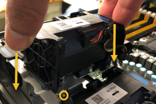

= SG6000-CNコンピュートコントローラのファンを交換する
:allow-uri-read: 
:icons: font
:imagesdir: ../media/

[role="lead"]
SG6000-CN コンピュート コントローラには 8 つの冷却ファンがあります。ファンの 1 つが故障した場合は、コントローラが適切に冷却されるように、できるだけ早く交換する必要があります。

.作業を開始する前に
* 交換用ファンを開封しておきます。
* これで完了です link:locating-controller-in-data-center.html["アプライアンスを物理的に設置します"]。
* 他のファンが取り付けられ、動作していることを確認しておきます。

.このタスクについて
ファンを交換する間、ストレージ ノードにアクセスできなくなります。

写真は、SG6000-CN コンピューティング コントローラのファンを示しています。コントローラーの上部カバーを取り外すと、冷却ファンにアクセスできます。

NOTE: 2 つの電源装置にもそれぞれファンが搭載されています。これらのファンはこの手順 には含まれていません。

image::../media/fan_fru.png[ファン FRU]

.手順
. link:power-sg6000-cn-controller-off-on.html["SG6000-CNコントローラをシャットダウンする"] 。
. 上部カバーのラッチを持ち上げて、アプライアンスからカバーを取り外します。
. 障害が発生しているファンを特定します。
+
image::../media/fan_location.png[ファンの位置]

. 障害が発生したファンをシャーシから取り出します。
+
image::../media/fan_removal.png[ファンの取り外し]

. 交換用ファンをシャーシのオープンスロットにスライドさせて挿入します。
+
ファンの端をガイドピンに合わせます。ピンは写真の丸で囲んでいます。

+

. ファンのコネクタを回路基板にしっかりと押し込みます。
+
image::../media/fan_connector_check.png[ファンコネクタの点検]

. 上部カバーをアプライアンスに戻し、ラッチを押し下げてカバーを所定の位置に固定します。
. link:power-sg6000-cn-controller-off-on.html#poweron["SG6000-CNコントローラの電源をオンにする"] 。
. アプライアンスノードが Grid Manager に表示され、アラートが表示されていないことを確認します。

部品の交換後、障害のある部品は、キットに付属する RMA 指示書に従ってネットアップに返却してください。を参照してください https://mysupport.netapp.com/site/info/rma["パーツの返品と交換"^] 詳細については、を参照してください。
