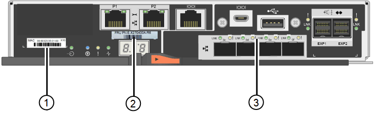

= SG6000のストレージコントローラを交換します
:allow-uri-read: 
:icons: font
:imagesdir: ../media/

[role="lead"]
E2800シリーズコントローラまたはEF570コントローラが適切に機能しない場合や障害が発生した場合は、コントローラの交換が必要となることがあります。

.作業を開始する前に
* 交換するコントローラと同じパーツ番号の交換用コントローラを用意しておきます。
* コントローラに接続する各ケーブルを識別するためのラベルを用意しておきます。
* ESD リストバンドを装着するか、静電気防止処置を施しておきます。
* No.1 プラスドライバを用意しておきます。
* データセンター内のコントローラを交換するストレージアプライアンスの物理的な場所を確認しておきます。
+
link:locating-controller-in-data-center.html["データセンターでコントローラを探します"]

NOTE: StorageGRID アプライアンスのコントローラを交換する際は、Eシリーズの手順書を参考にしないでください。手順が異なります。

.このタスクについて
コントローラに障害が発生したかどうかは、次の 2 つの方法で確認できます。

* SANtricity System Manager の Recovery Guru から、コントローラを交換するように指示されます。
* コントローラの黄色の警告 LED が点灯して、コントローラに障害が発生したことが通知されます。
+

NOTE: シェルフ内の両方のコントローラの警告 LED が点灯している場合は、テクニカルサポートに連絡してください。

アプライアンスにストレージコントローラが2台搭載されている場合は、次の条件を満たしていれば、アプライアンスの電源がオンで読み取り/書き込み処理が行われている間に片方のコントローラを交換できます。

* シェルフのもう一方のコントローラのステータスが「最適」である。
* SANtricity System Manager の Recovery Guru の詳細領域の「 * 削除してもよろしいですか？」というメッセージが表示され、このコンポーネントを削除しても安全であることを示します。

NOTE: 可能な場合は、この交換用手順 のアプライアンスをメンテナンスモードにして、予期しないエラーや障害が発生した場合の影響を最小限にしてください。

NOTE: シェルフの2台目のコントローラのステータスが「最適」でない場合や、Recovery Guruにコントローラを削除しないよう記載されている場合は、テクニカルサポートにお問い合わせください。

コントローラを交換するときは、元のコントローラからバッテリを取り外し、交換用コントローラに取り付ける必要があります。場合によっては、元のコントローラからホストインターフェイスカードを取り外して、交換用コントローラに取り付ける必要があります。

NOTE: ほとんどのアプライアンスモデルのストレージコントローラには、ホストインターフェイスカード（HIC）は搭載されていません。

このタスクには、次の部分があります。

. 準備
. コントローラをオフラインにします
. コントローラを取り外します
. バッテリを新しいコントローラに移動します
. 必要に応じてHICを新しいコントローラに移動します
. コントローラを交換してください

== 準備

.手順
. 新しいコントローラを開封し、静電気防止処置を施した平らな場所に置きます。
+
梱包材は、障害が発生したコントローラを発送するときのために保管しておいてください。

. 交換用コントローラの背面にある MAC アドレスと FRU パーツ番号のラベルを確認します。

次の図は、E2800AコントローラとE2800Bコントローラを示しています。E2800シリーズのコントローラとEF570コントローラの交換用手順 は同じです。

E2800Aストレージコントローラ：

image::../media/e2800_labels_on_controller.gif[E2800AコントローラのMACラベルとFRUラベル]

E2800Bストレージコントローラ：

[cols="1a,2a,4a"]
|===
| ラベル | コンポーネント | 説明 

 a| 
1.
 a| 
MACアドレス
 a| 
管理ポート1のMACアドレス（E2800Aの場合は「P1」、E2800B`の場合は「0a」）。元のコントローラの IP アドレスが DHCP を使用して取得したアドレスである場合は、新しいコントローラに接続する際にこのアドレスが必要になります。

 a| 
2.
 a| 
FRUパーツ番号
 a| 
FRU パーツ番号。この番号は、現在取り付けられているコントローラの交換パーツ番号と一致している必要があります。

 a| 
3.
 a| 
4ポートHIC
 a| 
4ポートのホストインターフェイスカード（HIC）。このカードは、交換の際に新しいコントローラに移動する必要があります。

*注：E2800AコントローラにはHICが搭載されていません。

|===

== コントローラをオフラインにします

.手順
. コントローラを取り外す準備をします。これらの手順を実行するには、 SANtricity System Manager を使用します。
+
.. 障害が発生したコントローラの交換パーツ番号が交換用コントローラの FRU パーツ番号と同じであることを確認します。
+
コントローラに障害が発生しているため交換が必要な場合は、 Recovery Guru の詳細領域に交換パーツ番号が表示されます。この番号を手動で確認する必要がある場合は、コントローラの * Base * タブを参照してください。

+

CAUTION: *データアクセスが失われる可能性があります&#8212;* 2つのパーツ番号が同じでない場合は、この手順 を使用しないでください。

.. 構成データベースをバックアップします。
+
コントローラを取り外すときに問題が発生した場合は、保存したファイルを使用して構成をリストアできます。

.. アプライアンスのサポートデータを収集します。
+

NOTE: コンポーネントを交換する前後にサポートデータを収集することで、交換しても問題が解決しない場合に、テクニカルサポートにすべてのログを送信できます。

.. 交換するコントローラをオフラインにします。

== コントローラを取り外します

.手順
. コントローラをアプライアンスから取り外します。
+
.. ESD リストバンドを装着するか、静電気防止処置を施します。
.. ケーブルにラベルを付け、ケーブルと SFP を外します。
+

NOTE: パフォーマンスの低下を防ぐため、ケーブルをねじったり、折り曲げたり、挟んだり、踏んだりしないでください。

.. カムハンドルのラッチを押してコントローラをアプライアンスから外し、カムハンドルを右側に開きます。
.. 両手でカムハンドルをつかみ、コントローラをスライドしてアプライアンスから引き出します。
+

CAUTION: コントローラは重いので、必ず両手で支えながら作業してください。

.. 取り外し可能なカバーを上にして、静電気防止処置を施した平らな場所にコントローラを置きます。
.. カバーをボタンを押し下げながらスライドして取り外します。

== バッテリを新しいコントローラに移動します

.手順
. 障害が発生したコントローラからバッテリを取り外し、交換用コントローラに取り付けます。
+
.. コントローラ内部（バッテリと DIMM の間）の緑の LED が消灯していることを確認します。
+
この緑の LED が点灯している場合は、コントローラがまだバッテリ電源を使用しています。この LED が消灯するのを待ってから、コンポーネントを取り外す必要があります。

+
image::../media/e2800_internal_cache_active_led.gif[E2800 の緑色の LED]

+
[cols="1a,2a"]
|===
| 項目 | 説明 

 a| 
1.
 a| 
内部キャッシュアクティブ LED

 a| 
2.
 a| 
バッテリー

|===
.. バッテリの青色のリリースラッチの位置を確認します。
.. バッテリをリリースラッチを押し下げながら引き出し、コントローラから外します。
+
image::../media/e2800_remove_battery.gif[バッテリのラッチ]

+
[cols="1a,2a"]
|===
| 項目 | 説明 

 a| 
1.
 a| 
バッテリのリリースラッチ

 a| 
2.
 a| 
バッテリー

|===
.. バッテリを持ち上げながらスライドし、コントローラから引き出します。
.. 交換用コントローラのカバーを取り外します。
.. バッテリのスロットが手前になるよう交換用コントローラの向きを変えます。
.. バッテリを少し下に傾けながらコントローラに挿入します。
+
バッテリ前部の金属製のフランジをコントローラ下部のスロットに挿入し、バッテリの上部がコントローラの左側にある小さな位置決めピンの下にくるまでスライドする必要があります。

.. バッテリラッチを上に動かしてバッテリを固定します。
+
カチッという音がしてラッチが固定されると、ラッチの下部がシャーシの金属製のスロットに収まります。

.. コントローラを裏返し、バッテリが正しく取り付けられていることを確認します。
+

CAUTION: * ハードウェアの破損の可能性 * - バッテリ前部の金属製のフランジがコントローラのスロットにしっかりと挿入されている必要があります（ 1 つ目の図）。バッテリが正しく取り付けられていないと（ 2 つ目の図）、金属製のフランジがコントローラボードに接触し、破損の原因となる可能性があります。

+
*** *正解--バッテリの金属製のフランジがコントローラのスロットに完全に挿入されています*
+
image::../media/e2800_battery_flange_ok.gif[バッテリのフランジが正常な状態]

*** * 不正解 -- バッテリの金属製のフランジがコントローラのスロットに挿入されていません *
+
image::../media/e2800_battery_flange_not_ok.gif[バッテリのフランジが正しくない状態]

. コントローラカバーを取り付けます。

== 必要に応じてHICを新しいコントローラに移動します

.手順
. 障害が発生したコントローラにホストインターフェイスカード（HIC）が搭載されている場合は、障害が発生したコントローラから交換用コントローラにHICを移動します。
+
E2800Bコントローラにのみ、別のHICを使用します。HICはメインコントローラボードにマウントされ、2つのSPFコネクタが含まれています。

+

NOTE: この手順 の図は2ポートHICを示しています。コントローラのHICのポート数は異なる場合があります。

. コントローラにHICが搭載されていない場合（E2800A）は、コントローラカバーを交換します。コントローラにHICが搭載されている場合（E2800B）は、に進みます <<move_the_HIC_to_the_replacement_controller,障害が発生したコントローラから交換用コントローラにHICを移動します>>。
+
.. [[move_The _HIC _on_the replacement _controller]] HICを搭載している場合は、障害が発生したコントローラから交換用コントローラにHICを移動します。
.. HICからSFPをすべて取り外します。
.. コントローラにHICカバーを固定しているネジをNo.1プラスドライバを使用して外します。
+
ネジは 4 本あります。 1 本は上部に、もう 1 本は側面に、 2 本は前面にあります。

+
image::../media/28_dwg_e2800_hic_faceplace_screws_maint-e2800.png[E2800カバーのネジ]

.. HIC カバーを取り外します。
.. コントローラカードに HIC を固定している 3 本の取り付けネジを手またはプラスドライバで緩めます。
.. HIC を持ち上げながら後方にスライドし、コントローラカードから慎重に外します。
+

CAUTION: HIC の底面やコントローラカードの表面のコンポーネントをこすったりぶつけたりしないように注意してください。

+
image::../media/28_dwg_e2800_hic_thumbscrews_maint-e2800.png[HIC取り付けネジE2800A]

+
[cols="1a,2a"]
|===
| ラベル | 説明 

 a| 
1.
 a| 
ホストインターフェイスカード

 a| 
2.
 a| 
蝶ネジ

|===
.. HIC を静電気防止処置を施した場所に置きます。
.. 交換用コントローラにブランクカバーを固定している4本のネジをNo.1プラスドライバを使用して外し、カバーを取り外します。
.. HICの3本の取り付けネジを交換用コントローラの対応する穴に合わせ、HICの底面のコネクタをコントローラカードのHICインターフェイスコネクタに合わせます。
+
HIC の底面やコントローラカードの表面のコンポーネントをこすったりぶつけたりしないように注意してください。

.. HIC を所定の位置に慎重に置き、 HIC をそっと押して HIC コネクタを固定します。
+

CAUTION: *機器の破損の可能性*- HICと取り付けネジの間にあるコントローラLEDの金色のリボンコネクタを挟まないように注意してください。

+
image::../media/28_dwg_e2800_hic_thumbscrews_maint-e2800.gif[E2800A HICのネジ]

+
[cols="1a,2a"]
|===
| ラベル | 説明 

 a| 
1.
 a| 
ホストインターフェイスカード

 a| 
2.
 a| 
蝶ネジ

|===
.. HIC の取り付けネジを手で締めます。
+
ネジを締めすぎてしまう可能性があるため、ドライバは使用しないでください。

.. 元のコントローラから取り外したHICカバーを新しいコントローラに取り付け、No.1プラスドライバを使用して4本のネジで固定します。
+
image::../media/28_dwg_e2800_hic_faceplace_screws_maint-e2800.png[E2800Aの前面プレートのネジ]

.. 取り外したSFPをHICに再度取り付けます。

== コントローラを交換してください

.手順
. 交換用コントローラをアプライアンスに取り付けます。
+
.. 取り外し可能なカバーが下になるようにコントローラを裏返します。
.. カムハンドルを開いた状態でコントローラをスライドし、アプライアンスに最後まで挿入します。
.. カムハンドルを左側に動かして、コントローラを所定の位置にロックします。
.. ケーブルと SFP を交換します。
.. 元のコントローラの IP アドレスが DHCP を使用して取得したアドレスである場合は、交換用コントローラの背面のラベルに記載された MAC アドレスを確認します。取り外したコントローラの DNS / ネットワークおよび IP アドレスを交換用コントローラの MAC アドレスと関連付けるよう、ネットワーク管理者に依頼します。
+

NOTE: 元のコントローラの IP アドレスが DHCP を使用して取得したアドレスでなければ、取り外したコントローラの IP アドレスが新しいコントローラで使用されます。

. SANtricity System Manager を使用して、コントローラをオンラインにします。
+
.. 「 * ハードウェア * 」を選択します。
.. 図にドライブが表示されている場合は、 * シェルフの背面を表示 * を選択します。
.. オンラインに切り替えるコントローラを選択します。
.. コンテキストメニューから * オンラインに配置 * を選択し、操作を確定します。
.. デジタル表示ディスプレイの状態がになっていることを確認します `99`。

. 新しいコントローラのステータスが「 Optimal 」であることを確認し、サポートデータを収集します。

部品の交換後、障害のある部品は、キットに付属する RMA 指示書に従ってネットアップに返却してください。を参照してください https://mysupport.netapp.com/site/info/rma["パーツの返品と交換"^] 詳細については、を参照してください。
