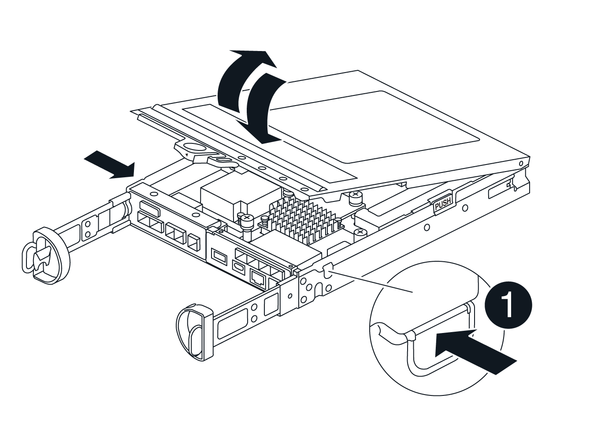

= ストレージコントローラシェルフのDIMMの交換（SG6160）
:allow-uri-read: 
:icons: font
:imagesdir: ../media/

[role="lead"]
メモリが一致しない場合、またはDIMMに障害が発生した場合は、E4000のDIMMを交換できます。

.このタスクについて
DIMM を交換するには、コントローラのキャッシュサイズを確認し、コントローラをオフラインにします。次にコントローラ、 DIMM を取り外し、新しい DIMM をコントローラに取り付けます。その後、コントローラをオンラインに戻し、ストレージアレイが正常に動作していることを確認します。

.作業を開始する前に
* 次のものがあることを確認します。
+
** 交換用 DIMM 。
** ESD リストバンドを装着するか、静電気防止処置を施しておきます。
** 静電気防止処置を施した平らな作業場所。
** コントローラキャニスターに接続する各ケーブルを識別するためのラベル。
** SANtricityシステムマネージャへのアクセス：
+
*** Grid Managerで、* nodes *>*_appliance node_*>* SANtricity System Manager *を選択します。コントローラ情報は https://docs.netapp.com/us-en/storagegrid-118/monitor/viewing-santricity-system-manager-tab.html["SANtricityの[System Manager]タブ"]。
*** 管理ステーションのブラウザで、コントローラのドメイン名またはIPアドレスを指定します。

== 手順 1 ： DIMM の交換が必要かどうかを確認します

DIMM を交換する前に、コントローラのキャッシュサイズを確認してください。

.手順
. コントローラのストレージアレイプロファイルにアクセスします。SANtricityシステムマネージャから、*サポート*›*サポートセンター*にアクセスします。サポートリソースページで、 * ストレージアレイプロファイル * を選択します。
. 下にスクロールするか、検索フィールドを使用して、 * データキャッシュモジュール * 情報を検索します。
. 次のいずれかがある場合は、DIMMの場所をメモし、このセクションの以降の手順を実行してコントローラのDIMMを交換します。
+
.. 故障した DIMM 、または * データキャッシュモジュール * を報告している DIMM が最適ではありません。
.. 容量が一致しない * データキャッシュモジュール * の DIMM 。

== 手順2：コントローラをオフラインにする

DIMM を安全に取り外して交換できるように、コントローラをオフラインにします。

.手順
. SANtricity System Manager の Recovery Guru で詳細を確認し、メモリが一致していない問題が報告されていること、および先に対処する必要がある項目がほかにないことを確認します。
. Recovery Guru の詳細領域で、交換する DIMM を特定します。
. SANtricity System Managerを使用してストレージアレイの構成データベースをバックアップします。
+
コントローラを取り外すときに問題が発生した場合は、保存したファイルを使用して構成をリストアできます。RAID 構成データベースの現在の状態が保存されます。これには、コントローラ上のボリュームグループとディスクプールのすべてのデータが含まれます。

+
** System Manager から：
+
... *サポート›サポートセンター›診断*を選択します。
... [ 構成データの収集 *] を選択します。
... [*Collect*]( 収集 ) をクリックします
+
ブラウザのDownloadsフォルダに、*configurationdata-という名前でファイルが保存されます。
<arrayName>-<dateTime>.7z *。

. コントローラがオフラインでない場合は、 SANtricity System Manager を使用してオフラインにします。
+
.. 「 * ハードウェア * 」を選択します。
.. 図にドライブが表示されている場合は、 * Show back of shelf * を選択してコントローラを表示します。
.. オフラインに切り替えるコントローラを選択します。
.. コンテキストメニューから * オフラインに切り替え * を選択し、操作を確定します。
+

NOTE: オフラインにするコントローラを使用して SANtricity System Manager にアクセスしている場合は、「 SANtricity System Manager を利用できません」というメッセージが表示されます。別のコントローラを使用して SANtricity System Manager に自動的にアクセスするには、 * 代替ネットワーク接続に接続する * を選択します。

. SANtricity System Managerでコントローラのステータスがオフラインに更新されるまで待ちます。
+

NOTE: ステータスの更新が完了するまでは、他の処理を開始しないでください。

. Recovery Guruで*[再確認]*を選択し、[詳細]領域の[削除する]フィールドが表示されていることを確認します。
「はい」と表示され、このコンポーネントを安全に取り外せることを示します。

== 手順3：コントローラキャニスターを取り外す

コントローラキャニスターをシステムから取り外し、コントローラキャニスターカバーを取り外します。

.手順
. 接地対策がまだの場合は、自身で適切に実施します。
. ケーブルマネジメントデバイスに接続しているケーブルをまとめているフックとループストラップを緩め、システムケーブルとSFPをコントローラキャニスターから外し（必要な場合）、どのケーブルがどこに接続されていたかを記録します。
+
ケーブルはケーブルマネジメントデバイスに収めたままにします。これにより、ケーブルマネジメントデバイスを取り付け直すときに、ケーブルを整理する必要がありません。

. ケーブルマネジメントデバイスをコントローラキャニスターの左右から取り外し、脇に置きます。
. カムハンドルのラッチを外れるまで押し、カムハンドルをいっぱいまで開いてコントローラキャニスターをミッドプレーンから外し、両手でコントローラキャニスターをシャーシから引き出します。
. コントローラキャニスターを裏返し、平らで安定した場所に置きます。
. コントローラキャニスターの側面にある青いボタンを押してカバーを開き、カバーを上に回転させてコントローラキャニスターから取り外します。
+

== 手順4：DIMMを交換する

コントローラ内部のDIMMの場所を確認して取り外し、交換します。

.手順
. 接地対策がまだの場合は、自身で適切に実施します。
. システムコンポーネントを交換する前にシステムのクリーンシャットダウンを実行し、不揮発性メモリ（ NVMEM ）内の書き込み前のデータが失われないようにする必要があります。LEDはコントローラキャニスターの背面にあります。
. NVMEM LED が点滅していない場合は、 NVMEM が空の状態です。以降の手順を省略して、この手順の次のタスクに進むことができます。
. NVMEM LED が点滅している場合は、 NVMEM にデータが含まれています。バッテリを取り外してメモリをクリアする必要があります。
+
.. コントローラキャニスターの側面にある青いボタンを押して、コントローラキャニスターからバッテリを取り外します。
.. 保持ブラケットからバッテリを上にスライドさせ、持ち上げてコントローラキャニスターから取り出します。
.. バッテリケーブルの場所を確認し、バッテリプラグのクリップを押してプラグソケットからロッククリップを外し、バッテリケーブルをソケットから抜きます。
.. NVMEM LED が点灯していないことを確認します。
.. バッテリコネクタを再接続し、コントローラ背面のLEDを再度確認します。
.. バッテリケーブルを抜きます。

. コントローラキャニスターでDIMMの場所を確認します。
. 交換用DIMMを正しい向きで挿入できるように、ソケット内のDIMMの向きと位置をメモします。
. DIMM の両側にある 2 つのツメをゆっくり押し開いて DIMM をスロットから外し、そのままスライドさせてスロットから取り出します。
+
DIMMが少し上に回転します。

. DIMMを所定の位置まで回転させ、ソケットから引き出します。
+

NOTE: DIMM 回路基板のコンポーネントに力が加わらないように、 DIMM の両端を慎重に持ちます。

+
image::../media/drw_E4000_replace_dimms_IEOPS-865.png[DIMMを取り外します。]

+
|===

 a| 
image::../media/legend_icon_01.png[凡例アイコン01]
| DIMM のツメ 

 a| 
image::../media/legend_icon_02.png[凡例アイコン 02]
| DIMM 
|===
. 交換用 DIMM を静電気防止用の梱包バッグから取り出し、 DIMM の端を持ってスロットに合わせます。
+
DIMM のピンの間にある切り欠きを、ソケットの突起と揃える必要があります。

. DIMMをスロットに対して垂直に挿入します。
+
DIMM のスロットへの挿入にはある程度の力が必要です。簡単に挿入できない場合は、 DIMM をスロットに正しく合わせてから再度挿入してください。

+

NOTE: DIMM がスロットにまっすぐ差し込まれていることを目で確認してください。

. DIMM の両端のノッチにツメがかかるまで、 DIMM の上部を慎重にしっかり押し込みます。
. バッテリを再接続します。
+
.. バッテリを接続します。
.. プラグがマザーボードのバッテリ電源ソケットに固定されていることを確認します。
.. バッテリを金属板の側壁の保持ブラケットに合わせます。
.. バッテリラッチがカチッという音がして側壁の開口部に収まるまで、バッテリパックを下にスライドさせます。

. コントローラキャニスターのカバーを再度取り付けます。

== 手順5：コントローラキャニスターを再度取り付ける

コントローラキャニスターをシャーシに再度取り付けます。

.手順
. 接地対策がまだの場合は、自身で適切に実施します。
. コントローラキャニスターのカバーを取り付けます（まだ取り付けていない場合）。
. コントローラキャニスターを裏返し、端をシャーシの開口部に合わせます。
. コントローラキャニスターをシステムの途中までそっと押し込みます。コントローラキャニスターの端をシャーシの開口部に合わせ、コントローラキャニスターをシステムの半分までそっと押し込みます。
+

NOTE: 指示があるまでコントローラキャニスターをシャーシに完全に挿入しないでください。

. 必要に応じてシステムにケーブルを再接続します。
. コントローラキャニスターの再取り付けが完了します。
+
.. カムハンドルを開いた状態で、コントローラキャニスターをミッドプレーンまでしっかりと押し込んで完全に装着し、カムハンドルをロック位置まで閉じます。
+

NOTE: コネクタの破損を防ぐため、コントローラキャニスターをスライドしてシャーシに挿入する際に力を入れすぎないように注意してください。

+
コントローラは、シャーシに装着されるとすぐにブートを開始します。

.. ケーブルマネジメントデバイスをまだ取り付けていない場合は、取り付け直します。
.. ケーブルマネジメントデバイスに接続されているケーブルをフックとループストラップでまとめます。

. コントローラキャニスターをリブートします。

== 手順6：DIMM交換後の処理

コントローラをオンラインにし、サポートデータを収集し、運用を再開します。

.手順
. コントローラをオンラインにします。
+
.. System Manager で、ハードウェアページに移動します。
.. [コントローラとコンポーネント]*を選択します。
.. DIMM を交換したコントローラを選択します。
.. ドロップダウンリストから「オンラインにする」 * を選択します。

. コントローラのブート時に、コントローラの LED を確認します。
+
もう一方のコントローラとの通信が再確立されると次のような状態

+
** 黄色の警告 LED が点灯した状態になります。
** ホストリンク LED は、ホストインターフェイスに応じて、点灯、点滅、消灯のいずれかになります。

. コントローラがオンラインに戻ったら、ステータスが「最適」になっていることを確認し、コントローラシェルフの警告LEDを確認します。
+
ステータスが「最適」でない場合やいずれかの警告 LED が点灯している場合は、すべてのケーブルが正しく装着され、コントローラキャニスターが正しく取り付けられていることを確認します。必要に応じて、コントローラキャニスターを取り外して再度取り付けます。
注：問題が解決しない場合は、テクニカルサポートにお問い合わせください。

. [ハードウェア]>[サポート]>[アップグレードセンター]*をクリックして、最新バージョンのSANtricity OSがインストールされていることを確認します。
+
必要に応じて、最新バージョンをインストールします。

. すべてのボリュームが優先所有者に戻っていることを確認します。
+
.. [ストレージ]>[ボリューム]*を選択します。[ * すべてのボリューム * ] ページで、ボリュームが優先所有者に配布されていることを確認します。ボリューム所有者を表示するには、[その他]>[所有権の変更]*を選択します。
.. すべてのボリュームが優先所有者に所有されている場合は、手順 6 に進みます。
.. いずれのボリュームも戻っていない場合は、手動でボリュームを戻す必要があります。詳細›ボリュームの再配置*に進みます。
.. Recovery Guru がない場合、または Recovery Guru の手順に従ってもボリュームが優先所有者に戻らない場合は、サポートに問い合わせてください。

. SANtricity システムマネージャを使用してストレージアレイのサポートデータを収集します。
+
.. *サポート›サポートセンター›診断*を選択します。
.. 「サポートデータの収集」を選択します。
.. [*Collect*]( 収集 ) をクリックします
+
ブラウザの Downloads フォルダに、「 * support-data.7z * 」という名前でファイルが保存されます。

