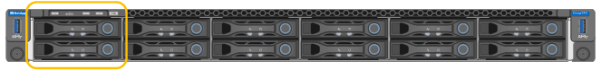

= SG6100-CNのドライブの交換
:allow-uri-read: 
:icons: font
:imagesdir: ../media/

[role="lead"]
SG6160アプライアンスには、読み取りキャッシュとして機能するSSDドライブがSG6100-CNコントローラに2本搭載されています。いずれかのドライブで障害が発生した場合は、パフォーマンスへの影響を最小限に抑えるために、できるだけ早く交換する必要があります。

.作業を開始する前に
* これで完了です link:locating-sgf6112-in-data-center.html["アプライアンスを物理的に設置します"]。
* 障害が発生したドライブを確認しておきます。左側のLEDが黄色に点灯していることを確認するか、Grid Managerを使用して link:verify-component-to-replace.html["障害ドライブが原因のアラートを表示します"]。
* 交換用ドライブを入手します。
* 適切な ESD 保護を用意しておきます。

.手順
. ドライブの左側の障害LEDがオレンジになっていることを確認するか、アラートのドライブスロットIDを使用してドライブの場所を特定します。
+
ドライブはシャーシ内で次の位置にあります（ベゼルを取り外した状態のシャーシ前面）。

+

. ESD リストバンドのストラップの端を手首に巻き付け、静電気の放電を防ぐためにクリップの端をメタルアースに固定します。
. 交換用ドライブを開封し、アプライアンスの近くの、静電気防止処置を施した平らな場所に置きます。
+
梱包材はすべて保管しておいてください。

. 障害が発生したドライブのリリースボタンを押します。
+
image::../media/h600s_driveremoval.gif[ドライブの取り外し]

+
ドライブのハンドルが途中まで開き、ドライブがスロットから外れます。

. ハンドルを開き、ドライブを引き出して、静電気防止処置を施した平らな場所に置きます。
. 交換用ドライブをドライブスロットに挿入する前に、ドライブのリリースボタンを押します。
+
ラッチが開きます。

+
image::../media/h600s_driveinstall.gif[ドライブの取り付け]

. 交換用ドライブをスロットに挿入し、ドライブのハンドルを閉じます。
+

CAUTION: ハンドルを閉じるときに力を入れすぎないでください。

+
ドライブが完全に挿入されると、カチッという音がします。

+
両方のSSDドライブが正常に機能している場合は、読み取りキャッシュ機能が自動的にリストアされます。可能です https://docs.netapp.com/us-en/storagegrid-118/monitor/running-diagnostics.html["診断を実行します"^] をクリックして読み取りキャッシュのヒット率を監視します。キャッシュが再構築されたばかりのため、最初はヒット率が低くなる可能性がありますが、オブジェクトデータにアクセスするクライアントがキャッシュに再度データを格納するにつれて、ヒット率は上昇します。

部品の交換後、障害のある部品は、キットに付属する RMA 指示書に従ってネットアップに返却してください。を参照してください https://mysupport.netapp.com/site/info/rma["パーツの返品と交換"^] 詳細については、を参照してください。
