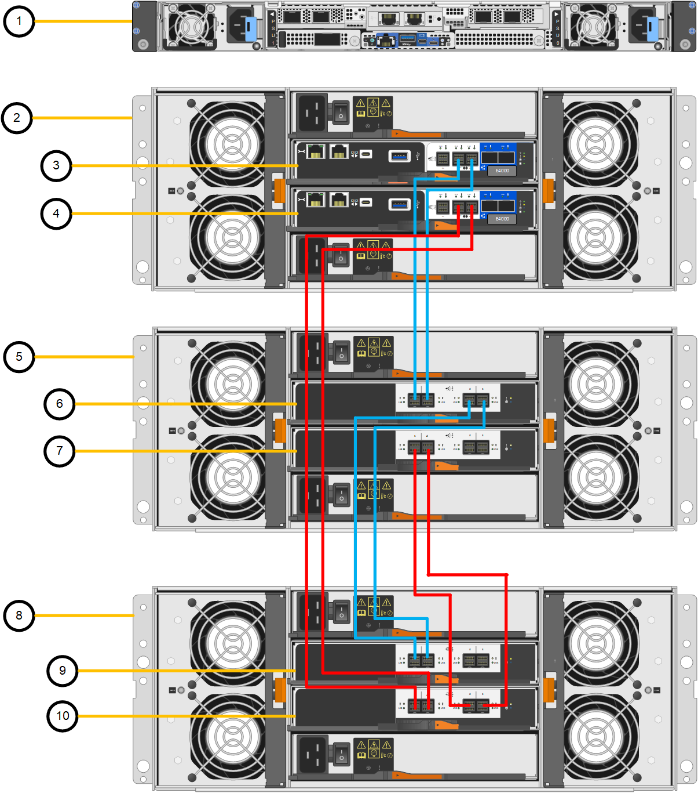

= 導入済みのSG6260に拡張シェルフを追加
:allow-uri-read: 
:icons: font
:imagesdir: ../media/

[role="lead"]
ストレージ容量を増やすには、StorageGRIDシステムにすでに導入されているSG6260に拡張シェルフを1つまたは2つ追加できます。

.このタスクについて
拡張シェルフを追加するには、次の手順を実行します。

* キャビネットまたはラックにハードウェアを設置します。
* SG6260をメンテナンスモードにします。
* 拡張シェルフをE4000コントローラシェルフまたは別の拡張シェルフに接続します。
* StorageGRIDアプライアンスインストーラを使用して拡張を開始します。
* 新しいボリュームが設定されるまで待ちます。

1台または2台の拡張シェルフの手順を完了するには、アプライアンスノード1台あたり1時間以内で完了します。ダウンタイムを最小限に抑えるため、以下の手順では、SG6260をメンテナンスモードにする前に、新しい拡張シェルフとドライブをインストールするよう指示しています。残りの手順は、アプライアンスノード1台あたり約20～30分かかります。

.作業を開始する前に
* プロビジョニングパスフレーズが必要です。
* StorageGRID 12.0以降を実行している必要があります。
* 拡張シェルフごとに、拡張シェルフと SAS ケーブルを 2 本用意します。
* データセンターで拡張シェルフを追加するlink:locating-sg6200-in-data-center.html["コントローラを物理的に配置"]があります。

.手順
. link:../installconfig/sg6260-installing-60-drive-shelves-into-cabinet-or-rack.html["キャビネットまたはラックへの60ドライブシェルフの設置"]の手順に従います。
. Grid Manager から、link:../commonhardware/placing-appliance-into-maintenance-mode.html["SG6200-CNコントローラをメンテナンスモードにします"]。
. 図に示すように、各拡張シェルフをE4000コントローラシェルフに接続します。
+
この図は、 2 台の拡張シェルフを示しています。IOM A のみをコントローラ A に接続し、 IOM B をコントローラ B に接続します

+

+
[cols="1a,2a"]
|===
| コールアウト | 説明 

 a| 
1.
 a| 
SG6200-CN

 a| 
2.
 a| 
E4000コントローラシェルフ

 a| 
3.
 a| 
コントローラ A

 a| 
4.
 a| 
コントローラ B

 a| 
5.
 a| 
拡張シェルフ 1

 a| 
6.
 a| 
拡張シェルフ 1 の IOM A

 a| 
7.
 a| 
拡張シェルフ 1 の IOM B

 a| 
8
 a| 
拡張シェルフ2

 a| 
9
 a| 
拡張シェルフ2のIOM A

 a| 
10
 a| 
拡張シェルフ2のIOM B

|===
. 電源コードを接続し、拡張シェルフに電源を投入
+
.. 各拡張シェルフの 2 つ電源装置のそれぞれに電源コードを接続します。
.. 各拡張シェルフの 2 本の電源コードを、キャビネットまたはラック内の別々の PDU に接続します。
.. 拡張シェルフごとに 2 つの電源スイッチをオンにします。
+
*** 電源投入プロセス中は、電源スイッチをオフにしないでください。
*** 拡張シェルフのファンは、初回起動時に大きな音を立てることがあります。起動時に大きな音がしても問題はありません。

. StorageGRID アプライアンスインストーラのホームページを監視します。
+
拡張シェルフの電源投入が完了してシステムで検出されるまでに約 5 分かかります。ホームページに、検出された新しい拡張シェルフの数と、拡張の開始ボタンが有効になっていることが表示されます。

+
既存または新規の拡張シェルフの数に応じて、ホームページに表示される可能性のあるメッセージの例を次に示します：

+
** ページの上部に表示されるバナーには、検出された拡張シェルフの合計数が表示されます。
+
*** バナーには拡張シェルフの総数が表示され、シェルフの構成と導入が完了しているか、新規および未設定のいずれであるかが示されます。
*** 拡張シェルフが検出されなかった場合は、バナーは表示されません。

** ページの下部に、拡張を開始する準備ができていることを示すメッセージが表示されます。
+
*** メッセージには、 StorageGRID が検出した新しい拡張シェルフの数が示されます。「 Attached 」は、シェルフが検出されたことを示します。"`Unconfigureed" は、シェルフが新規であり、 StorageGRID アプライアンス・インストーラを使用してまだ構成されていないことを示します。
+

NOTE: すでに導入されている拡張シェルフはこのメッセージに含まれません。これらの値は、ページ上部のバナーの数に含まれています。

*** このメッセージは、新しい拡張シェルフが検出されない場合は表示されません。

. 必要に応じて、ホームページのメッセージに記載されている問題を解決します。
+
たとえば、ストレージハードウェアの問題を解決するには、 SANtricity System Manager を使用します。

. ホームページに表示される拡張シェルフの数が、追加する拡張シェルフの数と一致していることを確認します。
+

NOTE: 新しい拡張シェルフが検出されていない場合は、適切にケーブル接続され、電源がオンになっていることを確認します。

. [[start_expansion]] * Start Expansion をクリックして、拡張シェルフを設定し、オブジェクトストレージで使用できるようにします。
. 拡張シェルフ構成の進捗状況を監視します。
+
初期インストール時と同様に、進行状況バーが Web ページに表示されます。

+
設定が完了すると、アプライアンスが自動的にリブートしてメンテナンスモードを終了し、グリッドに再参加します。このプロセスには最大20分かかることがあります。

+

NOTE: 拡張シェルフの構成に失敗した場合に再試行するには、 StorageGRID アプライアンスインストーラで * Advanced * > * Reboot Controller * を選択し、 * Reboot into Maintenance Mode * を選択します。ノードがリブートしたら、を再試行します <<start_expansion,拡張シェルフ構成>>。

+
再起動が完了すると、*Tasks*タブが表示され、ノードを再起動するか、アプライアンスをメンテナンスモードにするかの選択肢が表示されます。

. アプライアンスストレージノードおよび新しい拡張シェルフのステータスを確認します。
+
.. Grid Managerで、*Nodes*を選択し、アプライアンスStorage Nodeに緑色のチェックマークアイコンが表示されていることを確認します。
+
緑のチェックマークアイコンは、アクティブなアラートがなく、ノードがグリッドに接続されていることを示します。ノードアイコンの説明については、を参照してください https://docs.netapp.com/us-en/storagegrid/monitor/monitoring-system-health.html#monitor-node-connection-states["ノードの接続状態を監視します"^]。

.. 「 * Storage * 」タブを選択し、追加した各拡張シェルフのオブジェクトストレージテーブルに 16 個の新しいオブジェクトストアが表示されていることを確認します。
.. 新しい各拡張シェルフのシェルフステータスが Nominal であり、構成ステータスが Configured になっていることを確認します。

