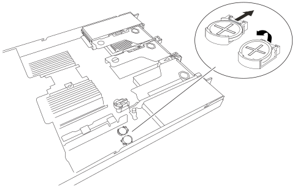

= SGF6212またはSG6200-CN CMOSバッテリを交換
:allow-uri-read: 
:icons: font
:imagesdir: ../media/

[role="lead"]
この手順に従って、システムボード上のCMOSコイン型電池を交換してください。

.このタスクについて
サービスの中断を防ぐため、CMOS バッテリーの交換を開始する前に、他のすべてのストレージ ノードがグリッドに接続されていることを確認するか、サービスの中断が許容される定期メンテナンス期間中にバッテリーを交換してください。 https://docs.netapp.com/us-en/storagegrid/monitor/monitoring-system-health.html#monitor-node-connection-states["ノードの接続状態を監視しています"^]に関する情報を参照してください。

CAUTION: オブジェクトのコピーを1つだけ作成するILMルールを使用したことがある場合は、定期メンテナンス期間中にバッテリーを交換する必要があります。この手順を実行すると、一時的に該当オブジェクトにアクセスできなくなる可能性があるためです。 https://docs.netapp.com/us-en/storagegrid/ilm/why-you-should-not-use-single-copy-replication.html["シングルコピーレプリケーションを使用しない理由"^]に関する情報を参照してください。

.作業を開始する前に
* link:verify-component-to-replace.html["CMOS バッテリの交換が必要なアプライアンスを確認しました"]があります。
* データセンターでCMOSバッテリーの交換が必要なlink:locating-sg6200-in-data-center.html["SGF6212アプライアンスまたはSG6200-CNコントローラの物理的な場所を確認した"]があります。
* アプライアンスの現在のBMC設定を記録しておきます（使用可能な場合）。
+
.. 交換するアプライアンスにログインします。
+
... 次のコマンドを入力します。 `ssh admin@_grid_node_IP_`
... に記載されているパスワードを入力します `Passwords.txt` ファイル。
... 次のコマンドを入力してrootに切り替えます。 `su -`
... に記載されているパスワードを入力します `Passwords.txt` ファイル。
+
rootとしてログインすると、プロンプトがから変わります `$` 終了： `#`。

.. と入力して `*run-host-command ipmitool lan print*`、アプライアンスの現在のBMC設定を表示します。
+

NOTE: ラックからアプライアンスを取り外す前に、link:power-sg6200-off-on.html#shut-down-the-sgf6212-appliance-or-sg6200-cn-controller["アプライアンスの通常のシャットダウン"]が必要です。

* すべてのケーブルを外し、link:reinstalling-sg6200-cover.html["アプライアンスカバーを取り外した"]。

.手順
. ESD リストバンドのストラップの端を手首に巻き付け、静電気の放電を防ぐためにクリップの端をメタルアースに固定します。
. 最初のCMOSバッテリーを取り外します。
+
.. システムボード上のCMOSバッテリーの位置を確認します。
.. 指またはプラスチック製のこじ開け工具を使用して、固定クリップをバッテリから押し出し、ソケットからスプリングします。
+

.. バッテリーを取り外し、適切に廃棄してください。

. 交換用のCMOSバッテリーを取り付けてください。
+
.. 交換用CMOSバッテリーをパッケージから取り出してください。
.. バッテリがカチッと所定の位置に収まるまで、交換用バッテリをプラス（+）側を上にしてシステム基板の空のソケットに押し込みます。

. 2つ目のCMOSバッテリについても、これらの手順を繰り返します。
. アプライアンスで実行する他のメンテナンス手順がない場合は、アプライアンスのカバーを再度取り付け、アプライアンスをラックに戻してケーブルを接続し、電源を投入します。
. 交換したアプライアンスでSEDドライブでドライブ暗号化が有効になっている場合は、次の手順を実行する必要があります。 link:../installconfig/optional-enabling-node-encryption.html#access-an-encrypted-drive["ドライブ暗号化パスフレーズを入力"] 交換用アプライアンスの初回起動時に暗号化されたドライブにアクセスするには、次の手順を実行します。
. 交換したアプライアンスでノード暗号化の暗号化キーを管理するためにキー管理サーバ（KMS）を使用していた場合は、ノードをグリッドに追加するために追加の設定が必要になることがあります。ノードが自動的にグリッドに追加されない場合は、次の設定が新しいアプライアンスに転送されたことを確認し、想定される設定と異なる設定があれば手動で設定します。
+
** link:../installconfig/accessing-storagegrid-appliance-installer.html["StorageGRID 接続を設定します"]
** https://docs.netapp.com/us-en/storagegrid/admin/kms-overview-of-kms-and-appliance-configuration.html#set-up-the-appliance["アプライアンスのノード暗号化を設定します"^]

. アプライアンスにログインします。
+
.. 次のコマンドを入力します。 `ssh admin@_grid_node_IP_`
.. に記載されているパスワードを入力します `Passwords.txt` ファイル。
.. 次のコマンドを入力してrootに切り替えます。 `su -`
.. に記載されているパスワードを入力します `Passwords.txt` ファイル。

. 以下のいずれかの方法を使用して、アプライアンスのBMCネットワーク接続を復元します：
+
** 静的IP、ネットマスク、およびゲートウェイを使用します
** DHCPを使用して、IP、ネットマスク、およびゲートウェイを取得します
+
... 静的IP、ネットマスク、およびゲートウェイを使用するようにBMCの設定をリストアするには、次のコマンドを入力します。
+
`*run-host-command ipmitool lan set 1 ipsrc static*`

+
`*run-host-command ipmitool lan set 1 ipaddr _Appliance_IP_*`

+
`*run-host-command ipmitool lan set 1 netmask _Netmask_IP_*`

+
`*run-host-command ipmitool lan set 1 defgw ipaddr _Default_gateway_*`

... DHCPを使用してIP、ネットマスク、およびゲートウェイを取得するようにBMCの設定を復元するには、次のコマンドを入力します。
+
`*run-host-command ipmitool lan set 1 ipsrc dhcp*`

. BMCネットワーク接続をリストアしたら、BMCインターフェイスに接続して監査し、追加で適用したBMCのカスタム設定をリストアします。たとえば、SNMPトラップの送信先やEメール通知の設定を確認する必要があります。を参照してください link:../installconfig/configuring-bmc-interface.html["BMCインターフェイスの設定"]。
. アプライアンスノードが Grid Manager に表示され、アラートが表示されていないことを確認します。

