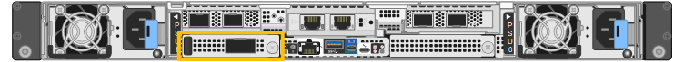

= SG6200-CNの外部NICを交換する
:allow-uri-read: 
:icons: font
:imagesdir: ../media/

[role="lead"]
SG6200-CNの外部ネットワークインターフェースカード（NIC）が最適に機能していない場合、または故障している場合は、交換が必要になる可能性があります。

.このタスクについて
サービスの中断を防ぐため、ネットワークインターフェースカード（NIC）の交換を開始する前に、他のすべてのストレージ ノードがグリッドに接続されていることを確認するか、サービスの中断が許容される定期メンテナンス期間中にNICを交換してください。link:https://docs.netapp.com/us-en/storagegrid/monitor/monitoring-system-health.html#monitor-node-connection-states["ノードの接続状態の監視"]に関する情報を参照してください。

CAUTION: オブジェクトのコピーを1つだけ作成するILMルールを使用したことがある場合は、この手順中に一時的にオブジェクトへのアクセスを失う可能性があるため、定期メンテナンス期間中にNICを交換する必要があります。link:https://docs.netapp.com/us-en/storagegrid/ilm/why-you-should-not-use-single-copy-replication.html["シングルコピーレプリケーションを使用しない理由"]を参照してください。

.作業を開始する前に
* 正しい交換用NICを用意しておきます。
* 次のことを決定しました。 link:verify-component-to-replace.html["交換するNICの場所"]。
+

* link:locating-sg6200-in-data-center.html["SG6200-CNコントローラの物理的な位置を確認しました"]データセンターでNICを交換します。
+

NOTE: この手順ではホットスワップはサポートされて*いません*。link:power-sg6200-off-on.html#shut-down-the-sgf6212-appliance-or-sg6200-cn-controller["アプライアンスの通常のシャットダウン"]は、ケーブルを外してNICを取り外す前に必要です。

* SG6200-CNの2本の電源コードを含む、すべてのケーブルを外しました。
* *オプション*：地域の規制で要求されている場合は、コントローラをラックから取り外しておきます。NICは外部からアクセスできるため、取り外す必要はありません。

== ステップ1：外部NICを取り外す

.手順
. 静電気放電を防ぐために、ESDリストバンドのストラップ側を手首に巻き付け、クリップ側を金属アースに固定します。
. ドライバを使用して、NICの前面プレートのネジを緩めます。
+

CAUTION: この手順では、ホットスワップは*サポートされていません*。NICを取り外す前に、コントローラの電源を切断する必要があります。

. 前面プレートのハンドルを引いて、NICを慎重に取り外します。NICを静電気防止処置を施した平らな場所に置きます。

== 手順2：外部NICを再取り付けする

.手順
. 静電気放電を防ぐために、ESDリストバンドのストラップ側を手首に巻き付け、クリップ側を金属アースに固定します。
. 交換用NICをパッケージから取り出します。
. NICをシャーシの開口部に合わせ、完全に装着されるまで慎重に押し込みます。
. NICの前面プレートのネジを締めます。

.完了後
アプライアンスで実行する他のメンテナンス手順がない場合は、アプライアンスをラックに戻し、ケーブルを接続して電源を投入します。

部品を交換した後、キットに同梱されているRMA手順書に記載されているとおりに、故障した部品をNetAppに返送してください。詳細については、 https://mysupport.netapp.com/site/info/rma["部品の返品と交換"^]ページを参照してください。
