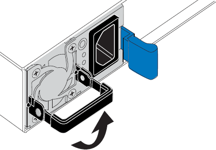

= SGF6212またはSG6200-CNの電源装置を1つまたは両方交換する
:allow-uri-read: 
:icons: font
:imagesdir: ../media/

[role="lead"]
SGF6212アプライアンスとSG6200-CNコンピューティングノードは、冗長性を確保するために2つの電源を備えています。電源装置のいずれかが故障した場合は、アプライアンスに冗長電源を確保するために、できるだけ早く交換する必要があります。アプライアンス内で動作する2つの電源装置は、同じモデル、同じワット数でなければなりません。

.このタスクについて
図は、2つの電源ユニットの設置場所を示しています。電源ユニットは機器の背面からアクセスできます。

image::../media/sgf6212_power_supplies.png[電源ユニット2個を搭載したSGF6212またはSG6200-CNの背面]

+ 注：この画像はSGF6212アプライアンスを示していますが、電源装置はSG6200-CNコンピューティング ノードでも同じ位置にあります。

.作業を開始する前に
* 交換する電源ユニットがlink:locating-sg6200-in-data-center.html["アプライアンスを物理的に設置します"]あります。
* これで完了です link:verify-component-to-replace.html["交換するPSUの場所を確認"]。
* 1 台の電源装置のみを交換する場合は、次の手順を実行します
+
** 交換用電源装置を開封し、交換する電源装置と同じモデルおよびワット数であることを確認しておきます。
** もう 1 つの電源装置が搭載され、動作していることを確認しておきます。

* 両方の電源装置を同時に交換する場合は、次の手順を実行します。
+
** 交換用電源装置を開封し、モデルとワット数が同じであることを確認しておきます。

.手順
. 電源装置を 1 台だけ交換する場合は、アプライアンスをシャットダウンする必要はありません。にアクセスします <<Unplug_the_power_cord,電源コードを抜きます>> ステップ。両方の電源装置を同時に交換する場合は、電源コードを取り外す前に次の手順を実行します。
+
.. link:power-sg6200-off-on.html#shut-down-the-sgf6212-appliance-or-sg6200-cn-controller["アプライアンスをシャットダウンします"]。
+

CAUTION: オブジェクトのコピーを1つだけ作成するILMルールを使用したことがあり、両方の電源装置を同時に交換する場合は、この手順中にこれらのオブジェクトに一時的にアクセスできなくなる可能性があるため、スケジュールされたメンテナンス時間中に電源装置を交換する必要があります。についての情報を参照してください https://docs.netapp.com/us-en/storagegrid/ilm/why-you-should-not-use-single-copy-replication.html["シングルコピーレプリケーションを使用しない理由"^]。

. [[power_power_cord 、 start=2 ] 交換する各電源装置から電源コードを抜きます。
+
アプライアンスの背面から見た場合、電源装置A（PSU0）は右側、電源装置B（PSU1）は左側にあります。

. 交換する最初のサプライ品のハンドルを持ち上げます。
+

. 青色のラッチを押し、電源装置を引き出します。
+
image::../media/sg6000_cn_remove_power_supply.gif[電源装置の取り外し]

. 右側の青色のラッチを使用して、交換用電源装置をシャーシにスライドさせます。
+

NOTE: 取り付けられている両方の電源装置のモデルとワット数が同じである必要があります。

+
交換用ユニットをスライドするときは、青色のラッチが右側にあることを確認してください。

+
電源装置が所定の位置に固定されると、カチッという音がします。

+
image::../media/sg6000_cn_insert_power_supply.gif[電源装置をスライドさせて挿入します]

. ハンドルをPSUの本体に押し下げます。
. 両方の電源装置を交換する場合は、手順 2 ~ 6 を繰り返して 2 台目の電源装置を交換します。
. link:../installconfig/connecting-power-cords-and-applying-power.html["交換したユニットに電源コードを接続し、電源を投入"]。

部品を交換した後、キットに同梱されているRMA手順書に記載されているとおりに、故障した部品をNetAppに返送してください。詳細については、 https://mysupport.netapp.com/site/info/rma["部品の返品と交換"^]ページを参照してください。
